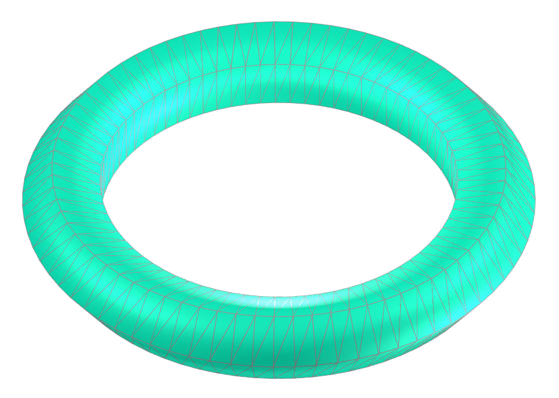

<link rel="stylesheet" href="../scripts/style.css">
<meta charset="utf-8">
<link rel="icon" type="image/png" href="vr/salas/imagens/icone.png">
<h2>Torus and Toroids: visualization of solids with Augmented Reality (AR) and Virtual Reality (VR) in A-frame</h2>
 <b>author:</b> Paulo Henrique Siqueira - Universidade Federal do Paraná
  <b>contact:</b> <a href="#">paulohscwb@gmail.com</a>
  <a href="https://paulohscwb.github.io/torus-toroids/basic/pt-br/">versão em português</a>
 <form style="margin: 0 auto; float:right; text-align:right; width:100%; margin-bottom:15px;">
	<select id="url" onchange="urlHandler(this.value)" style="color:royalblue;">
		<option disabled selected value>More solids:</option>
		<option disabled value="../basic/">Torus and toroids</option>
		<!--<option value="../tetragonal/">Tetragonal toroids</option>
		<option value="../iris/">Iris toroids</option>
		<option value="../mobius-cairo/">Mobius and Cairo toroids</option>
		<option value="../regular/">Regular toroids</option>
		<option value="../hexagonal/">Hexagonal toroids</option>
		<option value="../heptagonal/">Heptagonal dodecahedrons</option>
		<option value="../regular1/">Regular polygonal toroids 1</option>
		<option value="../regular2/">Regular polygonal toroids 2</option>
		<option value="../regular3/">Regular polygonal toroids 3</option>
		<option value="../rings/">Rings toroids</option>
		<option value="../regular4/">Regular polygonal toroids 4</option>
		<option value="../regular5/">Regular polygonal toroids 5</option>-->
	</select>
</form>

  <h2 align="center"> Torus and Toroids</h2>
An ordinary torus is considered a genus 1 surface. This solid has a single "hole", and can be constructed from a rectangle by gluing together both pairs of opposite edges without twists. The usual torus embedded in three-dimensional space is shaped like a donut.
The toroid is a surface of revolution obtained by rotating a closed plane curve, or a polygon, around an axis parallel to the plane that does not intersect the curve. The simplest toroid is the torus, and the term toroid is used to refer to a toroidal polyhedron.
This work shows torus and toroids modeled in 3D, with views that can be accessed with Augmented Reality resources and also in immersive Virtual Reality rooms.

<a href="#ra">Augmented Reality</a>&nbsp;&nbsp;|&nbsp;&nbsp;<a href="#m3d">3D Models</a>&nbsp;&nbsp;|&nbsp;&nbsp;<a href="../">Home</a>

  

 <h3 align="center">Immersive room</h3>
  
<iframe width="100%" src="sala.htm" title="Sala Imersiva dos toros e toroides" frameborder="0" loading="lazy"></iframe>

  
<a href="sala.htm" target="_blank">&#x1f517; room link</a>
 
  

  <h3 id="ra" align="center">Augmented Reality</h3>
  To view torus and toroids in AR, simply visit the pages indicated in the 3D solid models using any browser with a webcam device (smartphone, tablet or notebook). 
 Access to the VR pages is done by clicking on the blue circle that appears on top of the marker.

<h3 id="m3d" align="center">3D models</h3>
<!--<iframe width="560" height="315" style="max-width:100%" src="https://www.youtube.com/embed/videoseries?list=PLy0I_lGW8HxXqLmyaITBm0flxwtDvgTFT" title="YouTube video player" frameborder="0" allow="accelerometer; autoplay; clipboard-write; encrypted-media; gyroscope; picture-in-picture; web-share" allowfullscreen></iframe>-->
<h4>1. Torus</h4>

    Let the radius from the center of the hole to the center of the torus tube be r, and the radius of the tube be R. The parametric equations for a torus azimuthally symmetric about the z-axis are: x = (R + r&middot;cos(v))&middot;cos(u), y = (R + r&middot;cos(v))&middot;sin(u) and z = r&middot;sin(v), for u, v &isin; [0, 2&pi;). 
   
 

<h4>2. Polyhedral torus</h4>

    Consider n equal cylinders frustums, equidistant from a point. The generated solid by the union of these cylinders frustums is a polyhedral torus with n sides, and the intersections of the cylinders frustums are circles with equal radii.
   
 

<h4>3. Torus knot</h4>

    A (p, q) torus knot is obtained by winding a rope through the hole of a torus p times, with q revolutions before joining its ends, where p and q are prime numbers. The parametric equations for a torus azimuthally symmetric about the z-axis are: x = (R + r&middot;cos(q&middot;u))&middot;cos(p&middot;u), y = (R + r&middot;cos(q&middot;u))&middot;sin(p&middot;u) and z = r&middot;sin(q&middot;u), for u &isin; [0, 2&pi;).
   
  
 

<h4>4. Polygonal toroid</h4>

    The polygonal toroid is a surface of revolution obtained by rotating a polygon, around an axis parallel to the plane that does not intersect the curve.
   
 

<h4>5. Polyhedral toroid</h4>

    Consider n equal regular prisms frustums, equidistant from a point P and with lateral edges orthogonal to the axis passing through P. The solid generated by the union of these prisms frustums is a polyhedral toroid with n sides, and the intersections of the prisms frustums are congruent regular polygons.
   
 
 

<h4>6. Polyhedral toroidal knot</h4>

    A polyhedral toroidal knot (p, q) is obtained by winding a chain through the hole of a torus p times, with q revolutions before joining its ends, where p and q are prime numbers. The links of the chain are formed by prisms and prism frustums.
   
 

<h4>7. Borromean rings: torus knot</h4>

    The Borromean rings, also called Borromean links, are three interlocking rings named after the Italian Renaissance family that used them in their coat of arms. Removing any one ring leaves the other two unconnected. In this example, we have the Borromean rings made with torus knots with p = 1 and q = 2.
   
  
 

<h4>8. Borromean rings: polyhedral toroid</h4>

    The Borromean rings, also called Borromean links, are three interlocking rings named after the Italian Renaissance family that used them in their coat of arms. Removing any one ring leaves the other two unconnected. In this example, we have the Borromean rings made with polyhedral toroids with n = 4.
   
 

<a href="#p1" class="topo">back to top</a>

  Torus and Toroids: visualization of solids with Augmented Reality and Virtual Reality by <a xmlns:cc="http://creativecommons.org/ns#" href="https://paulohscwb.github.io/torus-toroids/basic/" property="cc:attributionName" rel="cc:attributionURL">Paulo Henrique Siqueira</a> is licensed with a license <a rel="license" href="http://creativecommons.org/licenses/by-nc-nd/4.0/">Creative Commons Attribution-NonCommercial-NoDerivatives 4.0 International</a>.

<h4>How to cite this work:</h4> 

Siqueira, P.H., "Torus and Toroids: visualization of solids with Augmented Reality and Virtual Reality". Available in: <https://paulohscwb.github.io/torus-toroids/basic/>, February 2025.

<!---->
  <b>References:</b>
 Weisstein, Eric W. "Torus" From MathWorld-A Wolfram Web Resource. <a href="https://mathworld.wolfram.com/Torus.html" target="_blank">https://mathworld.wolfram.com/Torus.html</a>
 Weisstein, Eric W. "Toroid" From MathWorld-A Wolfram Web Resource. <a href="https://mathworld.wolfram.com/Toroid.html" target="_blank">https://mathworld.wolfram.com/Toroid.html</a>
 McCooey, D. I. "Visual Polyhedra". <a href="http://dmccooey.com/polyhedra/" target="_blank">http://dmccooey.com/polyhedra/</a>
