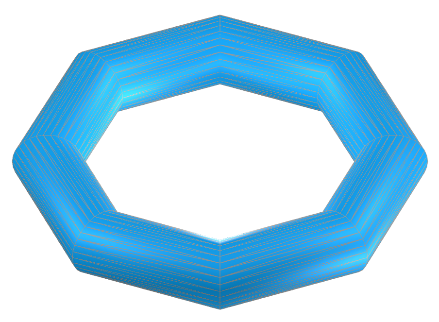
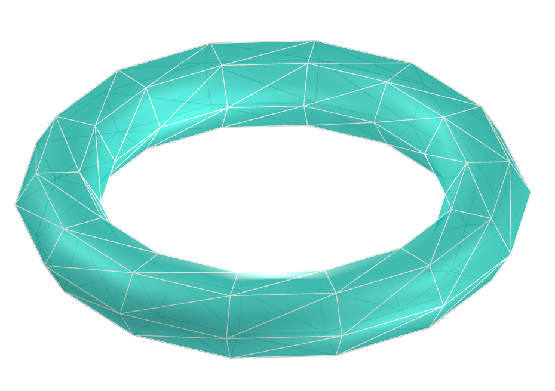
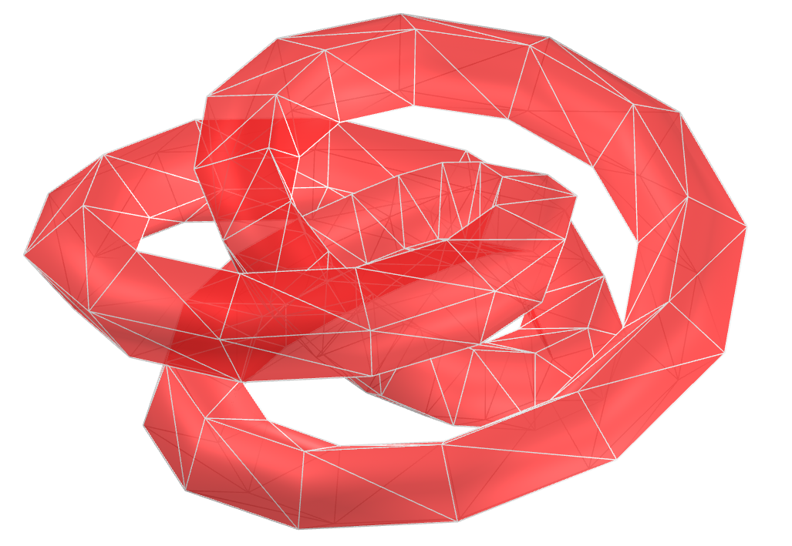
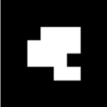
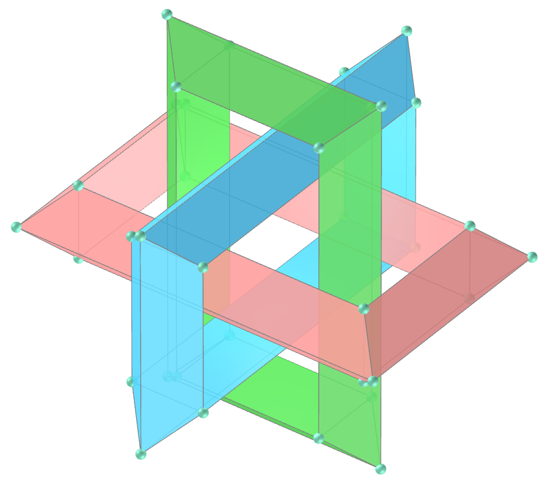

<link rel="stylesheet" href="../../scripts/style.css">
<meta charset="utf-8">
<link rel="icon" type="image/png" href="../basic/vr/salas/imagens/icone.png">
<h2>Toros e toroides: visualização dos sólidos com Realidade Aumentada (RA) e Realidade Virtual (RV) em A-frame</h2>
<b>autor:</b> Paulo Henrique Siqueira - Universidade Federal do Paraná
 <b>contato:</b> <a href="#"> paulohscwb@gmail.com </a>
 <a href="https://paulohscwb.github.io/torus-toroids/basic/">english version</a>
<form style="margin: 0 auto; float:right; text-align:right; width:100%; margin-bottom:15px;">
	<select id="url" onchange="urlHandler(this.value)" style="color:royalblue;">
		<option disabled selected>Mais sólidos:</option>
		<option disabled value="../../basic/pt-br/">Toros e toroides</option>
		<!--<option value="../../tetragonal/pt-br/">Toroides tetragonais</option>
		<option value="../../iris/pt-br/">Toroides de íris</option>
		<option value="../../mobius-cairo/pt-br/">Toroides de Mobius e Cairo</option>
		<option value="../../regular/pt-br/">Toroides regulares</option>
		<option value="../../hexagonal/pt-br/">Toroides hexagonais</option>
		<option value="../../heptagonal/pt-br/">Dodecaedros heptagonais</option>
		<option value="../../regular1/pt-br/">Toroides poligonais regulares 1</option>
		<option value="../../regular2/pt-br/">Toroides poligonais regulares 2</option>
		<option value="../../regular3/pt-br/">Toroides poligonais regulares 3</option>
		<option value="../../rings/pt-br/">Anéis toroides</option>
		<option value="../../regular4/pt-br/">Toroides poligonais regulares 4</option>
		<option value="../../regular5/pt-br/">Toroides poligonais regulares 5</option>-->
	</select>
</form>

  <h2 align="center"> Toros e Toroides</h2>
  Um toro comum é considerado uma superfície de gênero 1. Este sólido possui um único "buraco", e pode ser construído a partir de um retângulo colando ambos os pares de bordas opostas sem torções. O toro usual incorporado no espaço tridimensional tem o formato de uma rosquinha.
 O toroide é uma superfície de revolução obtida pela rotação de uma curva plana fechada, ou um polígono, em torno de um eixo paralelo ao plano que não intercepta a curva. O toroide mais simples é o toro, e o termo toroide é usado para se referir a um poliedro toroidal.
 Este trabalho mostra toros e toroides modelados em 3D, com as visualizações que podem ser acessadas com os recursos de Realidade Aumentada e também em salas imersivas de Realidade Virtual.
 
<a href="#ra">Realidade Aumentada</a>&nbsp;&nbsp;|&nbsp;&nbsp;<a href="#m3d">Modelos 3D</a>&nbsp;&nbsp;|&nbsp;&nbsp;<a href="../../pt-br/">Página Inicial</a>

 <h3 align="center">Sala imersiva</h3>
  
<iframe width="100%" src="../sala.htm" title="Sala Imersiva dos toros e toroides" frameborder="0" loading="lazy"></iframe>

  
<a href="../sala.htm" target="_blank">&#x1f517; room link</a>
 
  

  <h3 id="ra" align="center">Realidade Aumentada</h3>
  Para visualizar os toros e toroides em RA, visite as páginas indicadas nos modelos 3D dos sólidos utilizando qualquer navegador com um dispositivo de webcam (smartphone, tablet ou notebook).
 O acesso às páginas de RV é feito clicando no círculo azul que aparece em cima de cada marcador.

<h3 id="m3d" align="center">Modelos 3D</h3>
<!--<iframe width="560" height="315" style="max-width:100%" src="https://www.youtube.com/embed/videoseries?list=PLy0I_lGW8HxXgcL9RxOVEfCA1KDLByHZt" title="YouTube video player" frameborder="0" allow="accelerometer; autoplay; clipboard-write; encrypted-media; gyroscope; picture-in-picture; web-share" allowfullscreen></iframe>-->
<h4>1. Toro</h4>

    O toro é uma superfície de revolução obtida pela rotação de uma circunferência de raio r em torno de um eixo coplanar com a circunferência. A distância do centro da circunferência ao centro de rotação mede o raio do tubo R. As equações paramétricas para um toro azimutalmente simétrico em torno do eixo z são: x = (R + r&middot;cos(v))&middot;cos(u), y = (R + r&middot;cos(v))&middot;sin(u) e z = r&middot;sin(v), onde u, v &isin; [0, 2&pi;).
    

<h4>2. Toro poliédrico</h4>

    Considere n troncos de cilindros iguais, equidistantes de um ponto e com eixos coplanares. O sólido gerado por estes troncos de cilindros é um toro poliédrico de n lados, e as interseções dos troncos de cilindros são circunferências com raios iguais.
    

<h4>3. Nó toral</h4>

    Um nó toral (p, q) é obtido ao enrolar uma corda através do furo de um toro q vezes, com p revoluções antes de unir suas extremidades, onde p e q são números primos relativos. As equações paramétricas para um nó toral azimutalmente simétrico em torno do eixo z são: x = (R + r&middot;cos(q&middot;u))&middot;cos(p&middot;u), y = (R + r&middot;cos(q&middot;u))&middot;sin(p&middot;u) e z = r&middot;sin(q&middot;u), onde u &isin; [0, 2&pi;).
    

<h4>4. Toroide poligonal</h4>

    O toroide poligonal é uma superfície de revolução obtida pela rotação de um polígono em torno de um eixo coplanar com o polígono.
    

<h4>5. Toroide poliédrico</h4>

    Considere n troncos de prismas regulares iguais, equidistantes de um ponto P e com arestas laterais ortogonais ao eixo que passam por P. O sólido gerado pela união destes troncos de prismas é um toroide poliédrico com n lados, e as interseções dos troncos de prismas são polígonos regulares congruentes.
    

<h4>6. Nó toroidal poliédrico</h4>

    Um nó toroidal poliédrico (p, q) é obtido ao enrolar uma corrente através do furo de um toro q vezes, com p revoluções antes de unir suas extremidades, onde p e q são números primos relativos. Os elos da corrente são formados por prismas e troncos de prismas.
    

<h4>7. Anéis Borromeanos: nó toral</h4>

    Os anéis borromeanos, também chamados de elos borromeanos, são três anéis entrelaçados mutuamente, com o nome da família renascentista italiana que os usava em seu brasão de armas. A remoção de qualquer anel deixa os outros dois desconectados. Neste exemplo, temos os anéis borromeanos feitos com nós torais com p = 1 e q = 2.
    

<h4>8. Anéis Borromeanos: toroide poliédrico</h4>

    Os anéis borromeanos, também chamados de elos borromeanos, são três anéis entrelaçados mutuamente, com o nome da família renascentista italiana que os usava em seu brasão de armas. A remoção de qualquer anel deixa os outros dois desconectados. Neste exemplo, temos os anéis borromeanos feitos com toroides poliédricos com n = 4.
    

<a href="#p1" class="topo">voltar ao topo</a>

  Torus and Toroids: visualization of solids with Augmented Reality and Virtual Reality de <a xmlns:cc="http://creativecommons.org/ns#" href="https://paulohscwb.github.io/torus-toroids/basic/pt-br/" property="cc:attributionName" rel="cc:attributionURL">Paulo Henrique Siqueira</a> está licenciado com uma Licença <a rel="license" href="http://creativecommons.org/licenses/by-nc-nd/4.0/">Creative Commons Atribuição-NãoComercial-SemDerivações 4.0 Internacional</a>.

<h4>Como citar este trabalho:</h4> 

Siqueira, P.H., "Torus and Toroids: visualization of solids with Augmented Reality and Virtual Reality". Disponível em: <https://paulohscwb.github.io/torus-toroids/basic/pt-br/>, Fevereiro de 2025.

<!---->
  <b>Referências:</b>
 Weisstein, Eric W. "Torus" From MathWorld-A Wolfram Web Resource. <a href="https://mathworld.wolfram.com/Torus.html" target="_blank">https://mathworld.wolfram.com/Torus.html</a>
 Weisstein, Eric W. "Toroid" From MathWorld-A Wolfram Web Resource. <a href="https://mathworld.wolfram.com/Toroid.html" target="_blank">https://mathworld.wolfram.com/Toroid.html</a>
 McCooey, D. I. "Visual Polyhedra". <a href="http://dmccooey.com/polyhedra/" target="_blank">http://dmccooey.com/polyhedra/</a>
