<link rel="stylesheet" href="../scripts/style1.css">
<meta charset="utf-8">
<link rel="icon" type="image/png" href="vr/salas/imagens/icone.png">
<h2>Torus and Toroids: visualization of solids with Augmented Reality (AR) and Virtual Reality (VR) in A-frame</h2>
 <b>author:</b> Paulo Henrique Siqueira - Universidade Federal do Paraná
  <b>contact:</b> <a href="#">paulohscwb@gmail.com</a>
  <a href="https://paulohscwb.github.io/torus-toroids/heptadodekleinbottle/pt-br/">versão em português</a>
 <form style="margin: 0 auto; float:right; text-align:right; width:100%; margin-bottom:15px;">
	<select id="url" onchange="urlHandler(this.value)" style="color:royalblue;">
		<option disabled selected value>More solids:</option>
		<option value="../basic/">Torus and toroids</option>
		<option value="../tetragonal/">Tetragonal toroids</option>
		<option value="../iris/">Iris toroids</option>
		<option value="../regulartetrag/">Regular tetragonal toroids</option>
		<option value="../mobiuscairo/">Möbius, Vélez-Jahn and Cairo toroids</option>
		<option value="../hexagonal/">Hexagonal toroids</option>
		<option value="../regular1/">Regular polygonal and composition toroids 1</option>
		<option disabled value="../heptadodekleinbottle/">Heptagonal dodecahedrons and Klein bottles</option>
		<!--<option value="../regular2/">Regular polygonal toroids 2</option>
		<option value="../regular3/">Regular polygonal toroids 3</option>
		<option value="../rings/">Rings toroids</option>
		<option value="../regular4/">Regular polygonal toroids 4</option>
		<option value="../regular5/">Regular polygonal toroids 5</option>-->
	</select>
</form>

  <h2 align="center">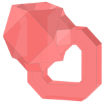 Heptagonal dodecahedrons and Klein bottles</h2>
A toroidal solid or toroid, is an orientable polyhedron without self-intersections that has genus greater than zero (meaning that it contains one or more holes). An orientable polyhedron's genus (G) is related to the number of vertices (V), faces (F), and edges (E) as follows:

V + F − E = 2 − 2 * G

This work shows heptagonal dodecahedrons and Klein bottles modeled in 3D, with views that can be accessed with resources in immersive Virtual Reality rooms.
 
<a href="#m3d">3D Models</a>&nbsp;&nbsp;|&nbsp;&nbsp;<a href="../">Home</a>

 

 

<h3 id="m3d" align="center">3D models</h3>
<!--<iframe width="560" height="315" style="max-width:100%" src="https://www.youtube.com/embed/videoseries?list=PLy0I_lGW8HxXgcL9RxOVEfCA1KDLByHZt" title="YouTube video player" frameborder="0" allow="accelerometer; autoplay; clipboard-write; encrypted-media; gyroscope; picture-in-picture; web-share" allowfullscreen></iframe>-->
<h4>1. Heptagonal dodecahedron #1</h4>
<a href="vr/HeptagonalDodecahedron_A.htm" target="_blank" title="3D model" class="fotoA">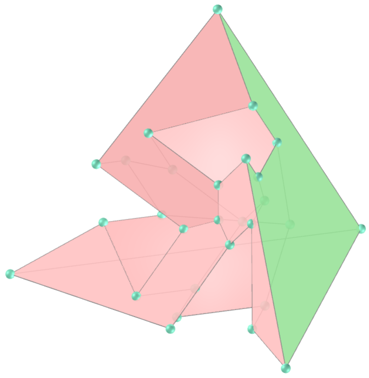</a>
  <b>faces:</b> 12 nonconvex heptagons | <b>vertices:</b> 28 | <b>edges:</b> 42
  

<h4>2. Heptagonal dodecahedron #2</h4>
<a href="vr/HeptagonalDodecahedron_B.htm" target="_blank" title="3D model" class="fotoA">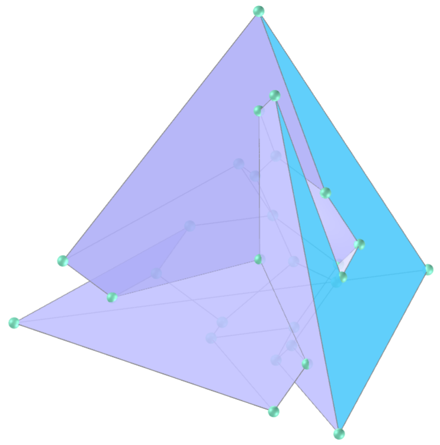</a>
  <b>faces:</b> 12 nonconvex heptagons | <b>vertices:</b> 28 | <b>edges:</b> 42
  

<h4>3. Heptagonal dodecahedron #3</h4>
<a href="vr/HeptagonalDodecahedron_C.htm" target="_blank" title="3D model" class="fotoA">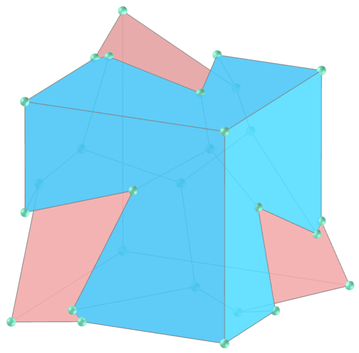</a>
  <b>faces:</b> 12 nonconvex heptagons | <b>vertices:</b> 28 | <b>edges:</b> 42
  

<h4>4. Heptagonal dodecahedron #4</h4>
<a href="vr/HeptagonalDodecahedron_D.htm" target="_blank" title="3D model" class="fotoA">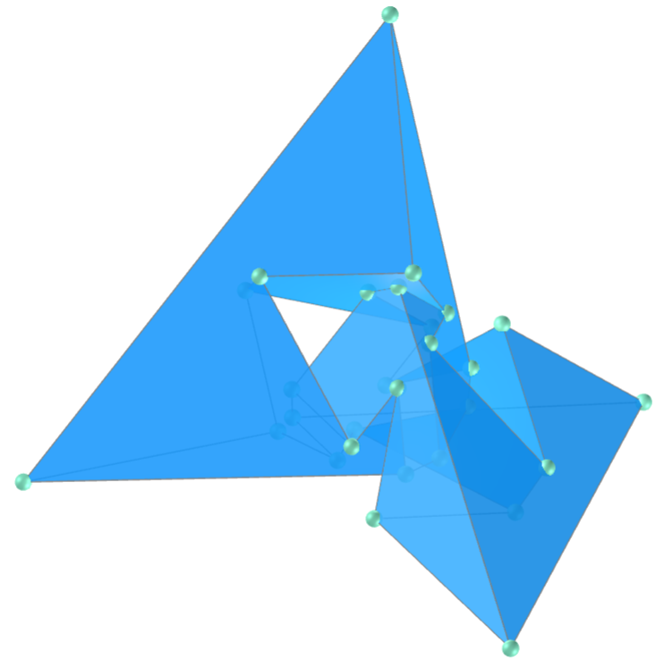</a>
  <b>faces:</b> 12 nonconvex heptagons | <b>vertices:</b> 28 | <b>edges:</b> 42
  

<h4>5. Heptagonal dodecahedron #5</h4>
<a href="vr/HeptagonalDodecahedron_E.htm" target="_blank" title="3D model" class="fotoA">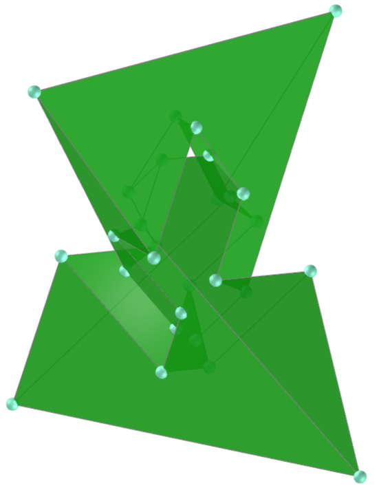</a>
  <b>faces:</b> 12 nonconvex heptagons | <b>vertices:</b> 28 | <b>edges:</b> 42
  

<h4>6. Heptagonal dodecahedron #6</h4>
<a href="vr/HeptagonalDodecahedron_F.htm" target="_blank" title="3D model" class="fotoA">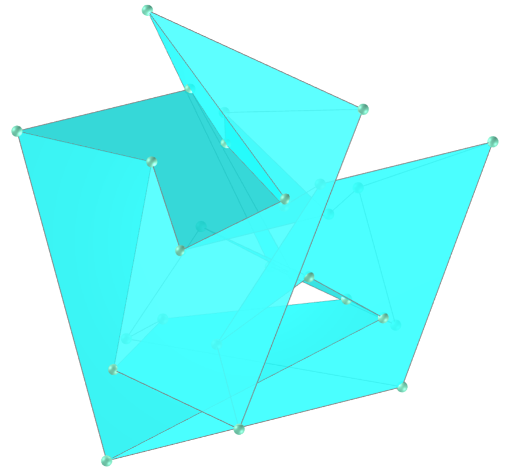</a>
  <b>faces:</b> 12 nonconvex heptagons | <b>vertices:</b> 28 | <b>edges:</b> 42
  

<h4>7. Heptagonal dodecahedron #7</h4>
<a href="vr/HeptagonalDodecahedron_G.htm" target="_blank" title="3D model" class="fotoA">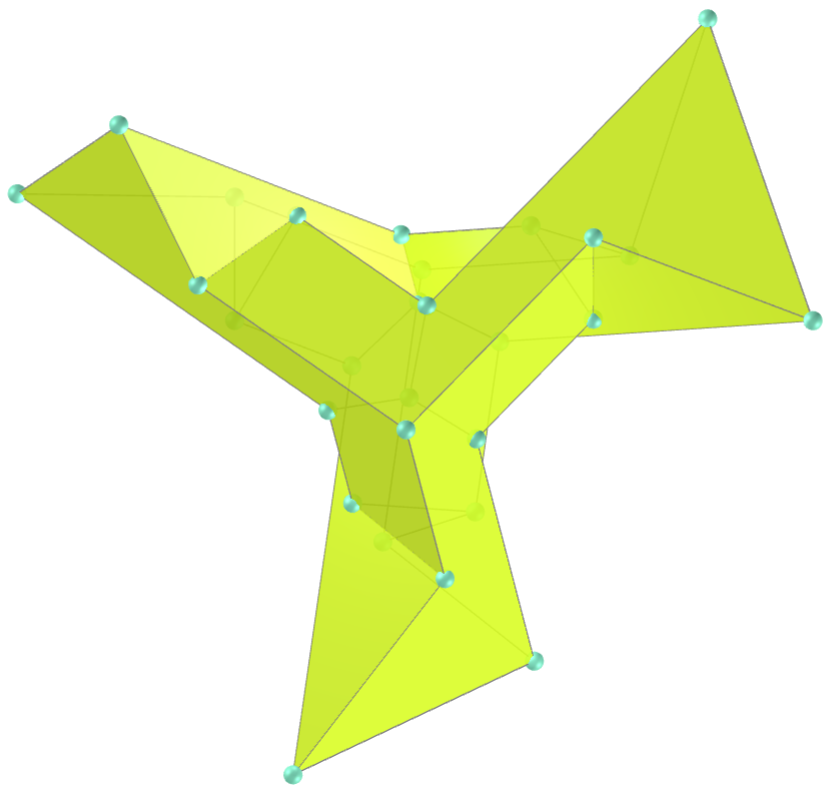</a>
  <b>faces:</b> 12 nonconvex heptagons | <b>vertices:</b> 28 | <b>edges:</b> 42
  

<h4>8. Heptagonal dodecahedron #8</h4>
<a href="vr/HeptagonalDodecahedron_H.htm" target="_blank" title="3D model" class="fotoA">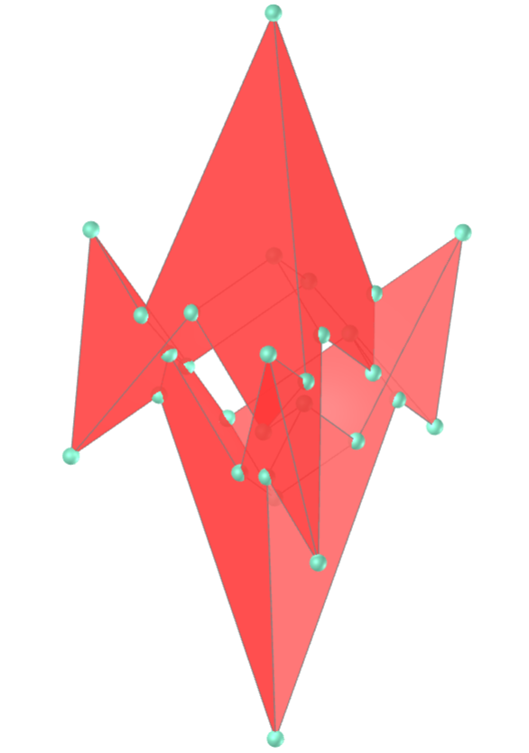</a>
  <b>faces:</b> 12 nonconvex heptagons | <b>vertices:</b> 28 | <b>edges:</b> 42
  

<h4>9. Heptagonal dodecahedron #9</h4>
<a href="vr/HeptagonalDodecahedron_I.htm" target="_blank" title="3D model" class="fotoA">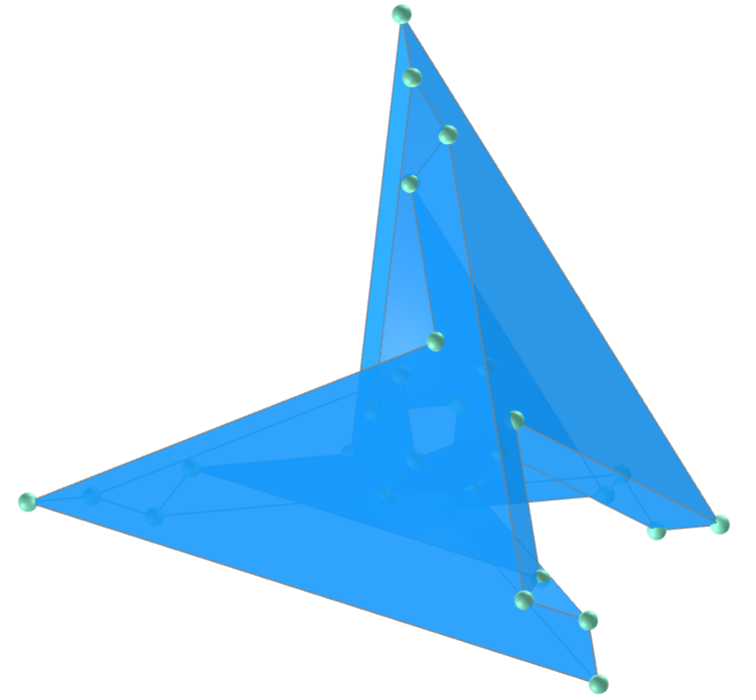</a>
  <b>faces:</b> 12 nonconvex heptagons | <b>vertices:</b> 28 | <b>edges:</b> 42
  

<h4>10. Heptagonal dodecahedron #10</h4>
<a href="vr/HeptagonalDodecahedron_J.htm" target="_blank" title="3D model" class="fotoA">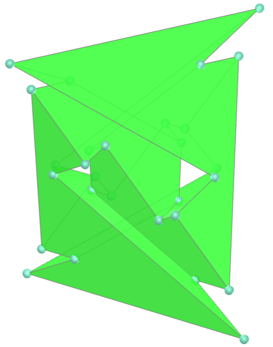</a>
  <b>faces:</b> 12 nonconvex heptagons | <b>vertices:</b> 28 | <b>edges:</b> 42
  

<a href="#p1" class="topo">back to top</a>

<h4>11. Heptagonal dodecahedron #11</h4>
<a href="vr/HeptagonalDodecahedron_K.htm" target="_blank" title="3D model" class="fotoA">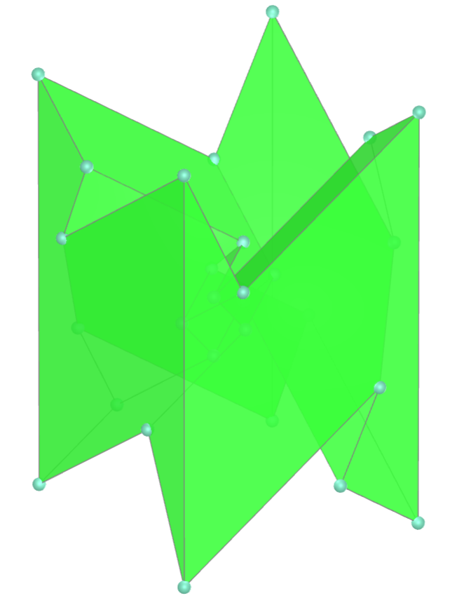</a>
  <b>faces:</b> 12 nonconvex heptagons | <b>vertices:</b> 28 | <b>edges:</b> 42
  

<h4>12. Klein cube bottle</h4>
<a href="vr/Cube.html" target="_blank" title="3D model" class="fotoA">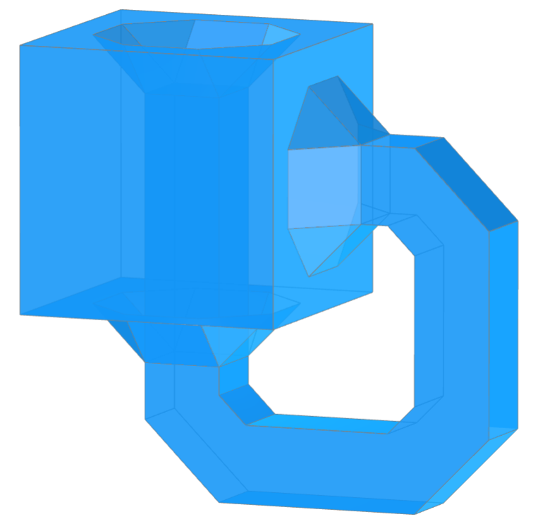</a>
  The Klein bottle is a closed, non-orientable surface, without interior or exterior, originally described by Felix Klein. This model of the Klein bottle was constructed using a cube, some prisms, and three cupolas.
  

<h4>13. Klein cube bottle v2</h4>
<a href="vr/Cube2.html" target="_blank" title="3D model" class="fotoA">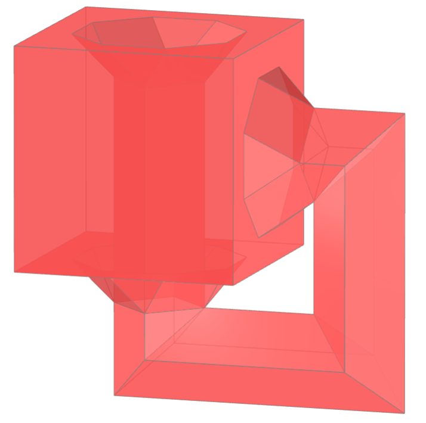</a>
  This model of the Klein bottle was constructed using a cube, some prisms, and three cupolas.
  

<h4>14. Klein cuboctahedron bottle</h4>
<a href="vr/Cuboctahedron.html" target="_blank" title="3D model" class="fotoA">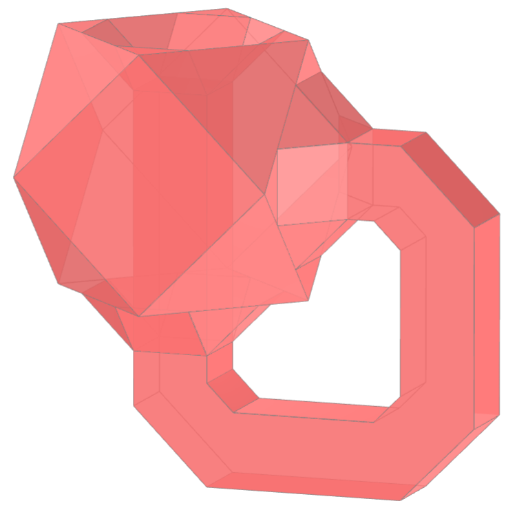</a>
  The Klein bottle is a closed, non-orientable surface, without interior or exterior, originally described by Felix Klein. This model of the Klein bottle was constructed using a cuboctahedron, some prisms, and three cupolas.
  

<h4>15. Klein cuboctahedron bottle v2</h4>
<a href="vr/Cuboctahedron2.html" target="_blank" title="3D model" class="fotoA">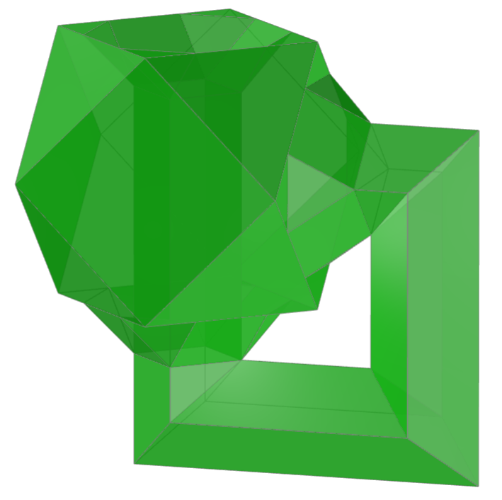</a>
  This model of the Klein bottle was constructed using a cuboctahedron, some prisms, and three cupolas.
  

<h4>16. Klein rhombicuboctahedron bottle</h4>
<a href="vr/Rhombicuboctahedron.html" target="_blank" title="3D model" class="fotoA">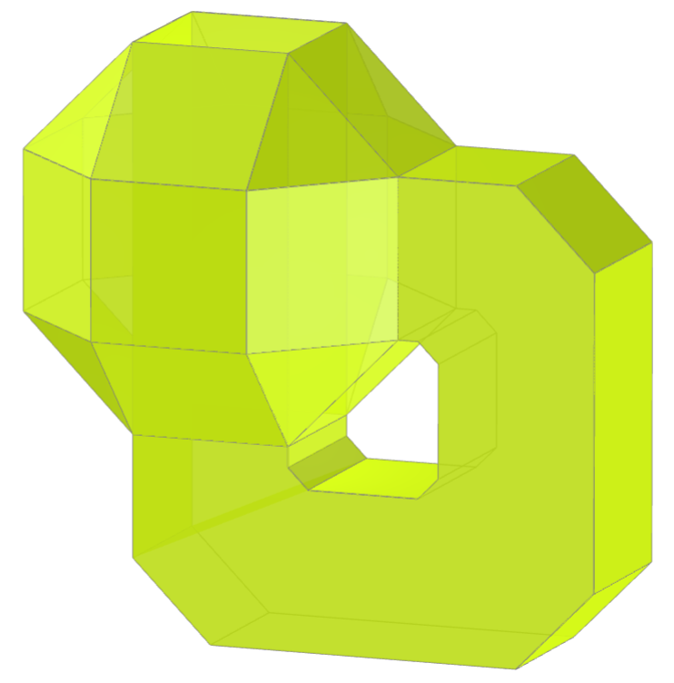</a>
  The Klein bottle is a closed, non-orientable surface, without interior or exterior, originally described by Felix Klein. This model of the Klein bottle was constructed using a rhombicuboctahedron and some prisms.
  

<h4>17. Klein rhombicuboctahedron bottle v2</h4>
<a href="vr/Rhombicuboctahedron2.html" target="_blank" title="3D model" class="fotoA">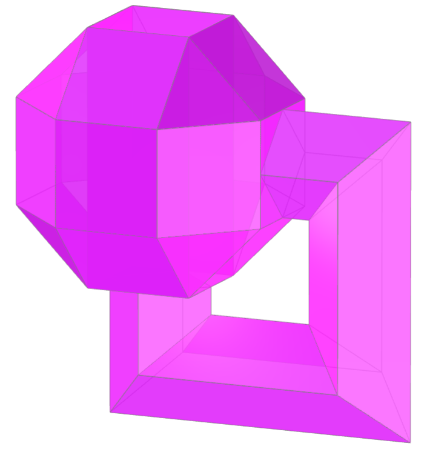</a>
  This model of the Klein bottle was constructed using a rhombicuboctahedron and some prisms.
  

<h4>18. Klein tetrakis hexahedron bottle</h4>
<a href="vr/TetrakisHexahedron.html" target="_blank" title="3D model" class="fotoA">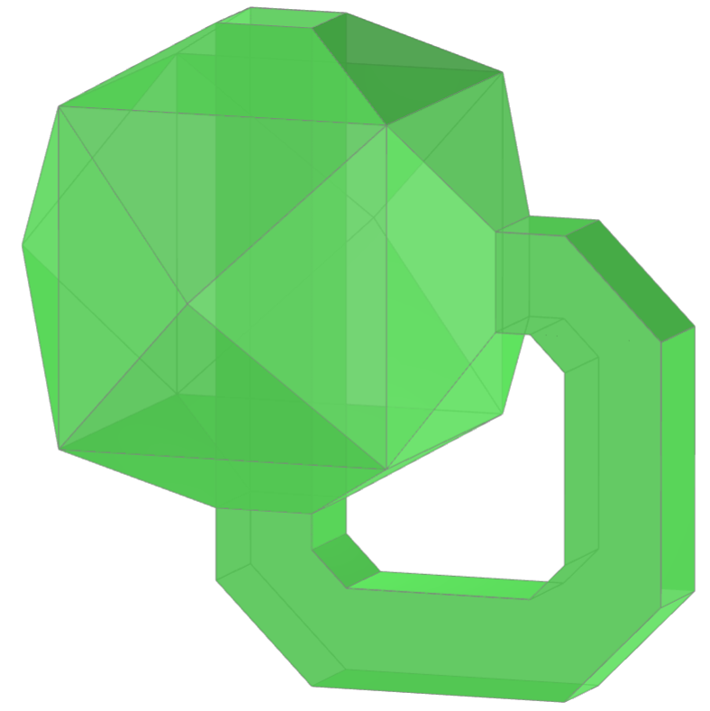</a>
  The Klein bottle is a closed, non-orientable surface, without interior or exterior, originally described by Felix Klein. This model of the Klein bottle was constructed using a tetrakis hexahedron and some prisms.
  

<h4>19. Klein truncated cube bottle</h4>
<a href="vr/TruncatedCube.html" target="_blank" title="3D model" class="fotoA">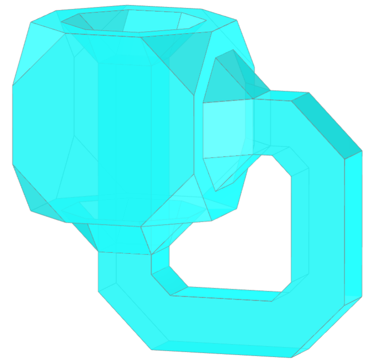</a>
  The Klein bottle is a closed, non-orientable surface, without interior or exterior, originally described by Felix Klein. This model of the Klein bottle was constructed using a truncated cube, some prisms, and three cupolas.
  

<h4>20. Klein truncated cube bottle v2</h4>

  This model of the Klein bottle was constructed using a truncated cube, some prisms, and three cupolas.
  

<a href="#p1" class="topo">back to top</a>

<h4>21. Klein truncated cuboctahedron bottle</h4>
<a href="vr/TruncatedCuboctahedron.html" target="_blank" title="3D model" class="fotoA">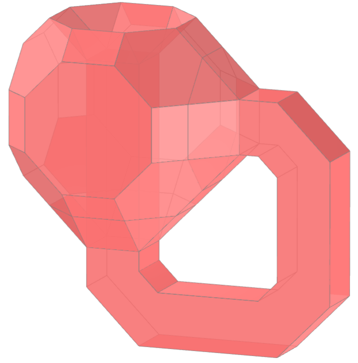</a>
  The Klein bottle is a closed, non-orientable surface, without interior or exterior, originally described by Felix Klein. This model of the Klein bottle was constructed using a truncated cuboctahedron, some prisms, and three cupolas.
  

<h4>22. Klein truncated cuboctahedron bottle v2</h4>
<a href="vr/TruncatedCuboctahedron2.html" target="_blank" title="3D model" class="fotoA">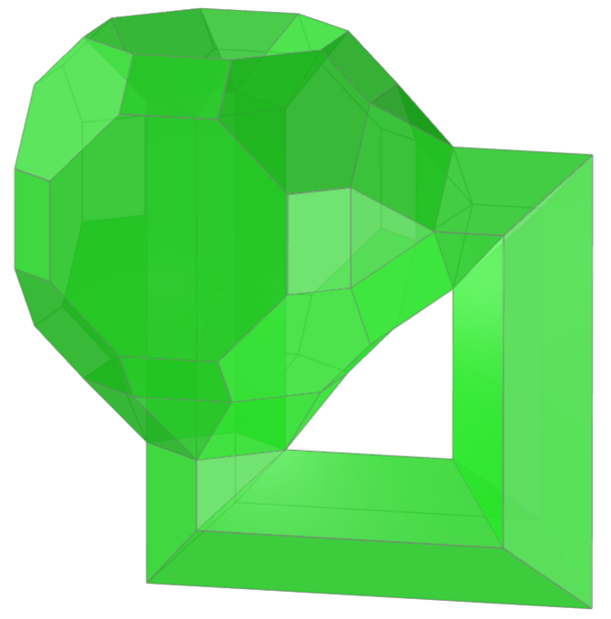</a>
  This model of the Klein bottle was constructed using a truncated cuboctahedron, some prisms, and three cupolas.
  

<h4>23. Klein truncated octahedron bottle</h4>
<a href="vr/TruncatedOctahedron.html" target="_blank" title="3D model" class="fotoA">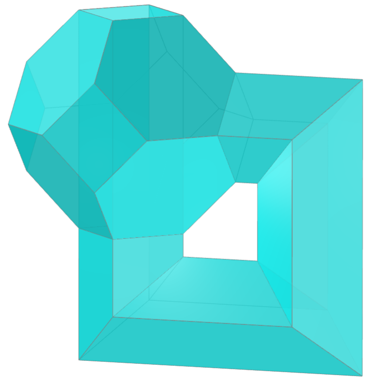</a>
  This model of the Klein bottle was constructed using a truncated octahedron and some prisms.
  

<a href="#p1" class="topo">back to top</a>

  Heptagonal dodecahedrons and Klein bottles: visualization of solids with Virtual Reality by <a xmlns:cc="http://creativecommons.org/ns#" href="https://paulohscwb.github.io/torus-toroids/heptadodekleinbottle/" property="cc:attributionName" rel="cc:attributionURL">Paulo Henrique Siqueira</a> is licensed with a license <a rel="license" href="http://creativecommons.org/licenses/by-nc-nd/4.0/">Creative Commons Attribution-NonCommercial-NoDerivatives 4.0 International</a>.

<h4>How to cite this work:</h4> 

Siqueira, P.H., "Heptagonal dodecahedrons and Klein bottles: visualization of solids with Virtual Reality". Available in: <https://paulohscwb.github.io/torus-toroids/heptadodekleinbottle/>, February 2026.

<!---->
  <b>References:</b>
 Weisstein, Eric W. "Torus" From MathWorld-A Wolfram Web Resource. <a href="https://mathworld.wolfram.com/Torus.html" target="_blank">https://mathworld.wolfram.com/Torus.html</a>
 Weisstein, Eric W. "Toroid" From MathWorld-A Wolfram Web Resource. <a href="https://mathworld.wolfram.com/Toroid.html" target="_blank">https://mathworld.wolfram.com/Toroid.html</a>
 Weisstein, Eric W. "Klein Bottle" From MathWorld-A Wolfram Web Resource. <a href="https://mathworld.wolfram.com/KleinBottle.html" target="_blank">https://mathworld.wolfram.com/KleinBottle.html</a>
 McCooey, D. I. "Visual Polyhedra". <a href="http://dmccooey.com/polyhedra/" target="_blank">http://dmccooey.com/polyhedra/</a>
