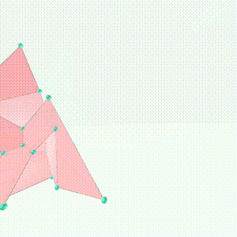

<link rel="stylesheet" href="../../scripts/style1.css">
<meta charset="utf-8">
<link rel="icon" type="image/png" href="../vr/salas/imagens/icone.png">
<h2>Toros e toroides: visualização dos sólidos com Realidade Aumentada (RA) e Realidade Virtual (RV) em A-frame</h2>
<b>autor:</b> Paulo Henrique Siqueira - Universidade Federal do Paraná
 <b>contato:</b> <a href="#"> paulohscwb@gmail.com </a>
 <a href="https://paulohscwb.github.io/torus-toroids/heptadodekleinbottle/">english version</a>
<form style="margin: 0 auto; float:right; text-align:right; width:100%; margin-bottom:15px;">
	<select id="url" onchange="urlHandler(this.value)" style="color:royalblue;">
		<option disabled selected>Mais sólidos:</option>
		<option value="../../basic/pt-br/">Toros e toroides</option>
		<option value="../../tetragonal/pt-br/">Toroides tetragonais</option>
		<option value="../../iris/pt-br/">Toroides de íris</option>
		<option value="../../regulartetrag/pt-br/">Toroides tetragonais regulares</option>
		<option value="../../mobiuscairo/pt-br/">Toroides de Möbius, Vélez-Jahn e Cairo</option>
		<option value="../../hexagonal/pt-br/">Toroides hexagonais</option>
		<option value="../../regular1/pt-br/">Toroides poligonais regulares e compostos 1</option>
		<option disabled value="../../heptadodekleinbottle/pt-br/">Dodecaedros heptagonais e garrafas de Klein</option>
		<!--<option value="../../regular2/pt-br/">Toroides poligonais regulares 2</option>
		<option value="../../regular3/pt-br/">Toroides poligonais regulares 3</option>
		<option value="../../rings/pt-br/">Anéis toroides</option>
		<option value="../../regular4/pt-br/">Toroides poligonais regulares 4</option>
		<option value="../../regular5/pt-br/">Toroides poligonais regulares 5</option>-->
	</select>
</form>

  <h2 align="center"> Dodecaedros heptagonais e garrafas de Klein</h2>
Um sólido toroidal ou toroide é um poliedro orientável sem autointerseções que tem gênero maior que zero (o que significa que contém um ou mais buracos). O gênero (G) de um poliedro orientável está relacionado ao número de vértices (V), faces (F) e arestas (E) da seguinte forma:

V + F − E = 2 − 2 * G

Este trabalho mostra dodecaedros heptagonais e garrafas de Klein modelados em 3D, com as visualizações que podem ser acessadas com recursos em salas de Realidade Virtual imersivas.
 
<a href="#m3d">Modelos 3D</a>&nbsp;&nbsp;|&nbsp;&nbsp;<a href="../../pt-br/">Página Inicial</a>

 

  

  

<h3 id="m3d" align="center">Modelos 3D</h3>
<iframe width="560" height="315" style="max-width:100%" src="https://www.youtube.com/embed/videoseries?list=PLy0I_lGW8HxWftZAnbAu27vnaGV95cStK" title="YouTube video player" frameborder="0" allow="accelerometer; autoplay; clipboard-write; encrypted-media; gyroscope; picture-in-picture; web-share" allowfullscreen></iframe>
<h4>1. Dodecaedro heptagonal #1</h4>

  <b>faces:</b> 12 heptágonos não convexos | <b>vértices:</b> 28| <b>arestas:</b> 42
  

<h4>2. Dodecaedro heptagonal #2</h4>

  <b>faces:</b> 12 heptágonos não convexos | <b>vértices:</b> 28 | <b>arestas:</b> 42
  

<h4>3. Dodecaedro heptagonal #3</h4>

  <b>faces:</b> 12 heptágonos não convexos | <b>vértices:</b> 28 | <b>arestas:</b> 42
  

<h4>4. Dodecaedro heptagonal #4</h4>

  <b>faces:</b> 12 heptágonos não convexos | <b>vértices:</b> 28 | <b>arestas:</b> 42
  

<h4>5. Dodecaedro heptagonal #5</h4>

  <b>faces:</b> 12 heptágonos não convexos | <b>vértices:</b> 28 | <b>arestas:</b> 42
  

<h4>6. Dodecaedro heptagonal #6</h4>

  <b>faces:</b> 12 heptágonos não convexos | <b>vértices:</b> 28 | <b>arestas:</b> 42
  

<h4>7. Dodecaedro heptagonal #7</h4>

  <b>faces:</b> 12 heptágonos não convexos | <b>vértices:</b> 28 | <b>arestas:</b> 42
  

<h4>8. Dodecaedro heptagonal #8</h4>

  <b>faces:</b> 12 heptágonos não convexos | <b>vértices:</b> 28 | <b>arestas:</b> 42
  

<h4>9. Dodecaedro heptagonal #9</h4>

  <b>faces:</b> 12 heptágonos não convexos | <b>vértices:</b> 28 | <b>arestas:</b> 42
  

<h4>10. Dodecaedro heptagonal #10</h4>

  <b>faces:</b> 12 heptágonos não convexos | <b>vértices:</b> 28 | <b>arestas:</b> 42
  

<a href="#p1" class="topo">voltar ao topo</a>

<h4>11. Dodecaedro heptagonal #11</h4>

  <b>faces:</b> 12 heptágonos não convexos | <b>vértices:</b> 28 | <b>arestas:</b> 42
  

<h4>12. Garrafa de Klein de cubo</h4>

  A garrafa de Klein é uma superfície fechada e não orientável, sem interior ou exterior, originalmente descrita por Felix Klein. Este modelo de garrafa de Klein foi construído com um cubo, alguns prismas e três cupolas.
  

<h4>13. Garrafa de Klein de cubo v2</h4>

   Este modelo de garrafa de Klein foi construído com um cubo, alguns prismas e três cupolas.
  

<h4>14. Garrafa de Klein de cuboctaedro</h4>

  A garrafa de Klein é uma superfície fechada e não orientável, sem interior ou exterior, originalmente descrita por Felix Klein. Este modelo de garrafa de Klein foi construído com um cuboctaedro, alguns prismas e três cupolas.
  

<h4>15. Garrafa de Klein de cuboctaedro v2</h4>

   Este modelo de garrafa de Klein foi construído com um cuboctaedro, alguns prismas e três cupolas.
  

<h4>16. Garrafa de Klein de rombicuboctaedro</h4>

  A garrafa de Klein é uma superfície fechada e não orientável, sem interior ou exterior, originalmente descrita por Felix Klein. Este modelo de garrafa de Klein foi construído com um rombicuboctaedro e alguns prismas.
  

<h4>17. Garrafa de Klein de rombicuboctaedro v2</h4>

  Este modelo de garrafa de Klein foi construído com um rombicuboctaedro e alguns prismas.
  

<h4>18. Garrafa de Klein de hexaedro tetrakis</h4>

  A garrafa de Klein é uma superfície fechada e não orientável, sem interior ou exterior, originalmente descrita por Felix Klein. Este modelo de garrafa de Klein foi construído com um hexaedro tetrakis e alguns prismas.
  

<h4>19. Garrafa de Klein de cubo truncado</h4>

  A garrafa de Klein é uma superfície fechada e não orientável, sem interior ou exterior, originalmente descrita por Felix Klein. Este modelo de garrafa de Klein foi construído com um cubo truncado, alguns prismas e três cupolas.
  

<h4>20. Garrafa de Klein de cubo truncado v2</h4>

  Este modelo de garrafa de Klein foi construído com um cubo truncado, alguns prismas e três cupolas.
  

<a href="#p1" class="topo">voltar ao topo</a>

<h4>21. Garrafa de Klein de cuboctaedro truncado</h4>

  A garrafa de Klein é uma superfície fechada e não orientável, sem interior ou exterior, originalmente descrita por Felix Klein. Este modelo de garrafa de Klein foi construído com um cuboctaedro truncado, alguns prismas e três cupolas.
  

<h4>22. Garrafa de Klein de cuboctaedro truncado v2</h4>

  Este modelo de garrafa de Klein foi construído com um cuboctaedro truncado, alguns prismas e três cupolas.
  

<h4>23. Garrafa de Klein de octaedro truncado</h4>

  Este modelo de garrafa de Klein foi construído com um octaedro truncado e alguns prismas.
  

<a href="#p1" class="topo">voltar ao topo</a>

  Heptagonal dodecahedrons and Klein bottles: visualization of solids with Virtual Reality de <a xmlns:cc="http://creativecommons.org/ns#" href="https://paulohscwb.github.io/torus-toroids/heptadodekleinbottle/pt-br/" property="cc:attributionName" rel="cc:attributionURL">Paulo Henrique Siqueira</a> está licenciado com uma Licença <a rel="license" href="http://creativecommons.org/licenses/by-nc-nd/4.0/">Creative Commons Atribuição-NãoComercial-SemDerivações 4.0 Internacional</a>.

<h4>Como citar este trabalho:</h4> 

Siqueira, P.H., "Heptagonal dodecahedrons and Klein bottles: visualization of solids with Virtual Reality". Disponível em: <https://paulohscwb.github.io/torus-toroids/heptadodekleinbottle/pt-br/>, Fevereiro de 2026.

<!---->
  <b>Referências:</b>
 Weisstein, Eric W. "Torus" From MathWorld-A Wolfram Web Resource. <a href="https://mathworld.wolfram.com/Torus.html" target="_blank">https://mathworld.wolfram.com/Torus.html</a>
 Weisstein, Eric W. "Toroid" From MathWorld-A Wolfram Web Resource. <a href="https://mathworld.wolfram.com/Toroid.html" target="_blank">https://mathworld.wolfram.com/Toroid.html</a>
 Weisstein, Eric W. "Klein Bottle" From MathWorld-A Wolfram Web Resource. <a href="https://mathworld.wolfram.com/KleinBottle.html" target="_blank">https://mathworld.wolfram.com/KleinBottle.html</a>
 McCooey, D. I. "Visual Polyhedra". <a href="http://dmccooey.com/polyhedra/" target="_blank">http://dmccooey.com/polyhedra/</a>