<link rel="stylesheet" href="../scripts/style1.css">
<meta charset="utf-8">
<link rel="icon" type="image/png" href="vr/salas/imagens/icone.png">
<h2>Torus and Toroids: visualization of solids with Augmented Reality (AR) and Virtual Reality (VR) in A-frame</h2>
 <b>author:</b> Paulo Henrique Siqueira - Universidade Federal do Paraná
  <b>contact:</b> <a href="#">paulohscwb@gmail.com</a>
  <a href="https://paulohscwb.github.io/torus-toroids/hexagonal/pt-br/">versão em português</a>
 <form style="margin: 0 auto; float:right; text-align:right; width:100%; margin-bottom:15px;">
	<select id="url" onchange="urlHandler(this.value)" style="color:royalblue;">
		<option disabled selected value>More solids:</option>
		<option value="../basic/">Torus and toroids</option>
		<option value="../tetragonal/">Tetragonal toroids</option>
		<option value="../iris/">Iris toroids</option>
		<option value="../regulartetrag/">Regular tetragonal toroids</option>
		<option value="../mobiuscairo/">Möbius, Vélez-Jahn and Cairo toroids</option>
		<option disabled value="../hexagonal/">Hexagonal toroids</option>
		<option value="../regular1/">Regular polygonal and composition toroids 1</option>
		<!--<option value="../heptagonal/">Heptagonal dodecahedrons</option>
		<option value="../regular2/">Regular polygonal toroids 2</option>
		<option value="../regular3/">Regular polygonal toroids 3</option>
		<option value="../rings/">Rings toroids</option>
		<option value="../regular4/">Regular polygonal toroids 4</option>
		<option value="../regular5/">Regular polygonal toroids 5</option>-->
	</select>
</form>

  <h2 align="center"> Hexagonal toroids</h2>
A toroidal solid or toroid, is an orientable polyhedron without self-intersections that has genus greater than zero (meaning that it contains one or more holes). An orientable polyhedron's genus (G) is related to the number of vertices (V), faces (F), and edges (E) as follows:

V + F − E = 2 − 2 * G

This work shows hexagonal toroids modeled in 3D, with views that can be accessed with resources in immersive Virtual Reality rooms.
 
<a href="#m3d">3D Models</a>&nbsp;&nbsp;|&nbsp;&nbsp;<a href="../">Home</a>

 

 
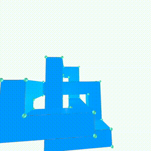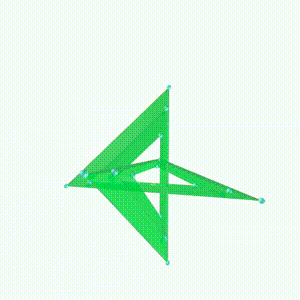

<h3 id="m3d" align="center">3D models</h3>
<iframe width="560" height="315" style="max-width:100%" src="https://www.youtube.com/embed/videoseries?list=PLy0I_lGW8HxXgcL9RxOVEfCA1KDLByHZt" title="YouTube video player" frameborder="0" allow="accelerometer; autoplay; clipboard-write; encrypted-media; gyroscope; picture-in-picture; web-share" allowfullscreen></iframe>
<h4>1. Hexagonal antiprism trapezohedron toroid</h4>
<a href="vr/HexagonalAntiprismTrapezohedronToroid.htm" target="_blank" title="3D model" class="fotoA">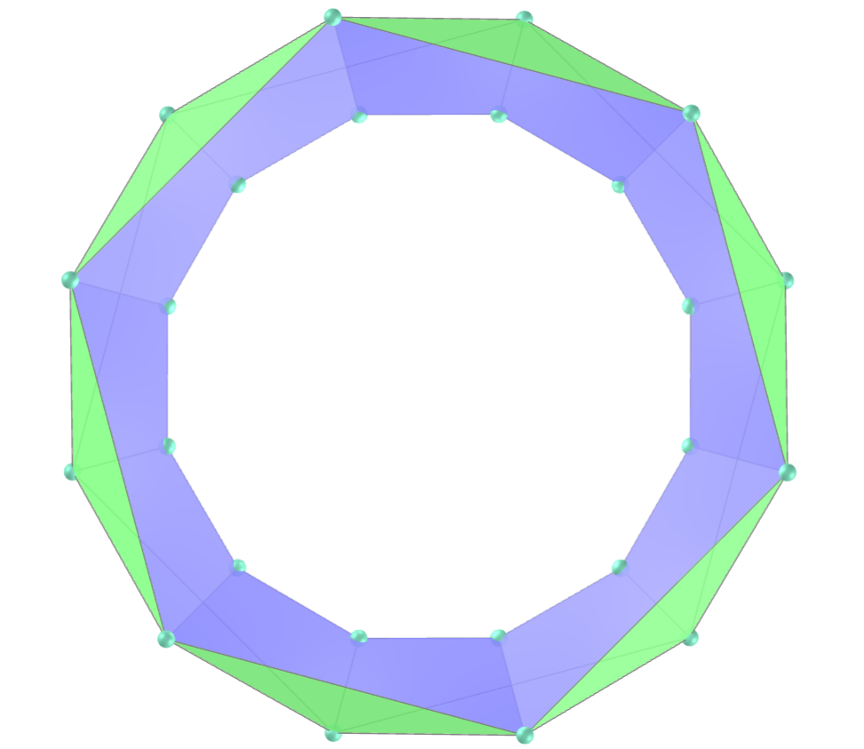</a>
  <b>faces:</b> 12 triangles and 12 pentagons | <b>vertices:</b> 12 | <b>edges:</b> 48
  

<h4>2. Hexagonal trapezohedron antiprism toroid</h4>
<a href="vr/HexagonalTrapezohedronAntiprismToroid.htm" target="_blank" title="3D model" class="fotoA">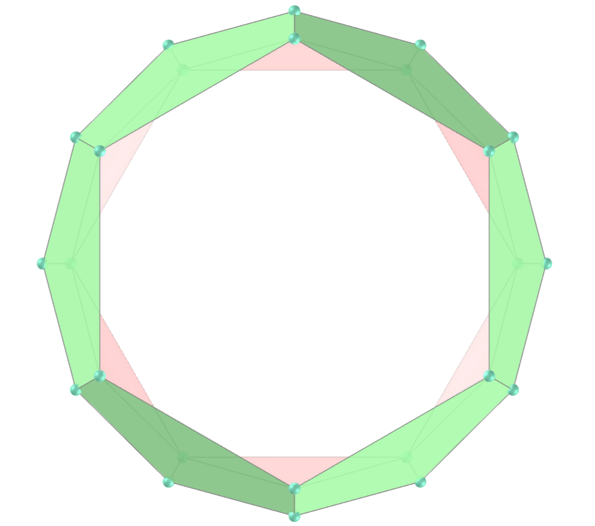</a>
  <b>faces:</b> 12 triangles and 12 pentagons | <b>vertices:</b> 12 | <b>edges:</b> 48
  

<h4>3. Hexagonal trapezohedron toroid</h4>
<a href="vr/HexagonalTrapezohedronToroid.htm" target="_blank" title="3D model" class="fotoA">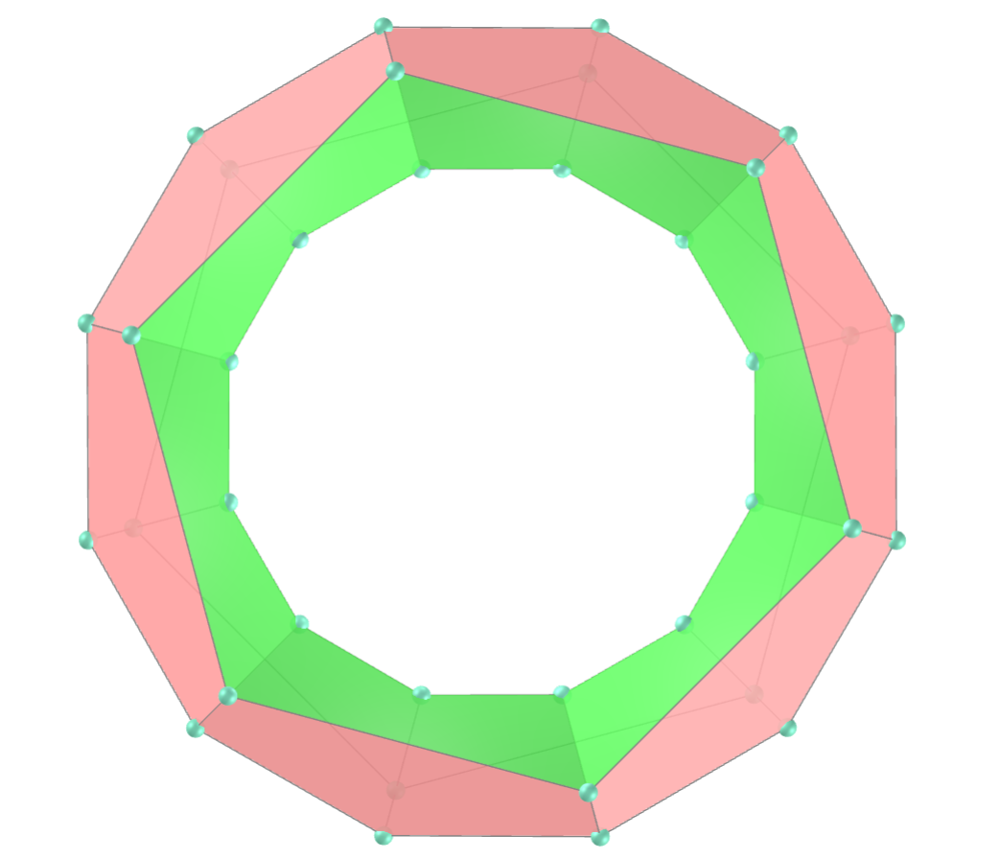</a>
  <b>faces:</b> 24 pentagons (12 convex and 12 nonconvex) | <b>vertices:</b> 36 | <b>edges:</b> 60
  

<h4>4. Knotted dodecahedron</h4>
<a href="vr/KnottedDodecahedron.htm" target="_blank" title="3D model" class="fotoA">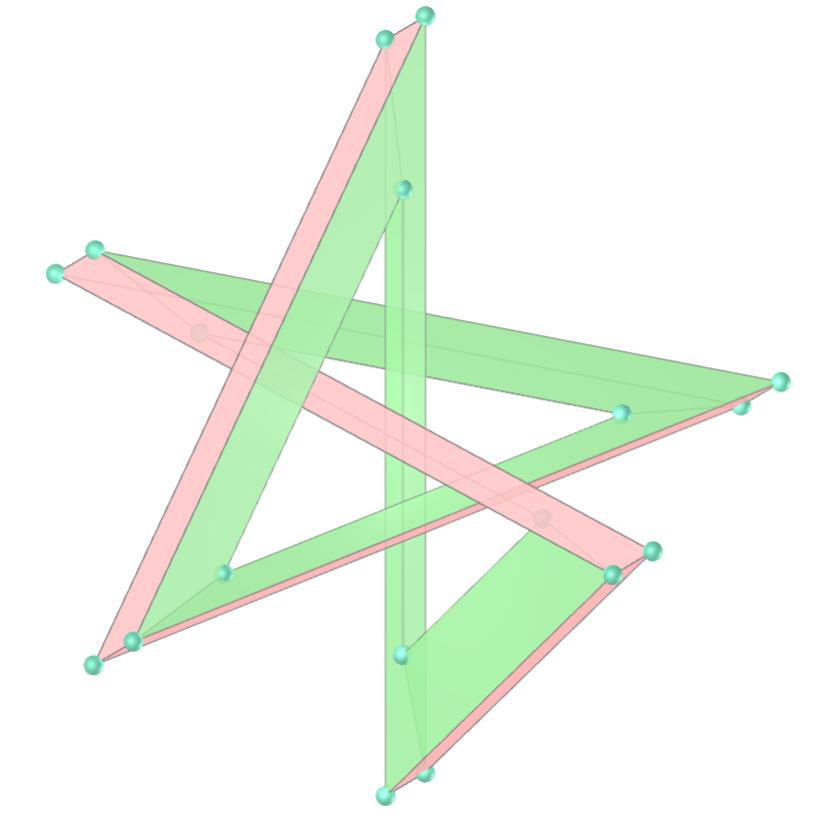</a>
  <b>faces:</b> 6 hexagons and 6 parallelograms | <b>vertices:</b> 18 | <b>edges:</b> 30
  

<h4>5. Szilassi toroid</h4>
<a href="vr/Szilassi.htm" target="_blank" title="3D model" class="fotoA">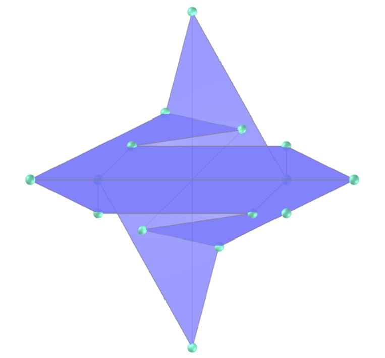</a>
  <b>faces:</b> 7 hexagons (1 convex and 6 nonconvex) | <b>vertices:</b> 14 | <b>edges:</b> 21
  

<h4>6. Hexagonal toroid #1</h4>
<a href="vr/HexagonalToroidA.htm" target="_blank" title="3D model" class="fotoA">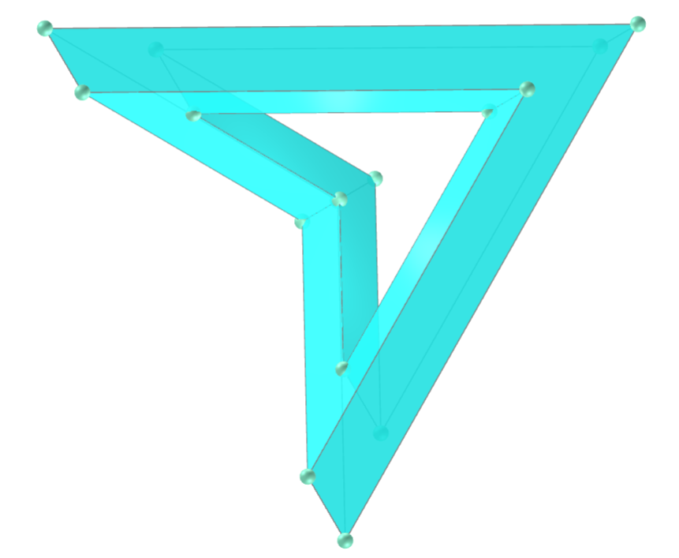</a>
  <b>faces:</b> 8 nonconvex hexagons | <b>vertices:</b> 16 | <b>edges:</b> 24
  

<h4>7. Hexagonal Toroid #2</h4>
<a href="vr/HexagonalToroidB.htm" target="_blank" title="3D model" class="fotoA">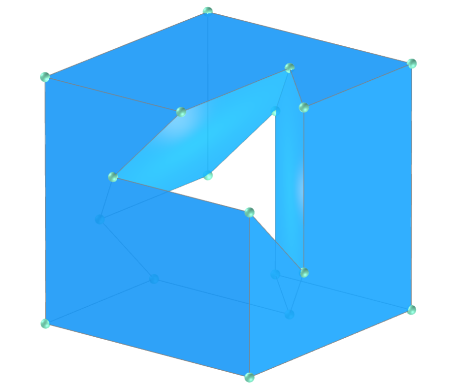</a>
  <b>faces:</b> 9 hexagons (3 convex and 6 nonconvex) | <b>vertices:</b> 18 | <b>edges:</b> 27
  

<h4>8. Hexagonal Toroid #3</h4>
<a href="vr/HexagonalToroidC.htm" target="_blank" title="3D model" class="fotoA">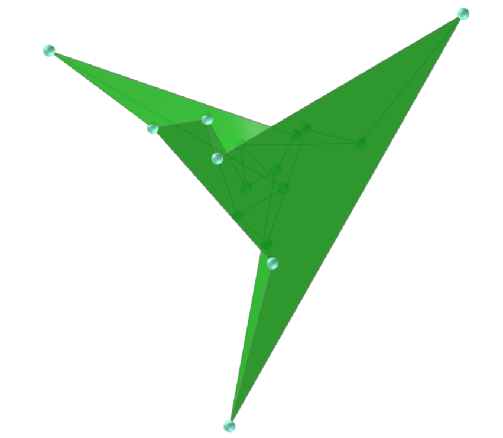</a>
  <b>faces:</b> 8 nonconvex hexagons | <b>vertices:</b> 16 | <b>edges:</b> 24
  

<h4>9. Hexagonal Toroid #4</h4>
<a href="vr/HexagonalToroidD.htm" target="_blank" title="3D model" class="fotoA">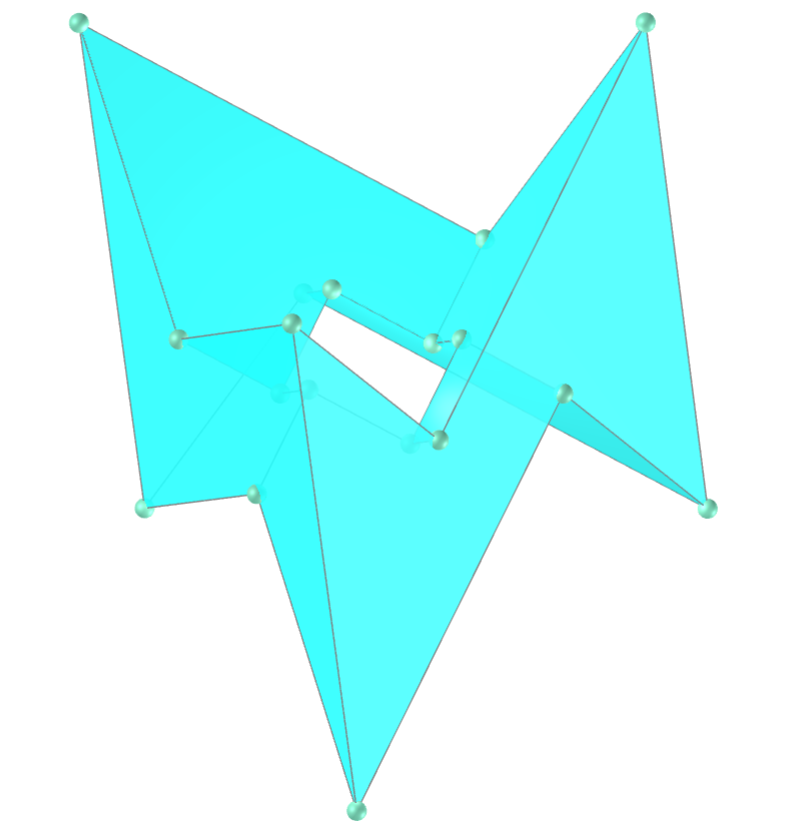</a>
  <b>faces:</b> 9 nonconvex hexagons | <b>vertices:</b> 18 | <b>edges:</b> 27
  

<h4>10. Hexagonal Toroid #5</h4>
<a href="vr/HexagonalToroidE.htm" target="_blank" title="3D model" class="fotoA">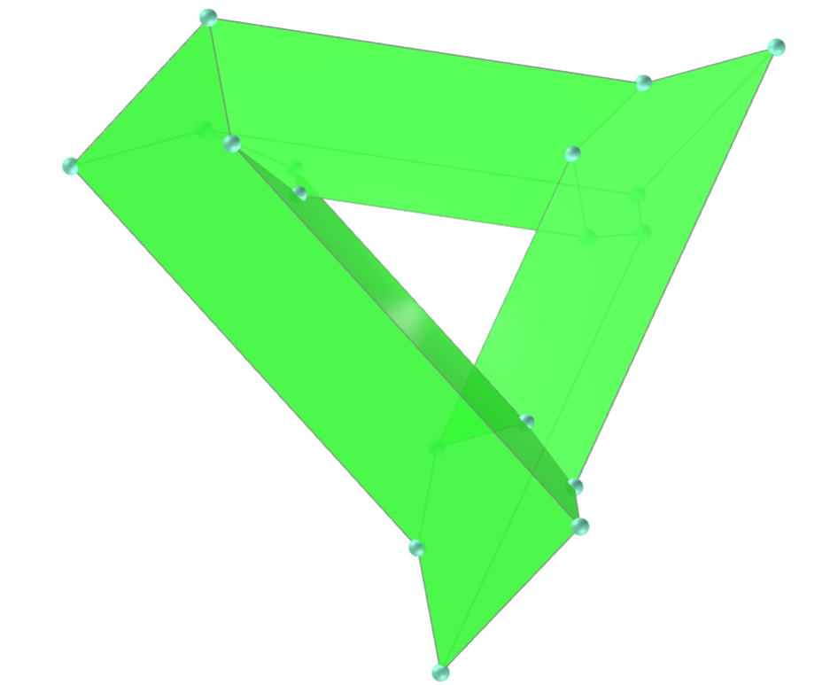</a>
  <b>faces:</b> 9 nonconvex hexagons | <b>vertices:</b> 18 | <b>edges:</b> 27
  

<a href="#p1" class="topo">back to top</a>

<h4>11. Hexagonal Toroid #6</h4>
<a href="vr/HexagonalToroidF.htm" target="_blank" title="3D model" class="fotoA">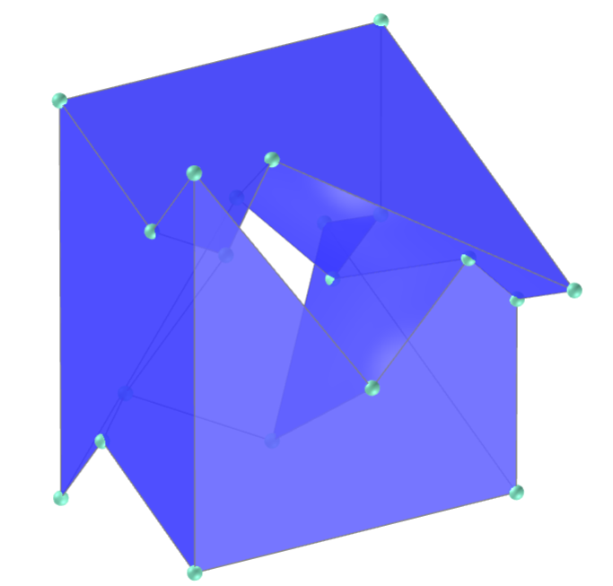</a>
  <b>faces:</b> 10 nonconvex hexagons | <b>vertices:</b> 20 | <b>edges:</b> 30
  

<h4>12. Hexagonal Toroid #7</h4>
<a href="vr/HexagonalToroidG.htm" target="_blank" title="3D model" class="fotoA">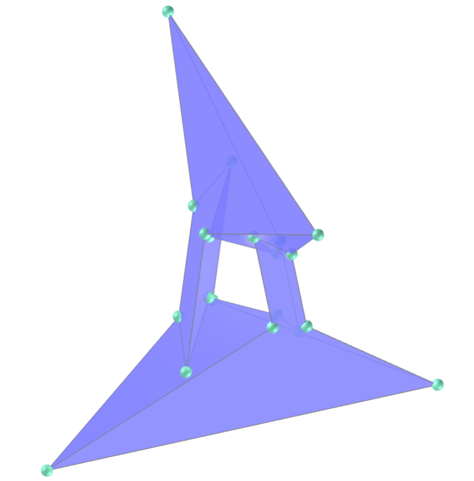</a>
  <b>faces:</b> 10 nonconvex hexagons | <b>vertices:</b> 20 | <b>edges:</b> 30
  

<h4>13. Hexagonal Toroid #8</h4>
<a href="vr/HexagonalToroidH.htm" target="_blank" title="3D model" class="fotoA">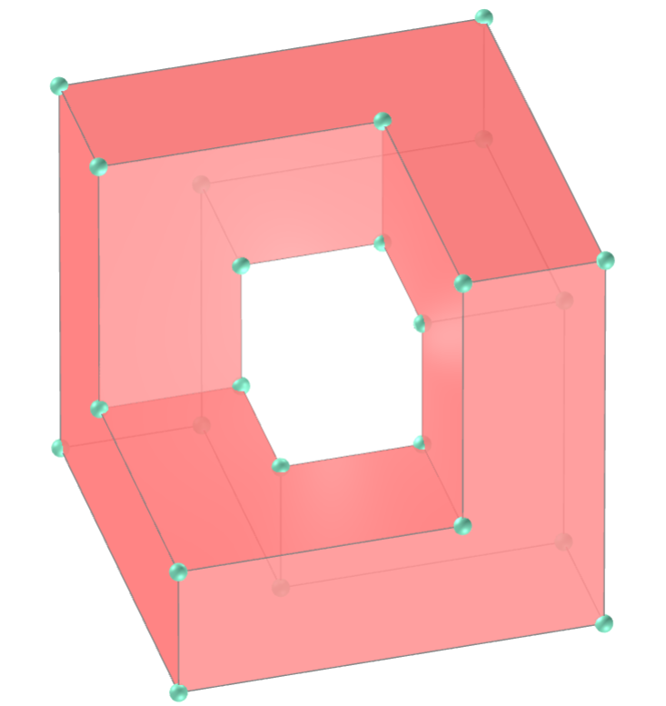</a>
  <b>faces:</b> 12 nonconvex hexagons | <b>vertices:</b> 24 | <b>edges:</b> 36
  

<h4>14. Hexagonal Toroid #9</h4>
<a href="vr/HexagonalToroidI.htm" target="_blank" title="3D model" class="fotoA">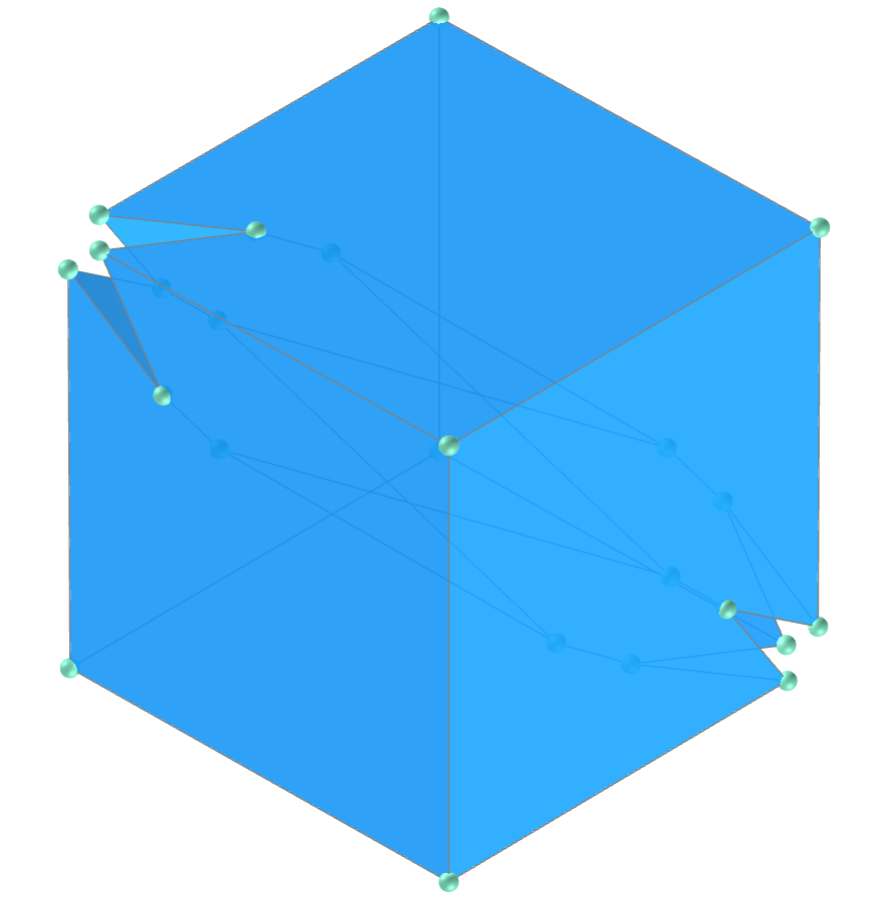</a>
  <b>faces:</b> 12 nonconvex hexagons | <b>vertices:</b> 24 | <b>edges:</b> 36
  

<h4>15. Hexagonal Toroid #10</h4>
<a href="vr/HexagonalToroidJ.htm" target="_blank" title="3D model" class="fotoA">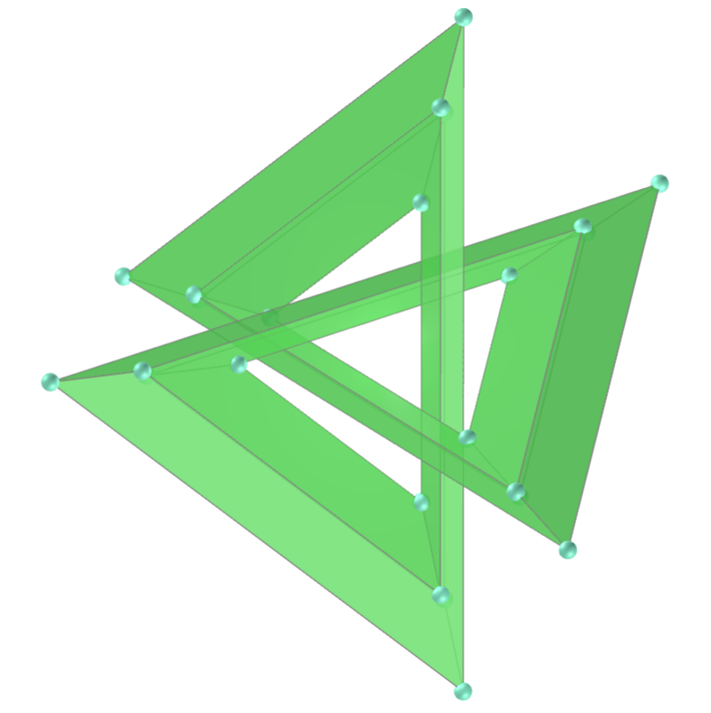</a>
  <b>faces:</b> 12 nonconvex hexagons | <b>vertices:</b> 24 | <b>edges:</b> 36
  

<h4>16. Hexagonal Toroid #11</h4>
<a href="vr/HexagonalToroidK.htm" target="_blank" title="3D model" class="fotoA">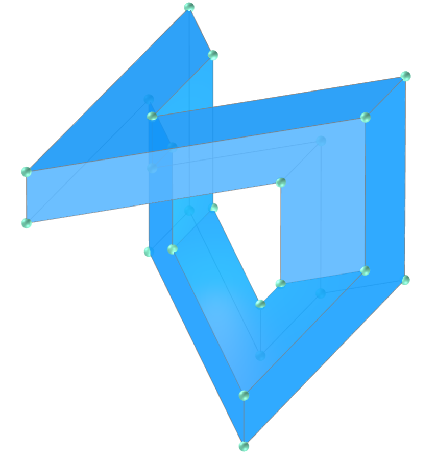</a>
  <b>faces:</b> 12 nonconvex hexagons | <b>vertices:</b> 24 | <b>edges:</b> 36
  

<h4>17. Hexagonal Toroid #12</h4>
<a href="vr/HexagonalToroidL.htm" target="_blank" title="3D model" class="fotoA">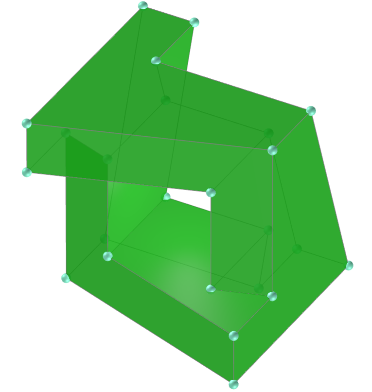</a>
  <b>faces:</b> 12 nonconvex hexagons | <b>vertices:</b> 24 | <b>edges:</b> 36
  

<h4>18. Hexagonal Toroid #13</h4>
<a href="vr/HexagonalToroidM.htm" target="_blank" title="3D model" class="fotoA">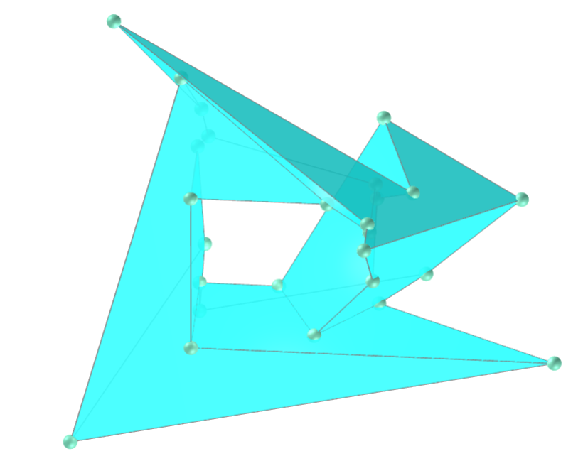</a>
  <b>faces:</b> 13 nonconvex hexagons | <b>vertices:</b> 26 | <b>edges:</b> 39
  

<h4>19. Hexagonal Toroid #14</h4>
<a href="vr/HexagonalToroidN.htm" target="_blank" title="3D model" class="fotoA">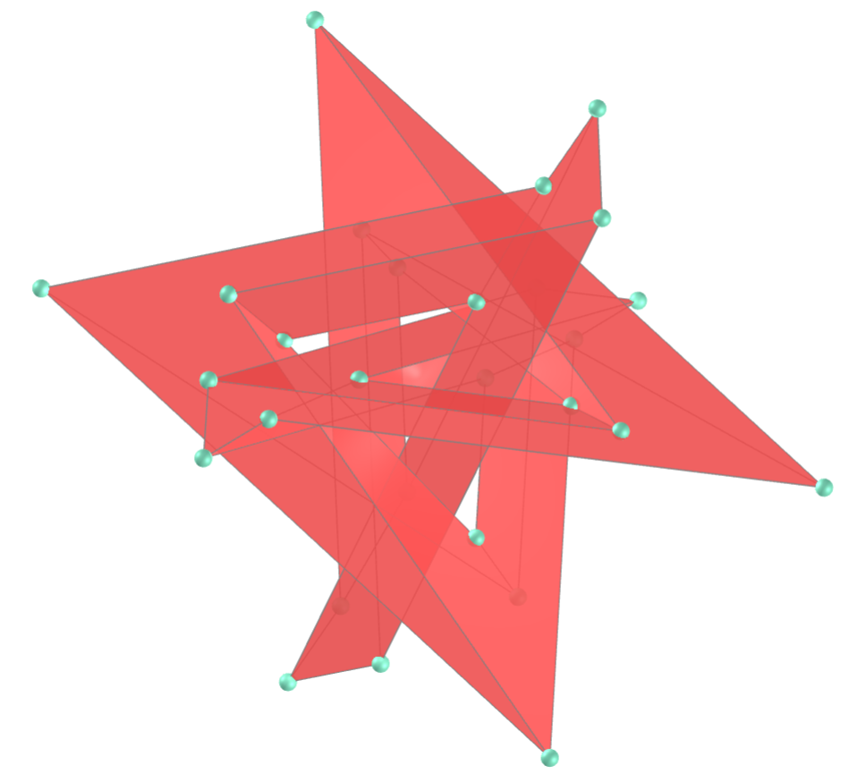</a>
  <b>faces:</b> 14 hexagons (2 convex and 12 nonconvex) | <b>vertices:</b> 28 | <b>edges:</b> 42
  

<h4>20. Hexagonal Toroid #15</h4>
<a href="vr/HexagonalToroidO.htm" target="_blank" title="3D model" class="fotoA">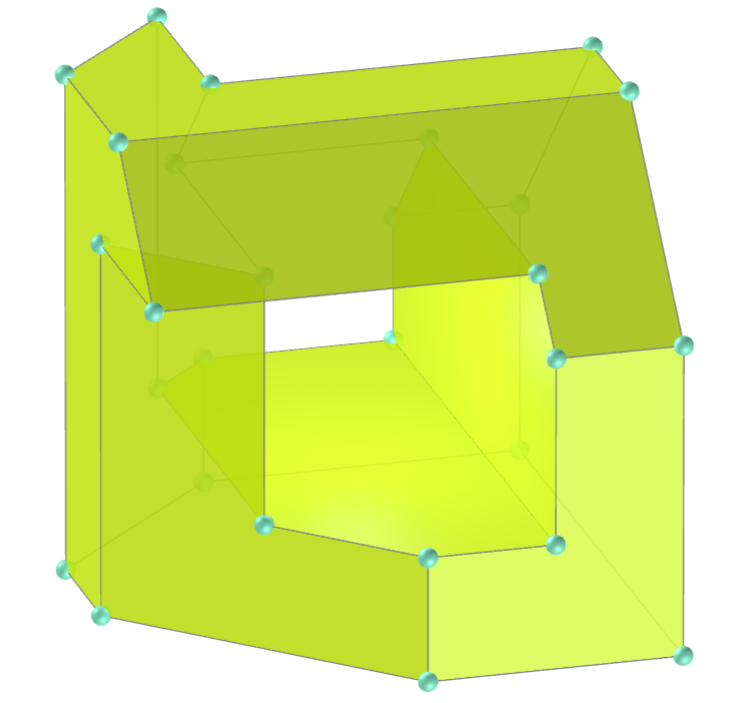</a>
  <b>faces:</b> 14 hexagons (4 convex and 10 nonconvex) | <b>vertices:</b> 28 | <b>edges:</b> 42
  

<a href="#p1" class="topo">back to top</a>

<h4>21. Hexagonal Toroid #16</h4>
<a href="vr/HexagonalToroidP.htm" target="_blank" title="3D model" class="fotoA">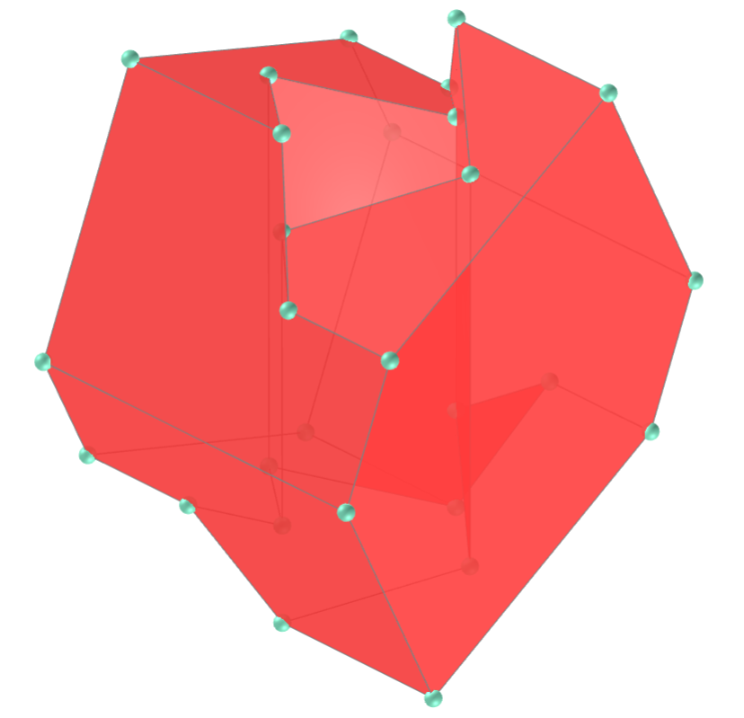</a>
  <b>faces:</b> 14 hexagons (2 convex and 12 nonconvex) | <b>vertices:</b> 28 | <b>edges:</b> 42
  

<h4>22. Hexagonal Toroid #17</h4>
<a href="vr/HexagonalToroidQ.htm" target="_blank" title="3D model" class="fotoA">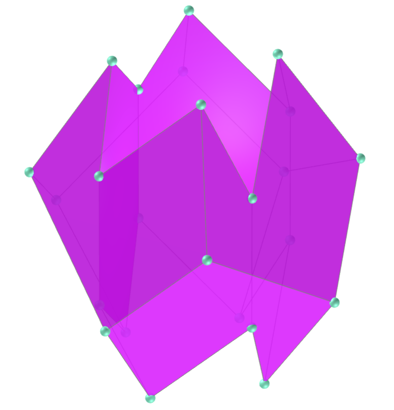</a>
  <b>faces:</b> 12 hexagons (4 convex and 8 nonconvex) | <b>vertices:</b> 24 | <b>edges:</b> 36
  

<h4>23. Hexagonal Toroid #18</h4>
<a href="vr/HexagonalToroidR.htm" target="_blank" title="3D model" class="fotoA">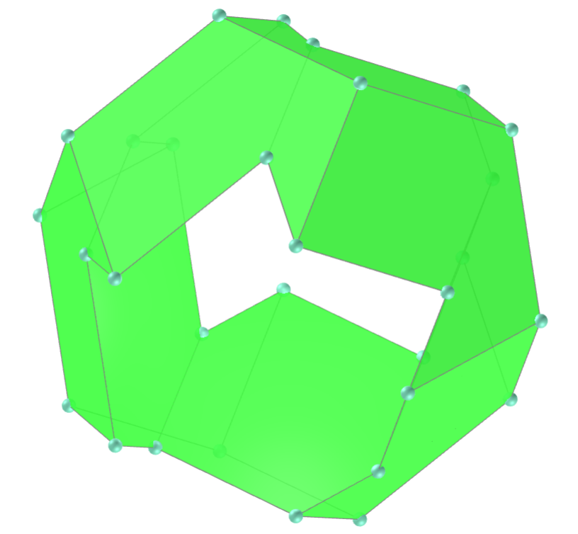</a>
  <b>faces:</b> 15 hexagons (5 convex and 10 nonconvex) | <b>vertices:</b> 30 | <b>edges:</b> 45
  

<h4>24. Hexagonal Toroid #19</h4>
<a href="vr/HexagonalToroidS.htm" target="_blank" title="3D model" class="fotoA">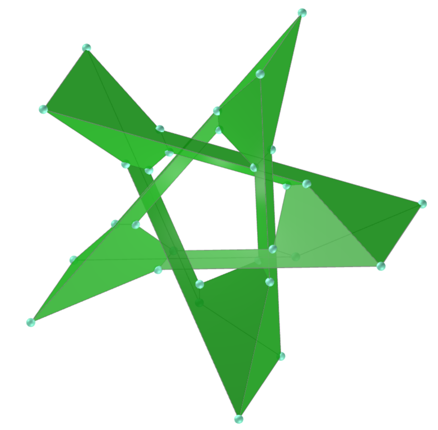</a>
  <b>faces:</b> 15 nonconvex hexagons | <b>vertices:</b> 30 | <b>edges:</b> 45
  

<h4>25. Hexagonal Toroid #20</h4>
<a href="vr/HexagonalToroidT.htm" target="_blank" title="3D model" class="fotoA">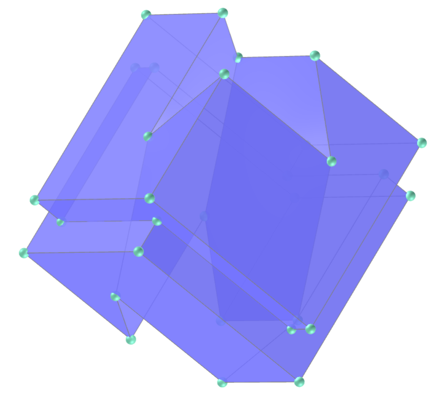</a>
  <b>faces:</b> 15 hexagons (3 convex and 12 nonconvex) | <b>vertices:</b> 30 | <b>edges:</b> 45
  

<h4>26. Hexagonal Toroid #21</h4>
<a href="vr/HexagonalToroidU.htm" target="_blank" title="3D model" class="fotoA">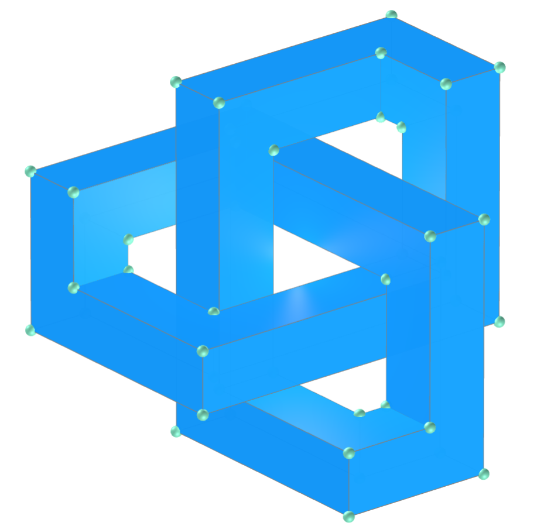</a>
  <b>faces:</b> 24 nonconvex hexagons | <b>vertices:</b> 48 | <b>edges:</b> 72
  

<a href="#p1" class="topo">back to top</a>

  Hexagonal toroids: visualization of solids with Virtual Reality by <a xmlns:cc="http://creativecommons.org/ns#" href="https://paulohscwb.github.io/torus-toroids/hexagonal/" property="cc:attributionName" rel="cc:attributionURL">Paulo Henrique Siqueira</a> is licensed with a license <a rel="license" href="http://creativecommons.org/licenses/by-nc-nd/4.0/">Creative Commons Attribution-NonCommercial-NoDerivatives 4.0 International</a>.

<h4>How to cite this work:</h4> 

Siqueira, P.H., "Hexagonal toroids: visualization of solids with Virtual Reality". Available in: <https://paulohscwb.github.io/torus-toroids/hexagonal/>, September 2025.

<!---->
  <b>References:</b>
 Weisstein, Eric W. "Torus" From MathWorld-A Wolfram Web Resource. <a href="https://mathworld.wolfram.com/Torus.html" target="_blank">https://mathworld.wolfram.com/Torus.html</a>
 Weisstein, Eric W. "Toroid" From MathWorld-A Wolfram Web Resource. <a href="https://mathworld.wolfram.com/Toroid.html" target="_blank">https://mathworld.wolfram.com/Toroid.html</a>
 McCooey, D. I. "Visual Polyhedra". <a href="http://dmccooey.com/polyhedra/" target="_blank">http://dmccooey.com/polyhedra/</a>
