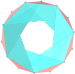

<link rel="stylesheet" href="../scripts/style1.css">
<meta charset="utf-8">
<link rel="icon" type="image/png" href="vr/salas/imagens/icone.png">
<h2>Torus and Toroids: visualization of solids with Augmented Reality (AR) and Virtual Reality (VR) in A-frame</h2>
 <b>author:</b> Paulo Henrique Siqueira - Universidade Federal do Paraná
  <b>contact:</b> <a href="#">paulohscwb@gmail.com</a>
  <a href="https://paulohscwb.github.io/torus-toroids/iris/pt-br/">versão em português</a>
 <form style="margin: 0 auto; float:right; text-align:right; width:100%; margin-bottom:15px;">
	<select id="url" onchange="urlHandler(this.value)" style="color:royalblue;">
		<option disabled selected value>More solids:</option>
		<option value="../basic/">Torus and toroids</option>
		<option value="../tetragonal/">Tetragonal toroids</option>
		<option disabled value="../iris/">Iris toroids</option>
		<option value="../regulartetrag/">Regular tetragonal toroids</option>
		<!--<option value="../mobius-cairo/">Mobius and Cairo toroids</option>
		<option value="../hexagonal/">Hexagonal toroids</option>
		<option value="../heptagonal/">Heptagonal dodecahedrons</option>
		<option value="../regular1/">Regular polygonal toroids 1</option>
		<option value="../regular2/">Regular polygonal toroids 2</option>
		<option value="../regular3/">Regular polygonal toroids 3</option>
		<option value="../rings/">Rings toroids</option>
		<option value="../regular4/">Regular polygonal toroids 4</option>
		<option value="../regular5/">Regular polygonal toroids 5</option>-->
	</select>
</form>

  <h2 align="center"> Iris toroids</h2>
A toroidal solid or toroid, is an orientable polyhedron without self-intersections that has genus greater than zero (meaning that it contains one or more holes). An orientable polyhedron's genus (G) is related to the number of vertices (V), faces (F), and edges (E) as follows:

V + F − E = 2 − 2 * G

This work shows iris toroids modeled in 3D, with views that can be accessed with resources in immersive Virtual Reality rooms.
 
<a href="#m3d">3D Models</a>&nbsp;&nbsp;|&nbsp;&nbsp;<a href="../">Home</a>

 

 

<h3 id="m3d" align="center">Modelos 3D</h3>
<iframe width="560" height="315" style="max-width:100%" src="https://www.youtube.com/embed/videoseries?list=PLy0I_lGW8HxXgcL9RxOVEfCA1KDLByHZt" title="YouTube video player" frameborder="0" allow="accelerometer; autoplay; clipboard-write; encrypted-media; gyroscope; picture-in-picture; web-share" allowfullscreen></iframe>
<h4>1. Anti Hexagonal Iris Toroid</h4>

  <b>faces:</b> 12 isosceles triangles and 12 scalene triangles
  <b>vertices:</b> 12
  <b>edges:</b> 36
  

<h4>2. Anti Heptagonal Iris Toroid</h4>

  <b>faces:</b> 14 isosceles triangles and 14 scalene triangles
  <b>vertices:</b> 14
  <b>edges:</b> 42
  

<h4>3. Anti Octagonal Iris Toroid</h4>

  <b>faces:</b> 16 isosceles triangles and 16 scalene triangles
  <b>vertices:</b> 16
  <b>edges:</b> 48
  

<h4>4. Anti Enneagonal Iris Toroid {9/3}</h4>

  <b>faces:</b> 18 isosceles triangles and 18 scalene triangles
  <b>vertices:</b> 18
  <b>edges:</b> 54
  

<h4>5. Anti Enneagonal Iris Toroid {9/4}</h4>

  <b>faces:</b> 18 isosceles triangles and 18 scalene triangles
  <b>vertices:</b> 18
  <b>edges:</b> 54
  

<h4>6. Anti Decagonal Iris Toroid {10/3}</h4>

  <b>faces:</b> 20 isosceles triangles and 20 scalene triangles
  <b>vertices:</b> 20
  <b>edges:</b> 60
  

<h4>7. Anti Decagonal Iris Toroid {10/4}</h4>

  <b>faces:</b> 20 isosceles triangles and 20 scalene triangles
  <b>vertices:</b> 20
  <b>edges:</b> 60
  

<h4>8. Pentagonal Iris Toroid</h4>

  <b>faces:</b> 5 rectangles and 10 scalene triangles
  <b>vertices:</b> 10
  <b>edges:</b> 25
  

<h4>9. Hexagonal Iris Toroid</h4>

  <b>faces:</b> 6 rectangles and 12 scalene triangles
  <b>vertices:</b> 12
  <b>edges:</b> 30
  

<h4>10. Heptagonal Iris Toroid {7/3}</h4>

  <b>faces:</b> 7 rectangles and 14 scalene triangles
  <b>vertices:</b> 14
  <b>edges:</b> 35
  

<a href="#p1" class="topo">back to top</a>

<h4>11. Heptagonal Iris Toroid {7/2}</h4>

  <b>faces:</b> 7 rectangles and 14 scalene triangles
  <b>vertices:</b> 14
  <b>edges:</b> 35
  

<h4>12. Octagonal Iris Toroid {8/3}</h4>

  <b>faces:</b> 8 rectangles and 16 scalene triangles
  <b>vertices:</b> 16
  <b>edges:</b> 40
  

<h4>13. Octagonal Iris Toroid {8/2}</h4>

  <b>faces:</b> 8 rectangles and 16 scalene triangles
  <b>vertices:</b> 16
  <b>edges:</b> 40
  

<h4>14. Enneagonal Iris Toroid {9/4}</h4>

  <b>faces:</b> 9 rectangles and 18 scalene triangles
  <b>vertices:</b> 18
  <b>edges:</b> 45
  

<h4>15. Enneagonal Iris Toroid {9/3}</h4>

  <b>faces:</b> 9 rectangles and 18 scalene triangles
  <b>vertices:</b> 18
  <b>edges:</b> 45
  

<h4>16. Enneagonal Iris Toroid {9/2}</h4>

  <b>faces:</b> 9 rectangles and 18 scalene triangles
  <b>vertices:</b> 18
  <b>edges:</b> 45
  

<h4>17. Decagonal Iris Toroid {10/4}</h4>

  <b>faces:</b> 10 rectangles and 20 scalene triangles
  <b>vertices:</b> 20
  <b>edges:</b> 50
  

<h4>18. Decagonal Iris Toroid {10/3}</h4>

  <b>faces:</b> 10 rectangles and 20 scalene triangles
  <b>vertices:</b> 20
  <b>edges:</b> 50
  

<h4>19. Decagonal Iris Toroid {10/2}</h4>

  <b>faces:</b> 10 rectangles and 20 scalene triangles
  <b>vertices:</b> 20
  <b>edges:</b> 50
  

<a href="#p1" class="topo">back to top</a>

  Iris toroids: visualization of solids with Virtual Reality by <a xmlns:cc="http://creativecommons.org/ns#" href="https://paulohscwb.github.io/torus-toroids/iris/" property="cc:attributionName" rel="cc:attributionURL">Paulo Henrique Siqueira</a> is licensed with a license <a rel="license" href="http://creativecommons.org/licenses/by-nc-nd/4.0/">Creative Commons Attribution-NonCommercial-NoDerivatives 4.0 International</a>.

<h4>How to cite this work:</h4> 

Siqueira, P.H., "Iris toroids: visualization of solids with Virtual Reality". Available in: <https://paulohscwb.github.io/torus-toroids/iris/>, April 2025.

<!---->
  <b>References:</b>
 Weisstein, Eric W. "Torus" From MathWorld-A Wolfram Web Resource. <a href="https://mathworld.wolfram.com/Torus.html" target="_blank">https://mathworld.wolfram.com/Torus.html</a>
 Weisstein, Eric W. "Toroid" From MathWorld-A Wolfram Web Resource. <a href="https://mathworld.wolfram.com/Toroid.html" target="_blank">https://mathworld.wolfram.com/Toroid.html</a>
 McCooey, D. I. "Visual Polyhedra". <a href="http://dmccooey.com/polyhedra/" target="_blank">http://dmccooey.com/polyhedra/</a>
