<link rel="stylesheet" href="../../scripts/style1.css">
<meta charset="utf-8">
<link rel="icon" type="image/png" href="../vr/salas/imagens/icone.png">
<h2>Toros e toroides: visualização dos sólidos com Realidade Aumentada (RA) e Realidade Virtual (RV) em A-frame</h2>
<b>autor:</b> Paulo Henrique Siqueira - Universidade Federal do Paraná
 <b>contato:</b> <a href="#"> paulohscwb@gmail.com </a>
 <a href="https://paulohscwb.github.io/torus-toroids/iris/">english version</a>
<form style="margin: 0 auto; float:right; text-align:right; width:100%; margin-bottom:15px;">
	<select id="url" onchange="urlHandler(this.value)" style="color:royalblue;">
		<option disabled selected>Mais sólidos:</option>
		<option value="../../basic/pt-br/">Toros e toroides</option>
		<option value="../../tetragonal/pt-br/">Toroides tetragonais</option>
		<option disabled value="../../iris/pt-br/">Toroides de íris</option>
		<option value="../../regulartetrag/pt-br/">Toroides tetragonais regulares</option>
		<option value="../../mobiuscairo/pt-br/">Toroides de Möbius, Vélez-Jahn e Cairo</option>
		<option value="../../hexagonal/pt-br/">Toroides hexagonais</option>
		<option value="../../regular1/pt-br/">Toroides poligonais regulares e compostos 1</option>
		<option value="../../heptadodekleinbottle/pt-br/">Dodecaedros heptagonais e garrafas de Klein</option>
		<!--<option value="../../regular2/pt-br/">Toroides poligonais regulares 2</option>
		<option value="../../regular3/pt-br/">Toroides poligonais regulares 3</option>
		<option value="../../rings/pt-br/">Anéis toroides</option>
		<option value="../../regular4/pt-br/">Toroides poligonais regulares 4</option>
		<option value="../../regular5/pt-br/">Toroides poligonais regulares 5</option>-->
	</select>
</form>

  <h2 align="center"> Toroides de íris</h2>
Um sólido toroidal ou toroide é um poliedro orientável sem autointerseções que tem gênero maior que zero (o que significa que contém um ou mais buracos). O gênero (G) de um poliedro orientável está relacionado ao número de vértices (V), faces (F) e arestas (E) da seguinte forma:

V + F − E = 2 − 2 * G

Este trabalho mostra toroides de íris modelados em 3D, com as visualizações que podem ser acessadas com recursos em salas de Realidade Virtual imersivas.
 
<a href="#m3d">Modelos 3D</a>&nbsp;&nbsp;|&nbsp;&nbsp;<a href="../../pt-br/">Página Inicial</a>

 

  
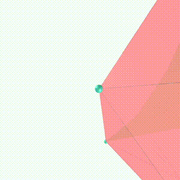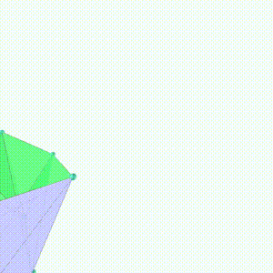
  

<h3 id="m3d" align="center">Modelos 3D</h3>
<iframe width="560" height="315" style="max-width:100%" src="https://www.youtube.com/embed/videoseries?list=PLy0I_lGW8HxXgcL9RxOVEfCA1KDLByHZt" title="YouTube video player" frameborder="0" allow="accelerometer; autoplay; clipboard-write; encrypted-media; gyroscope; picture-in-picture; web-share" allowfullscreen></iframe>
<h4>1. Toroide de íris anti-hexagonal</h4>
<a href="../vr/AntiHexagonalIrisToroid.htm" target="_blank" title="modelo 3D" class="fotoA">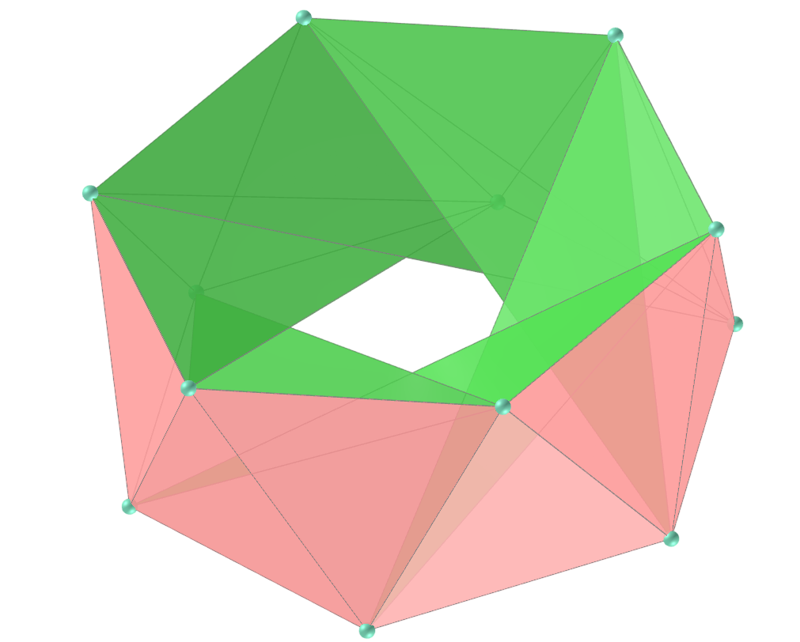</a>
  <b>faces:</b> 12 triângulos isósceles e 12 triângulos escalenos | <b>vértices:</b> 12 | <b>arestas:</b> 36
  

<h4>2. Toroide de íris anti-heptagonal</h4>

  <b>faces:</b> 14 triângulos isósceles e 14 triângulos escalenos | <b>vértices:</b> 14 | <b>arestas:</b> 42
  

<h4>3. Toroide de íris anti-octogonal</h4>
<a href="../vr/AntiOctagonalIrisToroid.htm" target="_blank" title="modelo 3D" class="fotoA">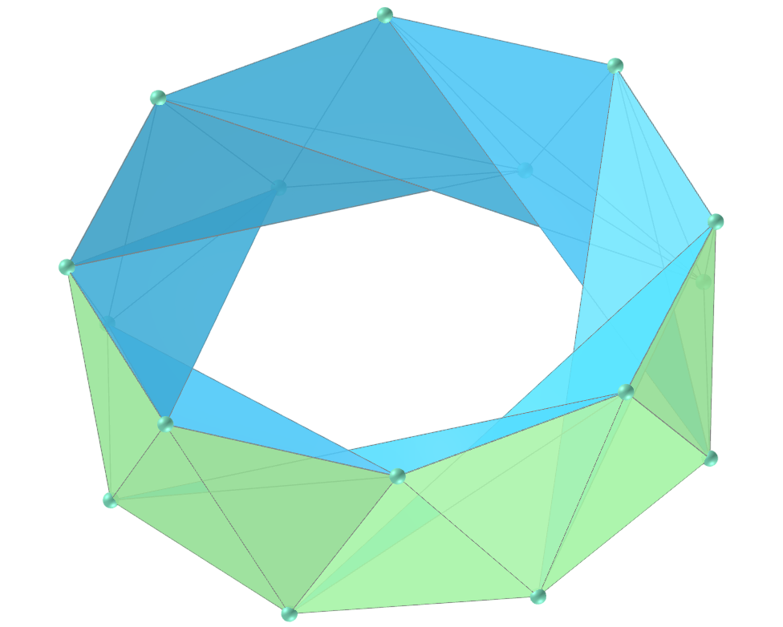</a>
  <b>faces:</b> 16 triângulos isósceles e 16 triângulos escalenos | <b>vértices:</b> 16 | <b>arestas:</b> 48
  

<h4>4. Toroide de íris anti-eneagonal {9/3}</h4>
<a href="../vr/AntiEnneagonalIrisToroid.htm" target="_blank" title="modelo 3D" class="fotoA">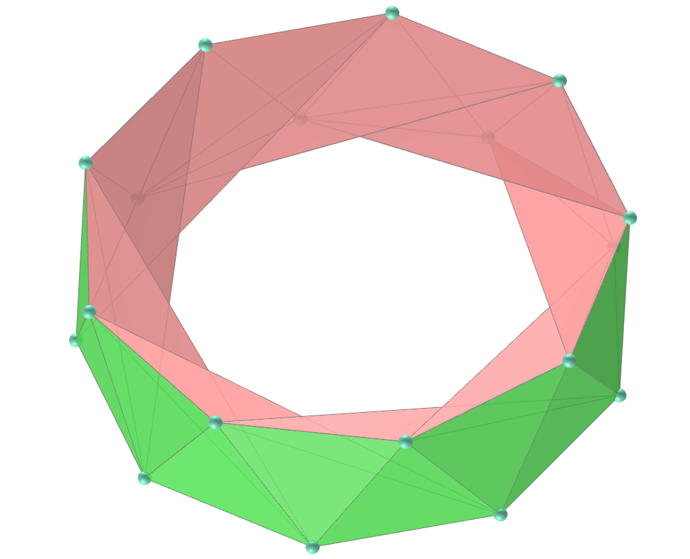</a>
  <b>faces:</b> 18 triângulos isósceles e 18 triângulos escalenos | <b>vértices:</b> 18 | <b>arestas:</b> 54
  

<h4>5. Toroide de íris anti-eneagonal {9/4}</h4>
<a href="../vr/AntiEnneagonalIrisToroid2.htm" target="_blank" title="modelo 3D" class="fotoA">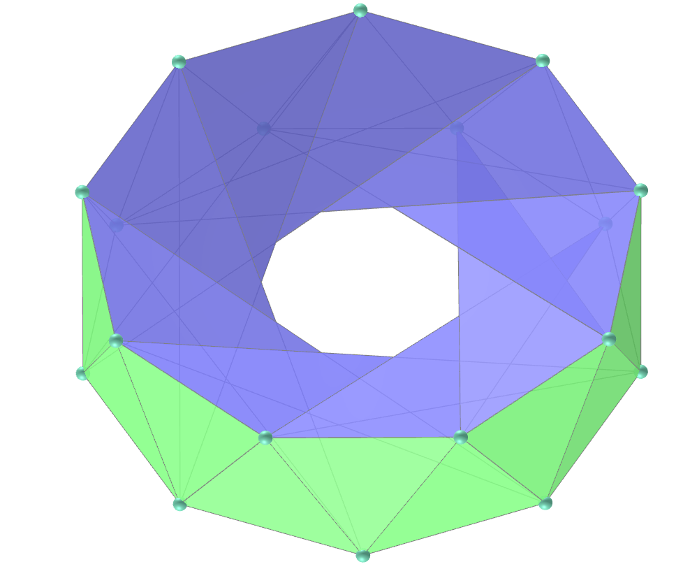</a>
  <b>faces:</b> 18 triângulos isósceles e 18 triângulos escalenos | <b>vértices:</b> 18 | <b>arestas:</b> 54
  

<h4>6. Toroide de íris anti-decagonal {10/3}</h4>

  <b>faces:</b> 20 triângulos isósceles e 20 triângulos escalenos | <b>vértices:</b> 20 | <b>arestas:</b> 60
  

<h4>7. Toroide de íris anti-decagonal {10/4}</h4>

  <b>faces:</b> 20 triângulos isósceles e 20 triângulos escalenos | <b>vértices:</b> 20 | <b>arestas:</b> 60
  

<h4>8. Toroide de íris pentagonal</h4>
<a href="../vr/PentagonalIrisToroid.htm" target="_blank" title="modelo 3D" class="fotoA">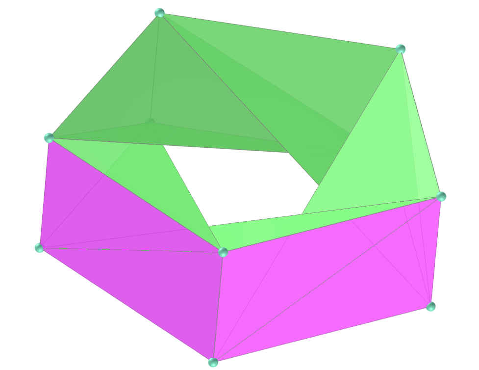</a>
  <b>faces:</b> 5 retângulos e 10 triângulos escalenos | <b>vértices:</b> 10 | <b>arestas:</b> 25
  

<h4>9. Toroide de íris hexagonal</h4>
<a href="../vr/HexagonalIrisToroid.htm" target="_blank" title="modelo 3D" class="fotoA">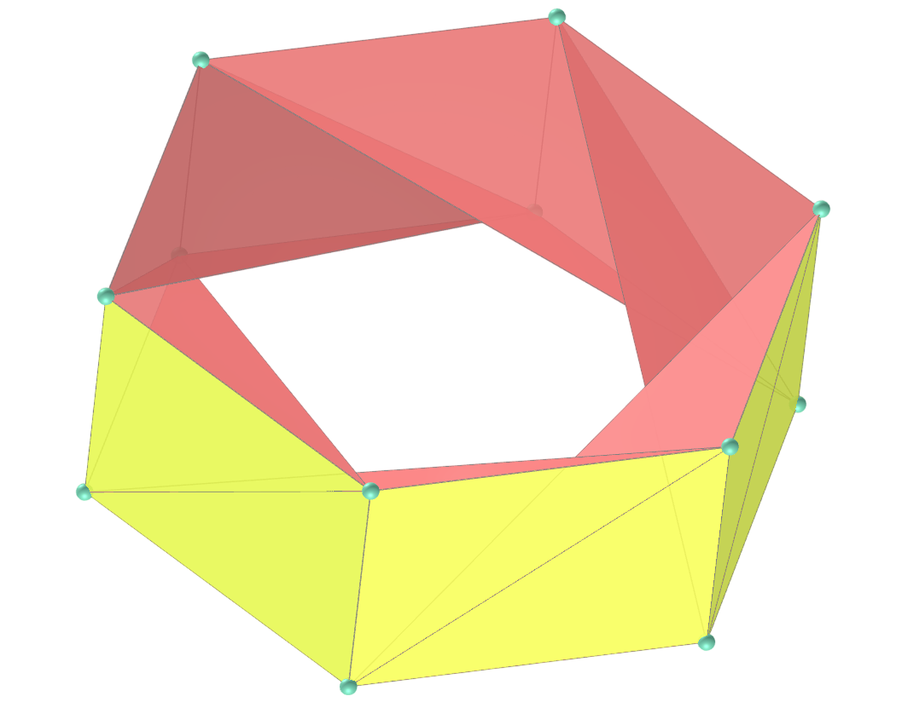</a>
  <b>faces:</b> 6 retângulos e 12 triângulos escalenos | <b>vértices:</b> 12 | <b>arestas:</b> 30
  

<h4>10. Toroide de íris heptagonal {7/3}</h4>

  <b>faces:</b> 7 retângulos e 14 triângulos escalenos | <b>vértices:</b> 14 | <b>arestas:</b> 35
  

<a href="#p1" class="topo">voltar ao topo</a>

<h4>11. Toroide de íris heptagonal {7/2}</h4>

  <b>faces:</b> 7 retângulos e 14 triângulos escalenos | <b>vértices:</b> 14 | <b>arestas:</b> 35
  

<h4>12. Toroide de íris octogonal {8/3}</h4>
<a href="../vr/OctagonalIrisToroid.htm" target="_blank" title="modelo 3D" class="fotoA">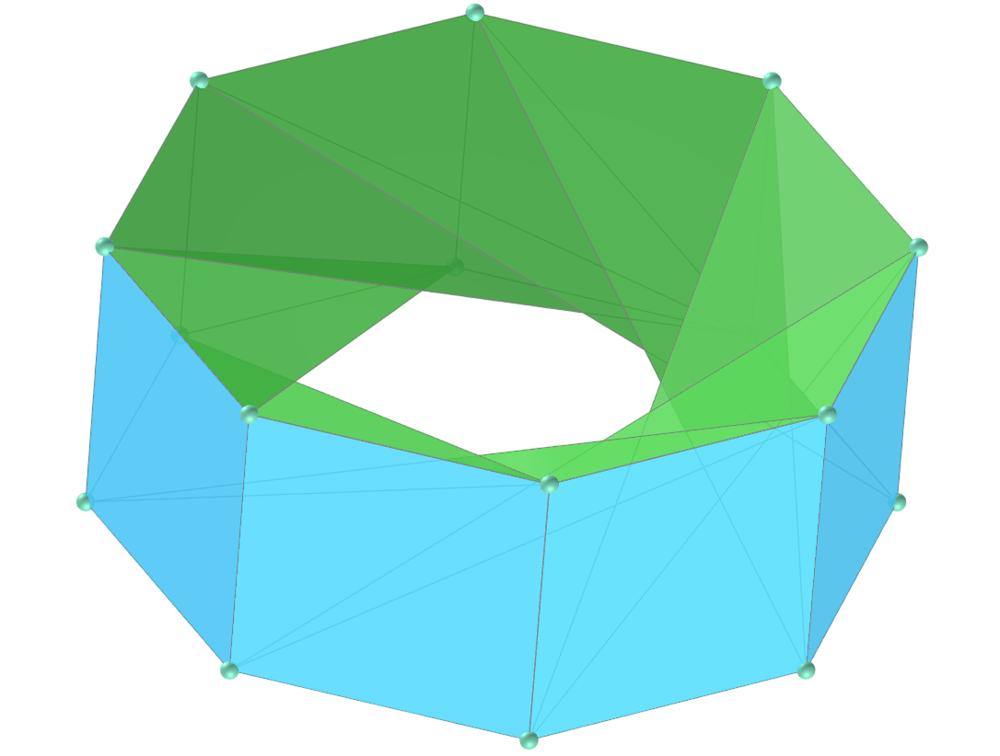</a>
  <b>faces:</b> 8 retângulos e 16 triângulos escalenos | <b>vértices:</b> 16 | <b>arestas:</b> 40
  

<h4>13. Toroide de íris octogonal {8/2}</h4>

  <b>faces:</b> 8 retângulos e 16 triângulos escalenos | <b>vértices:</b> 16 | <b>arestas:</b> 40
  

<h4>14. Toroide de íris eneagonal {9/4}</h4>
<a href="../vr/EnneagonalIrisToroid3.htm" target="_blank" title="modelo 3D" class="fotoA">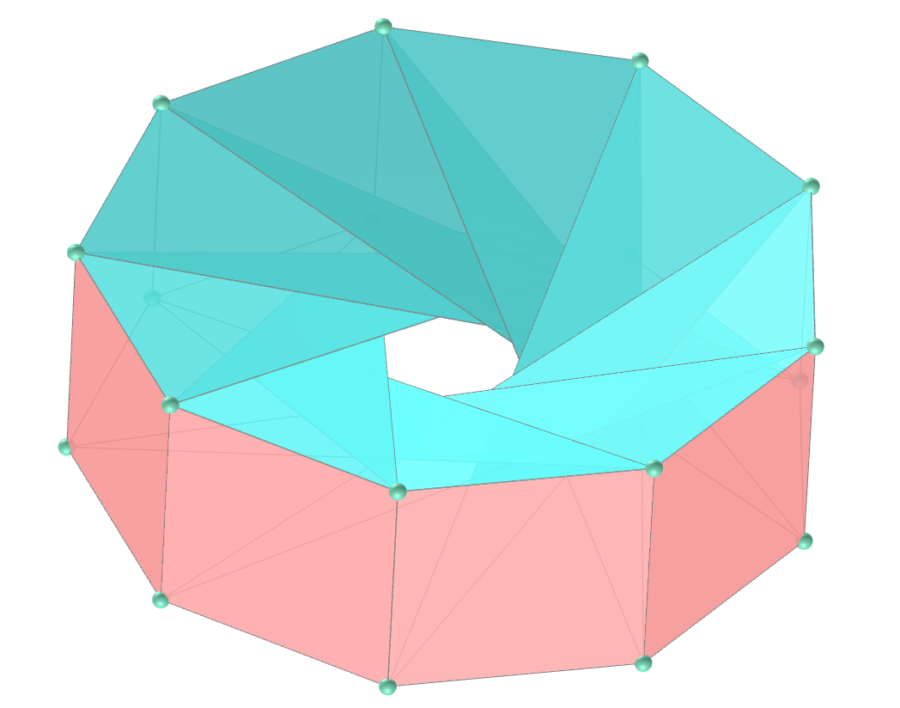</a>
  <b>faces:</b> 9 retângulos e 18 triângulos escalenos | <b>vértices:</b> 18 | <b>arestas:</b> 45
  

<h4>15. Toroide de íris eneagonal {9/3}</h4>

  <b>faces:</b> 9 retângulos e 18 triângulos escalenos | <b>vértices:</b> 18 | <b>arestas:</b> 45
  

<h4>16. Toroide de íris eneagonal {9/2}</h4>
<a href="../vr/EnneagonalIrisToroid2.htm" target="_blank" title="modelo 3D" class="fotoA">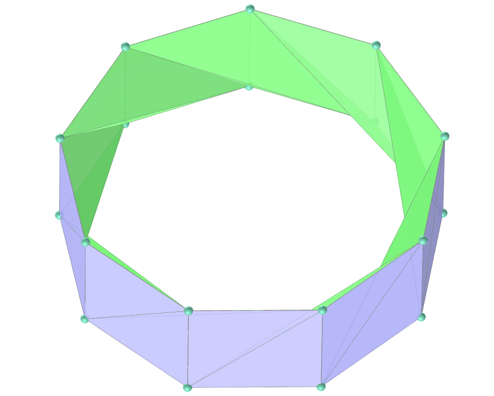</a>
  <b>faces:</b> 9 retângulos e 18 triângulos escalenos | <b>vértices:</b> 18 | <b>arestas:</b> 45
  

<h4>17. Toroide de íris decagonal {10/4}</h4>

  <b>faces:</b> 10 retângulos e 20 triângulos escalenos | <b>vértices:</b> 20 | <b>arestas:</b> 50
  

<h4>18. Toroide de íris decagonal {10/3}</h4>

  <b>faces:</b> 10 retângulos e 20 triângulos escalenos | <b>vértices:</b> 20 | <b>arestas:</b> 50
  

<h4>19. Toroide de íris decagonal {10/2}</h4>

  <b>faces:</b> 10 retângulos e 20 triângulos escalenos | <b>vértices:</b> 20 | <b>arestas:</b> 50
  

<a href="#p1" class="topo">voltar ao topo</a>

  Iris toroids: visualization of solids with Virtual Reality de <a xmlns:cc="http://creativecommons.org/ns#" href="https://paulohscwb.github.io/torus-toroids/iris/pt-br/" property="cc:attributionName" rel="cc:attributionURL">Paulo Henrique Siqueira</a> está licenciado com uma Licença <a rel="license" href="http://creativecommons.org/licenses/by-nc-nd/4.0/">Creative Commons Atribuição-NãoComercial-SemDerivações 4.0 Internacional</a>.

<h4>Como citar este trabalho:</h4> 

Siqueira, P.H., "Iris toroids: visualization of solids with Virtual Reality". Disponível em: <https://paulohscwb.github.io/torus-toroids/iris/pt-br/>, Abril de 2025.

<!---->
  <b>Referências:</b>
 Weisstein, Eric W. "Torus" From MathWorld-A Wolfram Web Resource. <a href="https://mathworld.wolfram.com/Torus.html" target="_blank">https://mathworld.wolfram.com/Torus.html</a>
 Weisstein, Eric W. "Toroid" From MathWorld-A Wolfram Web Resource. <a href="https://mathworld.wolfram.com/Toroid.html" target="_blank">https://mathworld.wolfram.com/Toroid.html</a>
 McCooey, D. I. "Visual Polyhedra". <a href="http://dmccooey.com/polyhedra/" target="_blank">http://dmccooey.com/polyhedra/</a>
