<link rel="stylesheet" href="../scripts/style1.css">
<meta charset="utf-8">
<link rel="icon" type="image/png" href="vr/salas/imagens/icone.png">
<h2>Torus and Toroids: visualization of solids with Augmented Reality (AR) and Virtual Reality (VR) in A-frame</h2>
 <b>author:</b> Paulo Henrique Siqueira - Universidade Federal do Paraná
  <b>contact:</b> <a href="#">paulohscwb@gmail.com</a>
  <a href="https://paulohscwb.github.io/torus-toroids/mobiuscairo/pt-br/">versão em português</a>
 <form style="margin: 0 auto; float:right; text-align:right; width:100%; margin-bottom:15px;">
	<select id="url" onchange="urlHandler(this.value)" style="color:royalblue;">
		<option disabled selected value>More solids:</option>
		<option value="../basic/">Torus and toroids</option>
		<option value="../tetragonal/">Tetragonal toroids</option>
		<option value="../iris/">Iris toroids</option>
		<option value="../regulartetrag/">Regular tetragonal toroids</option>
		<option disabled value="../mobiuscairo/">Möbius, Vélez-Jahn and Cairo toroids</option>
		<!--<option value="../hexagonal/">Hexagonal toroids</option>
		<option value="../heptagonal/">Heptagonal dodecahedrons</option>
		<option value="../regular1/">Regular polygonal toroids 1</option>
		<option value="../regular2/">Regular polygonal toroids 2</option>
		<option value="../regular3/">Regular polygonal toroids 3</option>
		<option value="../rings/">Rings toroids</option>
		<option value="../regular4/">Regular polygonal toroids 4</option>
		<option value="../regular5/">Regular polygonal toroids 5</option>-->
	</select>
</form>

  <h2 align="center"> Möbius, Vélez-Jahn and Cairo toroids</h2>
Cairo tiles are named after the plaster pattern on some streets in Cairo.
 Solids with characteristics similar to Möbius sheets were discovered by Gonzalo Vélez-Jahn in 1968. These solids were described by Martin Gardner as toroidal polyhedra, which are transformations of prismatic rings.
 This work shows Möbius, Vélez-Jahn and Cairo toroids modeled in 3D, with views that can be accessed with resources in immersive Virtual Reality rooms.
 
<a href="#m3d">3D Models</a>&nbsp;&nbsp;|&nbsp;&nbsp;<a href="../">Home</a>

 

 
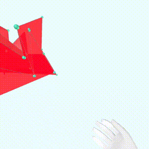

<h3 id="m3d" align="center">Modelos 3D</h3>
<!--<iframe width="560" height="315" style="max-width:100%" src="https://www.youtube.com/embed/videoseries?list=PLy0I_lGW8HxXgcL9RxOVEfCA1KDLByHZt" title="YouTube video player" frameborder="0" allow="accelerometer; autoplay; clipboard-write; encrypted-media; gyroscope; picture-in-picture; web-share" allowfullscreen></iframe>-->
<h4>1. Cairo Tiling Toroid</h4>

  <b>faces:</b> 8 mirror-symmetric pentagons | <b>vertices:</b> 12 | <b>edges:</b> 20
  

<h4>2. Cairo Tiling Toroid v2</h4>

  <b>faces:</b> 16 mirror-symmetric pentagons | <b>vertices:</b> 24 | <b>edges:</b> 40
  

<h4>3. Cairo Tiling Toroid v3</h4>

  <b>faces:</b> 16 irregular pentagons | <b>vertices:</b> 24 | <b>edges:</b> 40
  

<h4>4. Cairo Tiling boomerang Toroid</h4>

  <b>faces:</b> 16 irregular pentagons | <b>vertices:</b> 24 | <b>edges:</b> 40
  

<h4>5. Cairo Tiling boomerang Toroid v2</h4>

  <b>faces:</b> 16 irregular pentagons | <b>vertices:</b> 24 | <b>edges:</b> 40
  

<h4>6. Möbius and Vélez-Jahn Toroid of Chamfered Tetrahedron</h4>

  Möbius and Vélez-Jahn toroid modeled with 10 Chamfered Tetrahedra
  

<h4>7. Möbius and Vélez-Jahn Toroid of Cube</h4>

  Möbius and Vélez-Jahn toroid modeled with 10 Cubes
  

<h4>8. Möbius and Vélez-Jahn Toroid of Cube kites</h4>
<a href="vr/CubeKites.htm" target="_blank" title="3D model" class="fotoA">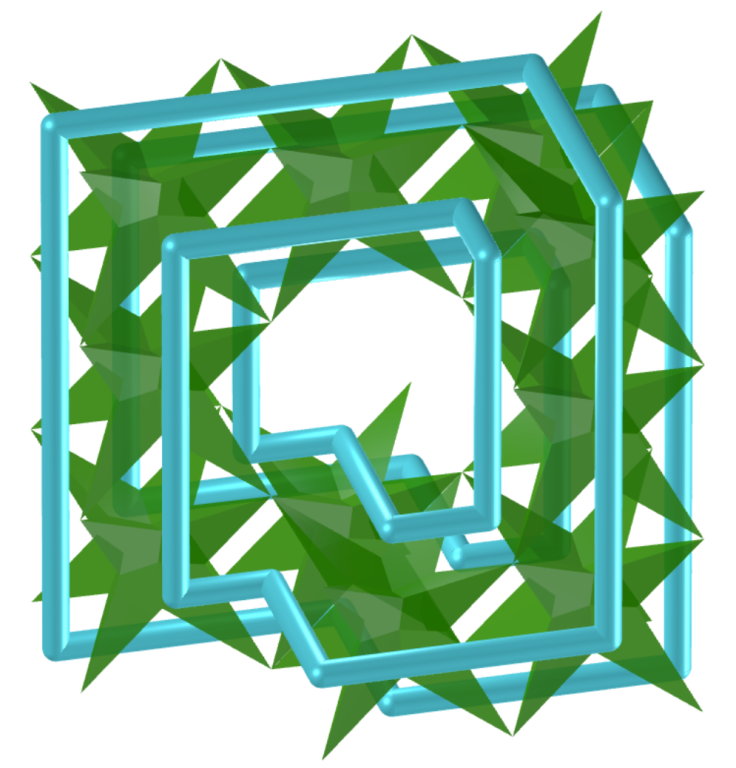</a>
  Möbius and Vélez-Jahn toroid modeled with 10 Cubes kites
  

<h4>9. Möbius and Vélez-Jahn Toroid of Cubitruncated Cuboctahedron</h4>

  Möbius and Vélez-Jahn toroid modeled with 10 Cubitruncated Cuboctahedrons
  

<h4>10. Möbius and Vélez-Jahn Toroid of Cuboctahedron</h4>

  Möbius and Vélez-Jahn toroid modeled with 10 Cuboctahedrons
  

<a href="#p1" class="topo">back to top</a>

<h4>11. Möbius and Vélez-Jahn Toroid of Cuboctahedron kites</h4>

  Möbius and Vélez-Jahn toroid modeled with 10 Cuboctahedrons kites
  

<h4>12. Möbius and Vélez-Jahn Toroid of Cubohemioctahedron</h4>

  Möbius and Vélez-Jahn toroid modeled with 10 Cubohemioctahedrons
  

<h4>13. Möbius and Vélez-Jahn Toroid of Escher solid</h4>

  Möbius and Vélez-Jahn toroid modeled with 10 Escher solids
  

<h4>14. Möbius and Vélez-Jahn Toroid of Great Cubicuboctahedron</h4>

  Möbius and Vélez-Jahn toroid modeled with 10 Great Cubicuboctahedrons
  

<h4>15. Möbius and Vélez-Jahn Toroid of Great Rhombihexahedron</h4>

  Möbius and Vélez-Jahn toroid modeled with 10 Great Rhombihexahedrons
  

<h4>16. Möbius and Vélez-Jahn Toroid of Great Truncated Cuboctahedron</h4>
<a href="vr/GreatTruncatedCuboctahedron.htm" target="_blank" title="3D model" class="fotoA">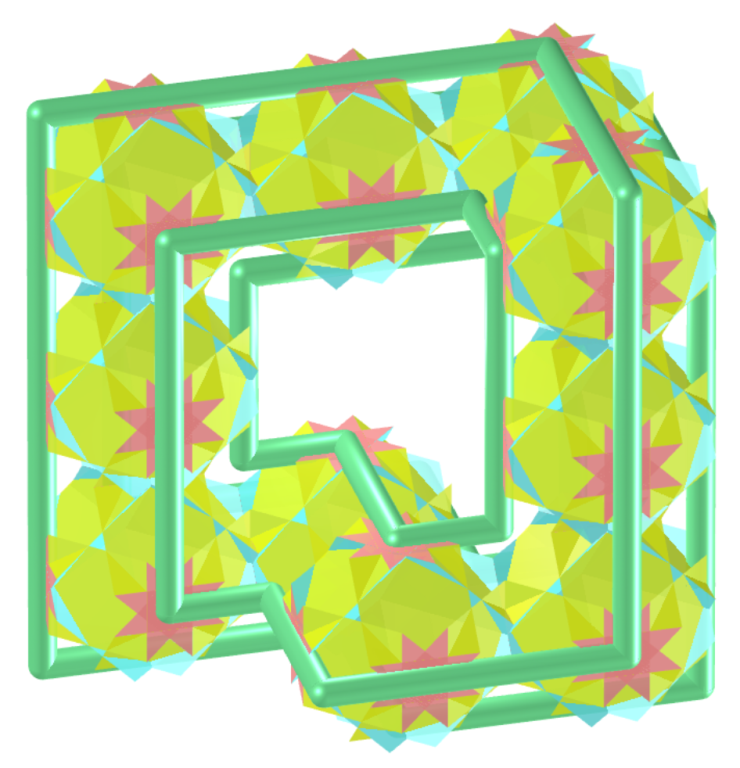</a>
  Möbius and Vélez-Jahn toroid modeled with 10 Great Truncated Cuboctahedrons
  

<h4>17. Möbius and Vélez-Jahn Toroid of Octahemioctacron</h4>

  Möbius and Vélez-Jahn toroid modeled with 10 Octahemioctacrons
  

<h4>18. Möbius and Vélez-Jahn Toroid of Octahemioctahedron</h4>

  Möbius and Vélez-Jahn toroid modeled with 10 Octahemioctahedrons
  

<h4>19. Möbius and Vélez-Jahn Toroid of Rhombicuboctahedron</h4>

  Möbius and Vélez-Jahn toroid modeled with 10 Rhombicuboctahedrons
  

<h4>20. Möbius and Vélez-Jahn Toroid of Rhombicuboctahedron kites</h4>

  Möbius and Vélez-Jahn toroid modeled with 10 Rhombicuboctahedrons kites
  

<a href="#p1" class="topo">back to top</a>

<h4>21. Möbius and Vélez-Jahn Toroid of Small Cubicuboctahedron</h4>

  Möbius and Vélez-Jahn toroid modeled with 10 Small Cubicuboctahedrons
  

<h4>22. Möbius and Vélez-Jahn Toroid of Small Rhombihexahedron</h4>

  Möbius and Vélez-Jahn toroid modeled with 10 Small Rhombihexahedrons
  

<h4>23. Möbius and Vélez-Jahn Toroid of Truncated Cube</h4>

  Möbius and Vélez-Jahn toroid modeled with 10 Truncated Cubes
  

<h4>24. Möbius and Vélez-Jahn Toroid of Truncated Cube kites</h4>

  Möbius and Vélez-Jahn toroid modeled with 10 Truncated Cubes kites
  

<h4>25. Möbius and Vélez-Jahn Toroid of Truncated Cuboctahedron</h4>
<a href="vr/TruncatedCuboctahedron.htm" target="_blank" title="3D model" class="fotoA">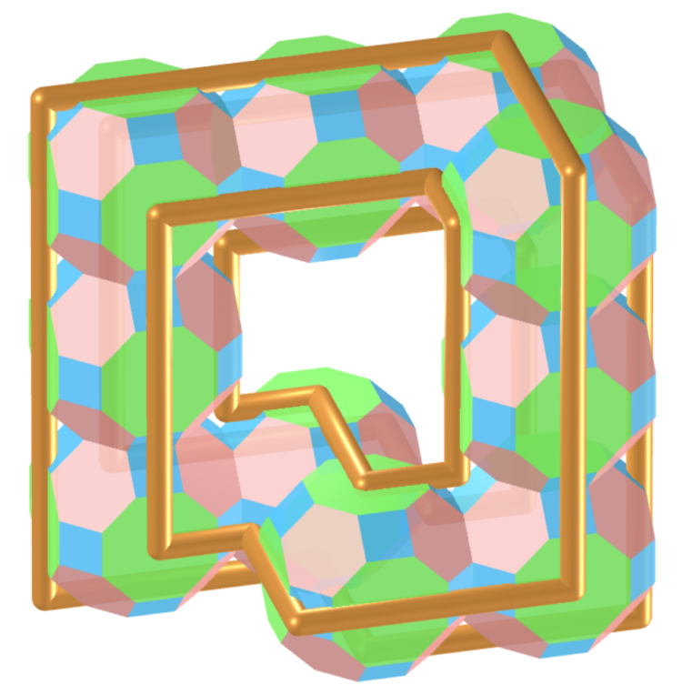</a>
  Möbius and Vélez-Jahn toroid modeled with 10 Truncated cuboctahedrons
  

<h4>26. Möbius and Vélez-Jahn Toroid of Truncated cuboctahedron kites</h4>
<a href="vr/TruncatedCuboctahedronKites.htm" target="_blank" title="3D model" class="fotoA">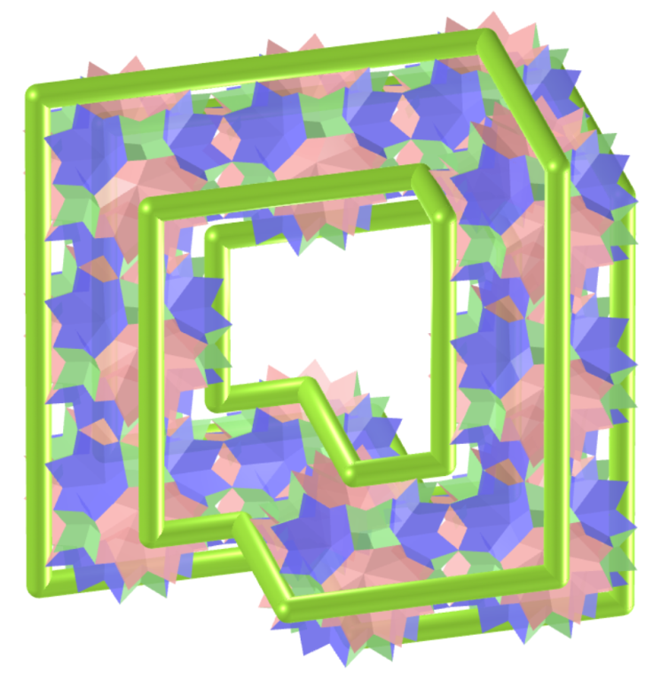</a>
  Möbius and Vélez-Jahn toroid modeled with 10 Truncated cuboctahedrons kites
  

<h4>27. Möbius and Vélez-Jahn Toroid of Truncated Octahedron</h4>

  Möbius and Vélez-Jahn toroid modeled with 10 Truncated Octahedrons
  

<h4>28. Möbius and Vélez-Jahn Toroid of Truncated Octahedron kites</h4>

  Möbius and Vélez-Jahn toroid modeled with 10 Truncated Octahedrons kites
  

<h4>29. Möbius and Vélez-Jahn Toroid of Concave Dodecahedron</h4>
<a href="vr/ConcaveDodecahedron.html" target="_blank" title="3D model" class="fotoA">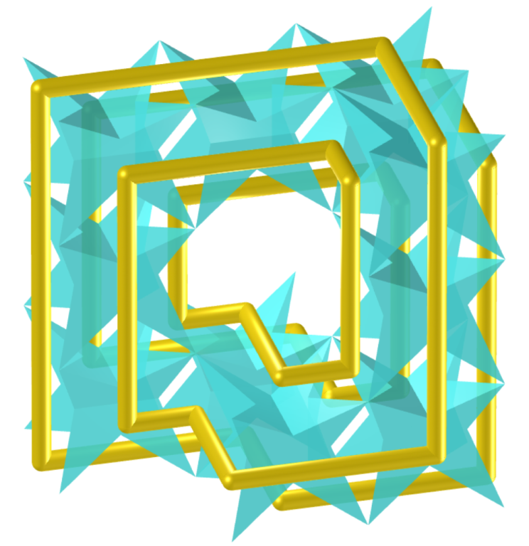</a>
  Möbius and Vélez-Jahn toroid modeled with 10 Concave Dodecahedrons
  

<h4>30. Möbius and Vélez-Jahn Toroid of Ditrigonal Dodecadodecahedron</h4>

  Möbius and Vélez-Jahn toroid modeled with 10 Ditrigonal Dodecadodecahedrons
  

<a href="#p1" class="topo">back to top</a>

<h4>31. Möbius and Vélez-Jahn Toroid of Dodecadodecahedron</h4>

  Möbius and Vélez-Jahn toroid modeled with 10 Dodecadodecahedrons
  

<h4>32. Möbius and Vélez-Jahn Toroid of Dodecahedron</h4>
<a href="vr/Dodecahedron.html" target="_blank" title="3D model" class="fotoA">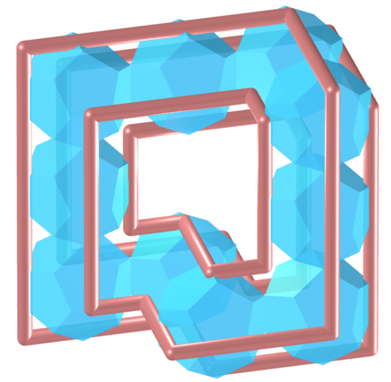</a>
  Möbius and Vélez-Jahn toroid modeled with 10 Dodecahedrons
  

<h4>33. Möbius and Vélez-Jahn Toroid of Great Ditrigonal Dodecicosidodecahedron</h4>

  Möbius and Vélez-Jahn toroid modeled with 10 Great Ditrigonal Dodecicosidodecahedrons
  

<h4>34. Möbius and Vélez-Jahn Toroid of Great Ditrigonal Icosidodecahedron</h4>
<a href="vr/GreatDitrigonalIcosidodecahedron.html" target="_blank" title="3D model" class="fotoA">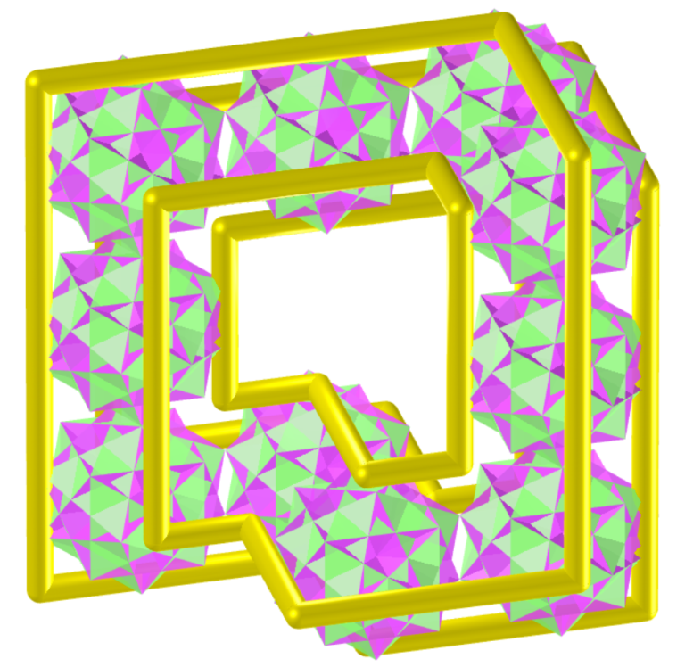</a>
  Möbius and Vélez-Jahn toroid modeled with 10 Great Ditrigonal Icosidodecahedrons
  

<h4>35. Möbius and Vélez-Jahn Toroid of Great Dodecacronic Hexecontahedron</h4>
<a href="vr/GreatDodecacronicHexecontahedron.html" target="_blank" title="3D model" class="fotoA">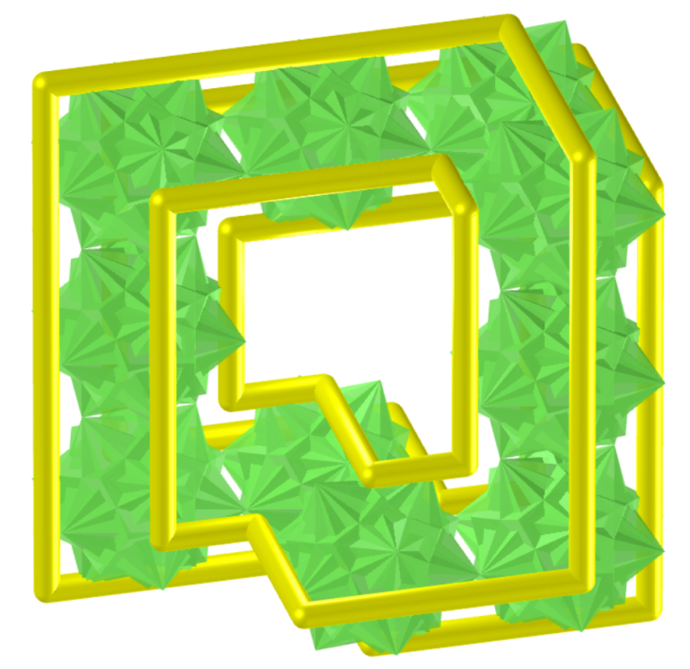</a>
  Möbius and Vélez-Jahn toroid modeled with 10 Great Dodecacronic Hexecontahedrons
  

<h4>36. Möbius and Vélez-Jahn Toroid of Great Godecahedron</h4>
<a href="vr/GreatDodecahedron.html" target="_blank" title="3D model" class="fotoA">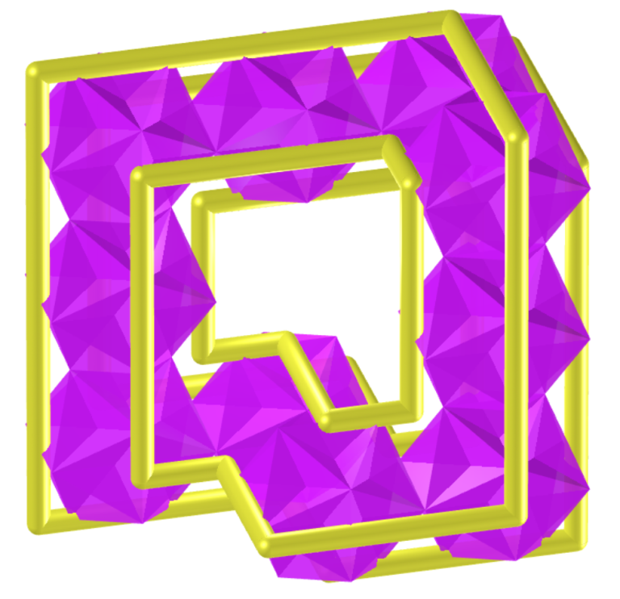</a>
  Möbius and Vélez-Jahn toroid modeled with 10 Great Dodecahedrons
  

<h4>37. Möbius and Vélez-Jahn Toroid of Great Dodecahemicosahedron</h4>
<a href="vr/GreatDodecahemicosahedron.html" target="_blank" title="3D model" class="fotoA">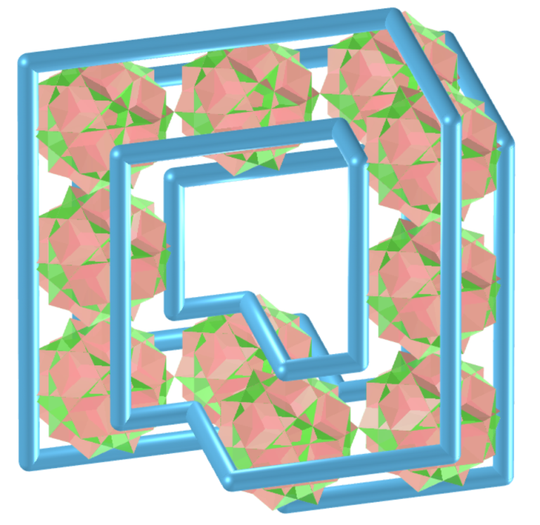</a>
  Möbius and Vélez-Jahn toroid modeled with 10 Great Dodecahemicosahedrons
  

<h4>38. Möbius and Vélez-Jahn Toroid of Great Dodecahemidodecahedron</h4>
<a href="vr/GreatDodecahemidodecahedron.html" target="_blank" title="3D model" class="fotoA">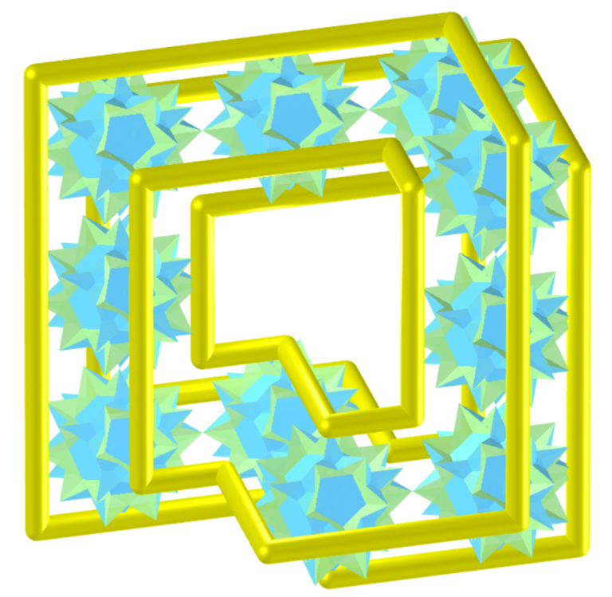</a>
  Möbius and Vélez-Jahn toroid modeled with 10 Great Dodecahemidodecahedrons
  

<h4>39. Möbius and Vélez-Jahn Toroid of Great Dodecicosahedron</h4>
<a href="vr/GreatDodecicosahedron.html" target="_blank" title="3D model" class="fotoA">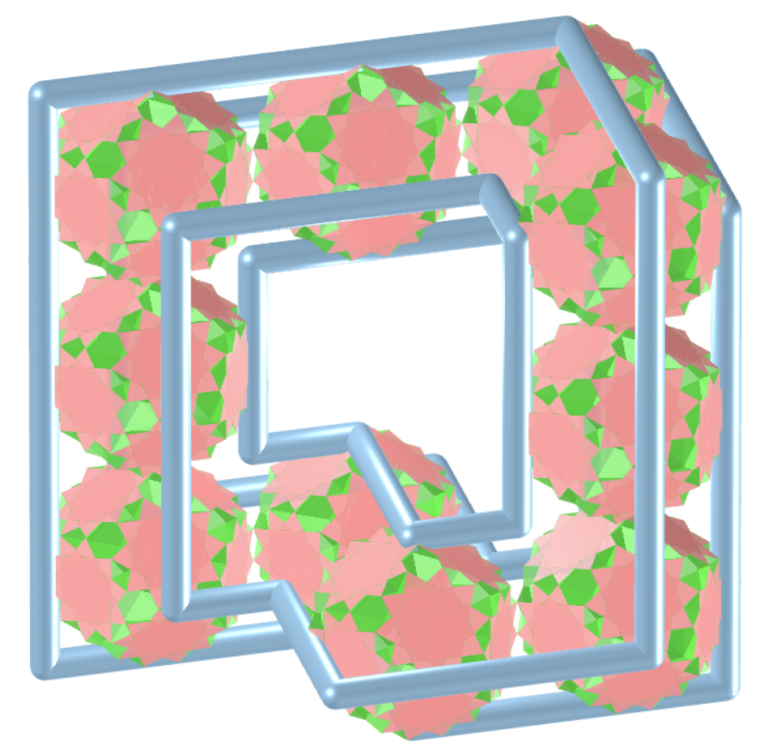</a>
  Möbius and Vélez-Jahn toroid modeled with 10 Great Dodecicosahedrons
  

<h4>40. Möbius and Vélez-Jahn Toroid of Great Dodecicosidodecahedron</h4>

  Möbius and Vélez-Jahn toroid modeled with 10 Great Dodecicosidodecahedrons
  

<a href="#p1" class="topo">back to top</a>

<h4>41. Möbius and Vélez-Jahn Toroid of Great Icosahedron</h4>
<a href="vr/GreatIcosahedron.html" target="_blank" title="3D model" class="fotoA">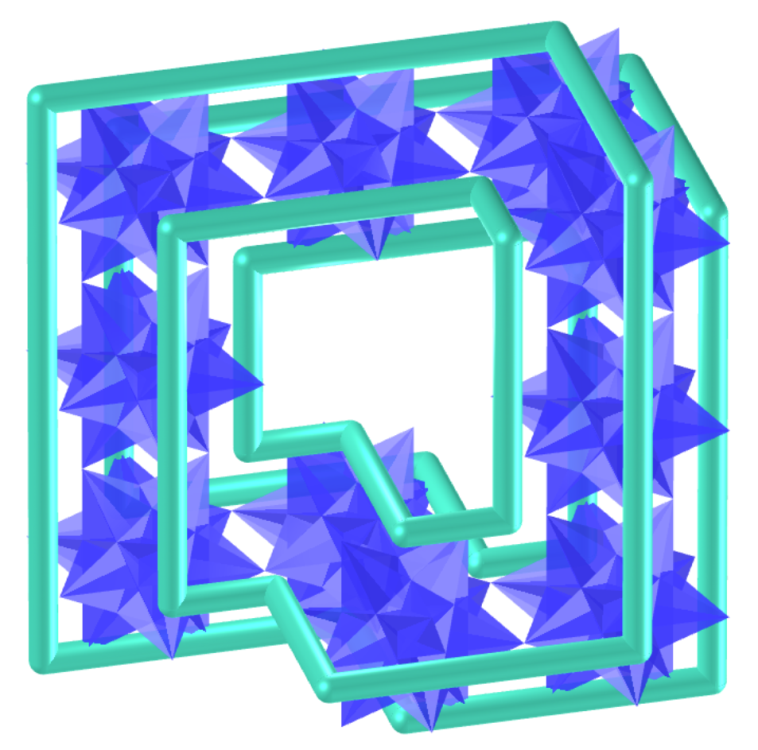</a>
  Möbius and Vélez-Jahn toroid modeled with 10 Great Icosahedrons
  

<h4>42. Möbius and Vélez-Jahn Toroid of Great Icosicosidodecahedron</h4>
<a href="vr/GreatIcosicosidodecahedron.html" target="_blank" title="3D model" class="fotoA">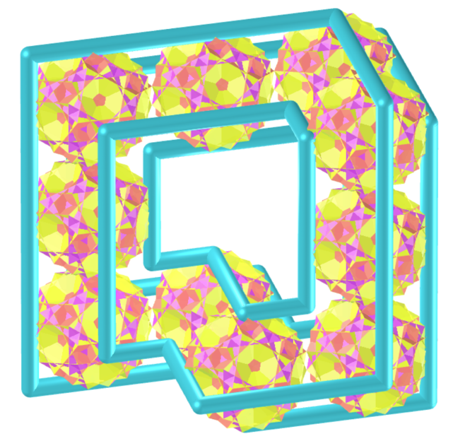</a>
  Möbius and Vélez-Jahn toroid modeled with 10 Great Icosicosidodecahedrons
  

<h4>43. Möbius and Vélez-Jahn Toroid of Great Icosidodecahedron</h4>
<a href="vr/GreatIcosidodecahedron.html" target="_blank" title="3D model" class="fotoA">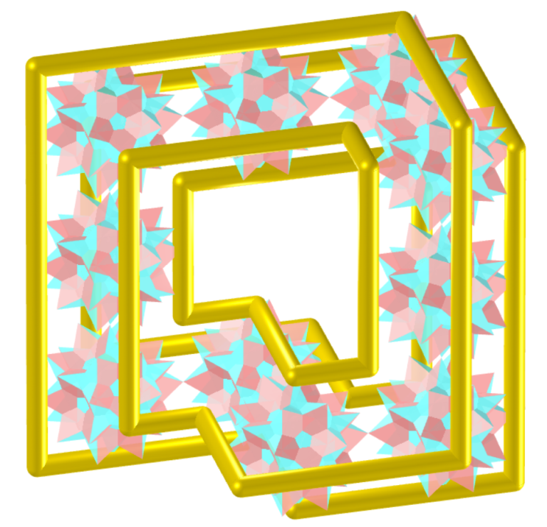</a>
  Möbius and Vélez-Jahn toroid modeled with 10 Great Icosidodecahedrons
  

<h4>44. Möbius and Vélez-Jahn Toroid of Great Icosihemidodecahedron</h4>

  Möbius and Vélez-Jahn toroid modeled with 10 Great Icosihemidodecahedrons
  

<h4>45. Möbius and Vélez-Jahn Toroid of Great Rhombidodecahedron</h4>
<a href="vr/GreatRhombidodecahedron.html" target="_blank" title="3D model" class="fotoA">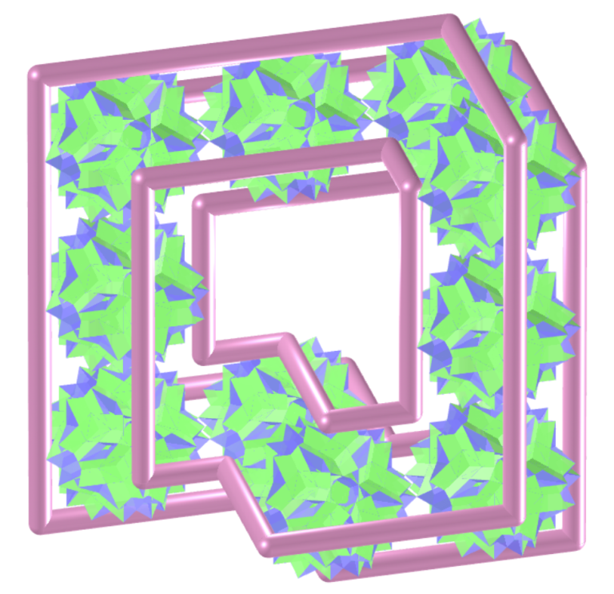</a>
  Möbius and Vélez-Jahn toroid modeled with 10 Great rhombidodecahedrons
  

<h4>46. Möbius and Vélez-Jahn Toroid of Great Stellated Truncated Dodecahedron</h4>
<a href="vr/GreatStellatedTruncatedDodecahedron.html" target="_blank" title="3D model" class="fotoA">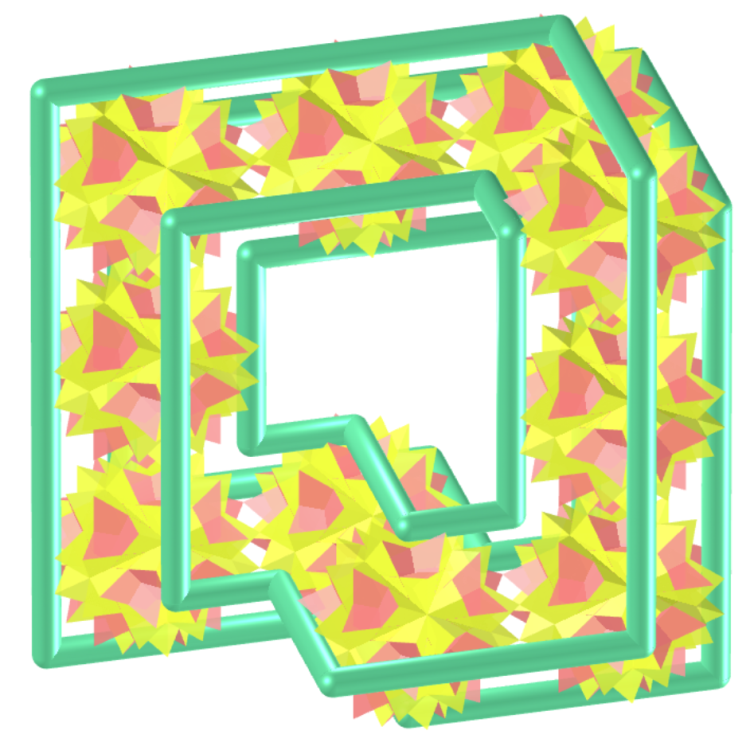</a>
  Möbius and Vélez-Jahn toroid modeled with 10 Great Stellated Truncated Dodecahedrons
  

<h4>47. Möbius and Vélez-Jahn Toroid of Great Truncated Icosidodecahedron</h4>

  Möbius and Vélez-Jahn toroid modeled with 10 Great Truncated Icosidodecahedrons
  

<h4>48. Möbius and Vélez-Jahn Toroid of Icosahedron</h4>
<a href="vr/Icosahedron.html" target="_blank" title="3D model" class="fotoA">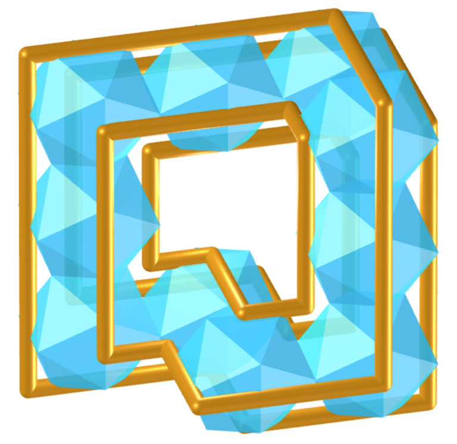</a>
  Möbius and Vélez-Jahn toroid modeled with 10 Icosahedrons
  

<h4>49. Möbius and Vélez-Jahn Toroid of Icosidodecadodecahedron</h4>
<a href="vr/Icosidodecadodecahedron.html" target="_blank" title="3D model" class="fotoA">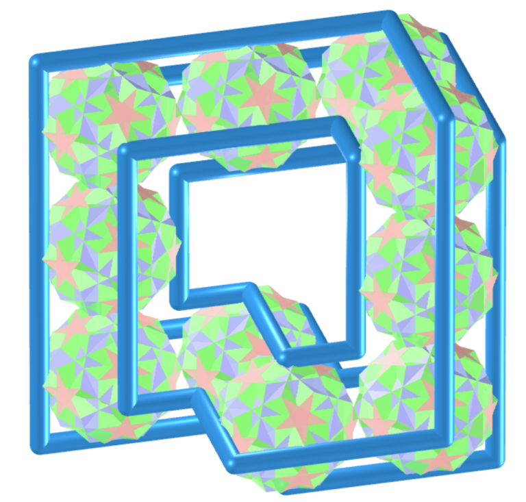</a>
  Möbius and Vélez-Jahn toroid modeled with 10 Icosidodecadodecahedrons
  

<h4>50. Möbius and Vélez-Jahn Toroid of Icositruncated Dodecadodecahedron</h4>
<a href="vr/IcositruncatedDodecadodecahedron.html" target="_blank" title="3D model" class="fotoA">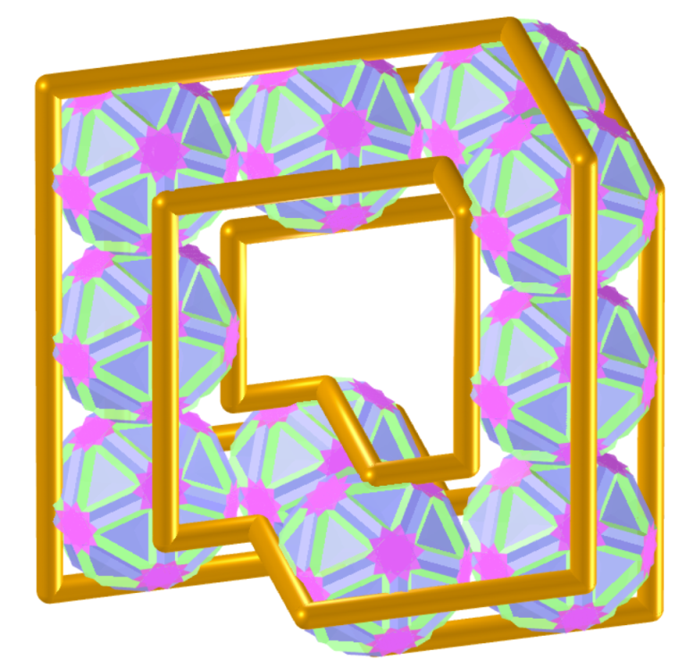</a>
  Möbius and Vélez-Jahn toroid modeled with 10 Icositruncated Dodecadodecahedrons
  

<a href="#p1" class="topo">back to top</a>

<h4>51. Möbius and Vélez-Jahn Toroid of Pentakis Dodecahedron</h4>

  Möbius and Vélez-Jahn toroid modeled with 10 Pentakis Dodecahedrons
  

<h4>52. Möbius and Vélez-Jahn Toroid of Rhombicosahedron</h4>

  Möbius and Vélez-Jahn toroid modeled with 10 Rhombicosahedrons
  

<h4>53. Möbius and Vélez-Jahn Toroid of Rhombicosidodecahedron</h4>

  Möbius and Vélez-Jahn toroid modeled with 10 Rhombicosidodecahedrons
  

<h4>54. Möbius and Vélez-Jahn Toroid of Rhombidodecadodecahedron</h4>
<a href="vr/Rhombidodecadodecahedron.html" target="_blank" title="3D model" class="fotoA">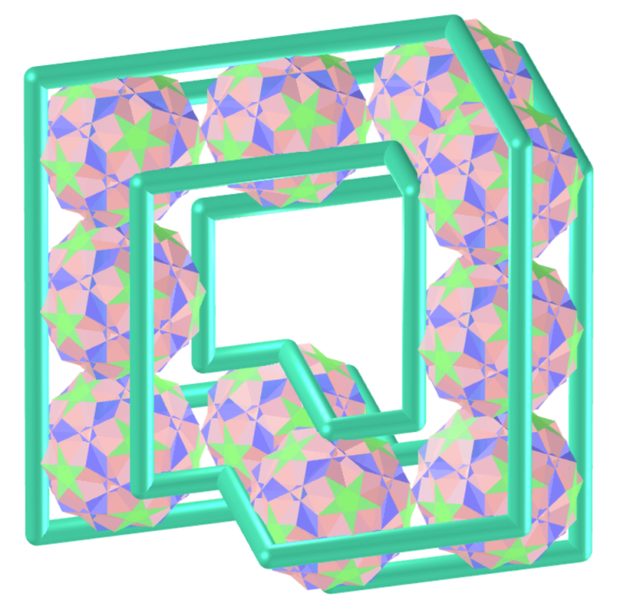</a>
  Möbius and Vélez-Jahn toroid modeled with 10 Rhombidodecadodecahedron
  

<h4>55. Möbius and Vélez-Jahn Toroid of Small Ditrigonal Dodecicosidodecahedron</h4>
<a href="vr/SmallDitrigonalDodecicosidodecahedron.html" target="_blank" title="3D model" class="fotoA">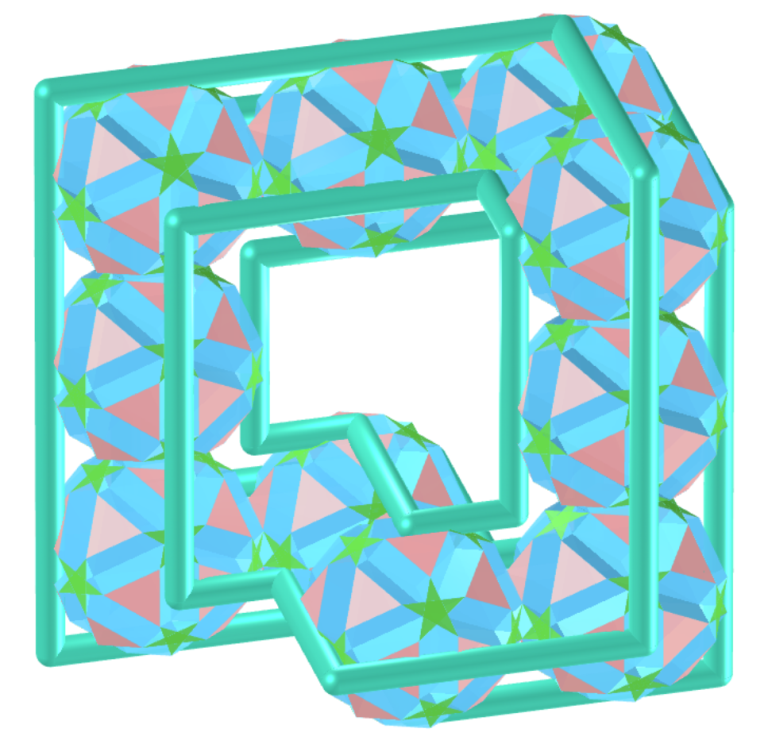</a>
  Möbius and Vélez-Jahn toroid modeled with 10 Small Ditrigonal Dodecicosidodecahedrons
  

<h4>56. Möbius and Vélez-Jahn Toroid of Small Ditrigonal Icosidodecahedron</h4>

  Möbius and Vélez-Jahn toroid modeled with 10 Small Ditrigonal Icosidodecahedrons
  

<h4>57. Möbius and Vélez-Jahn Toroid of Small Dodecahemicosahedron</h4>
<a href="vr/SmallDodecahemicosahedron.html" target="_blank" title="3D model" class="fotoA">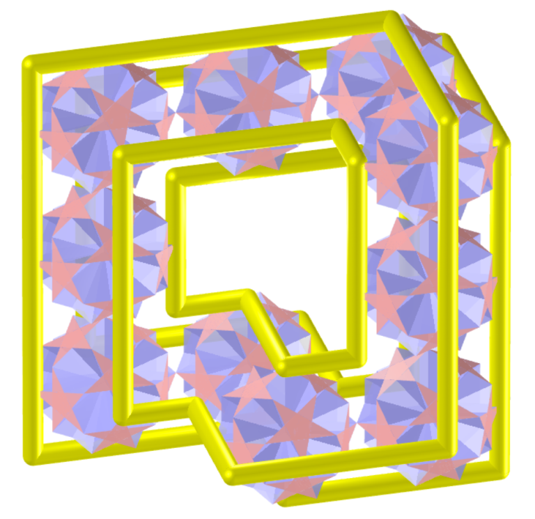</a>
  Möbius and Vélez-Jahn toroid modeled with 10 Small Dodecahemicosahedrons
  

<h4>58. Möbius and Vélez-Jahn Toroid of Small Dodecicosahedron</h4>

  Möbius and Vélez-Jahn toroid modeled with 10 Small Dodecicosahedrons
  

<h4>59. Möbius and Vélez-Jahn Toroid of Small Dodecicosidodecahedron</h4>

  Möbius and Vélez-Jahn toroid modeled with 10 Small Dodecicosidodecahedrons
  

<h4>60. Möbius and Vélez-Jahn Toroid of Small Hexagonal Hexecontahedron</h4>

  Möbius and Vélez-Jahn toroid modeled with 10 Small Hexagonal Hexecontahedrons
  

<a href="#p1" class="topo">back to top</a>

<h4>61. Möbius and Vélez-Jahn Toroid of Small Icosicosidodecahedron</h4>

  Möbius and Vélez-Jahn toroid modeled with 10 Small Icosicosidodecahedrons
  

<h4>62. Möbius and Vélez-Jahn Toroid of Small Rhombidodecahedron</h4>
<a href="vr/SmallRhombidodecahedron.html" target="_blank" title="3D model" class="fotoA">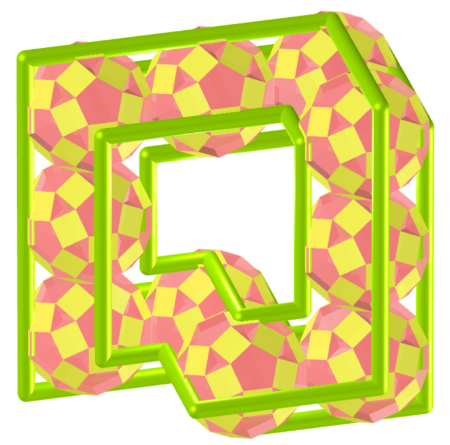</a>
  Möbius and Vélez-Jahn toroid modeled with 10 Small Rhombidodecahedrons
  

<h4>63. Möbius and Vélez-Jahn Toroid of Small Snub Icosicosidodecahedron</h4>

  Möbius and Vélez-Jahn toroid modeled with 10 Small Snub Icosicosidodecahedrons
  

<h4>64. Möbius and Vélez-Jahn Toroid of Small Stellated Truncated Dodecahedron</h4>

  Möbius and Vélez-Jahn toroid modeled with 10 Small Stellated Truncated Dodecahedrons
  

<h4>65. Möbius and Vélez-Jahn Toroid of Small Triambic Icosahedron</h4>
<a href="vr/SmallTriambicIcosahedron.html" target="_blank" title="3D model" class="fotoA">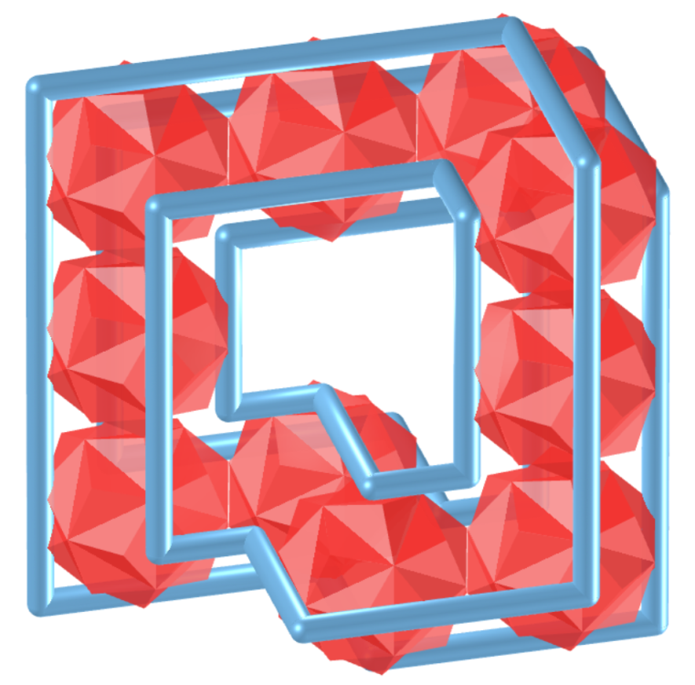</a>
  Möbius and Vélez-Jahn toroid modeled with 10 Small Triambic Icosahedrons
  

<h4>66. Möbius and Vélez-Jahn Toroid of Stellated Truncated Hexahedron</h4>
<a href="vr/StellatedTruncatedHexahedron.html" target="_blank" title="3D model" class="fotoA">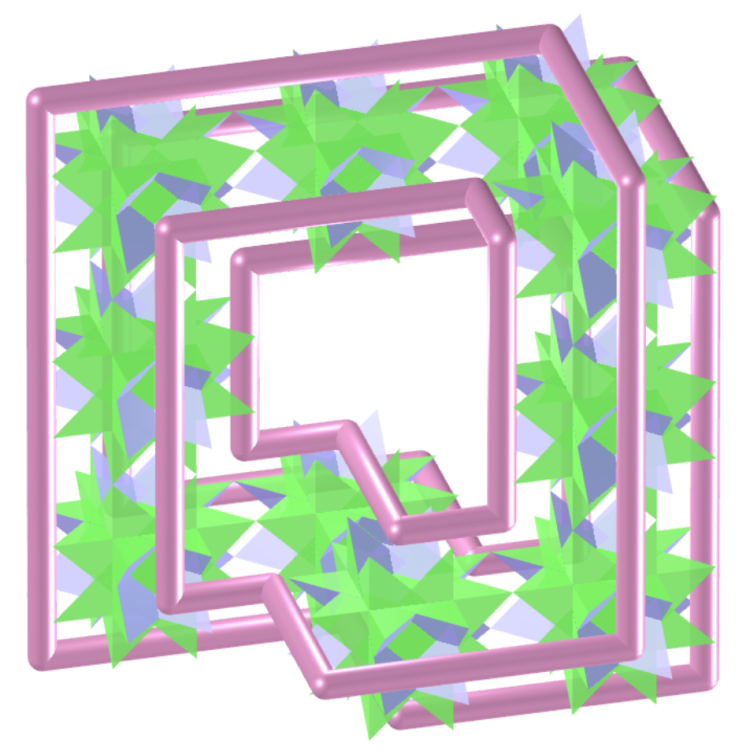</a>
  Möbius and Vélez-Jahn toroid modeled with 10 Stellated Truncated Hexahedrons
  

<h4>67. Möbius and Vélez-Jahn Toroid of Triakis Icosahedron</h4>
<a href="vr/TriakisIcosahedron.html" target="_blank" title="3D model" class="fotoA">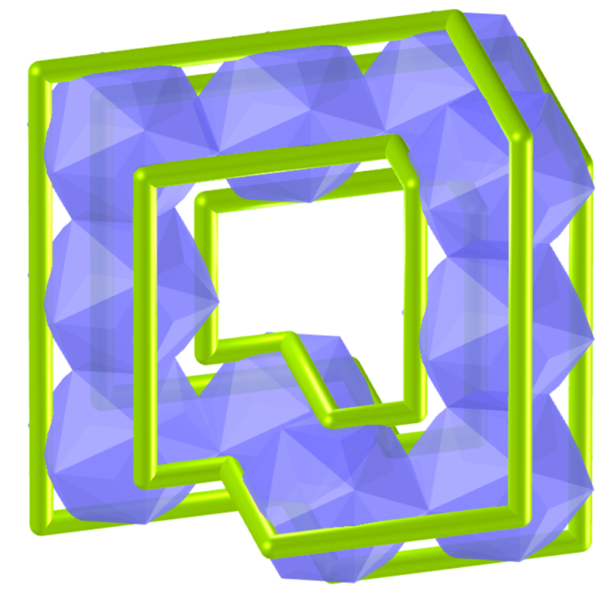</a>
  Möbius and Vélez-Jahn toroid modeled with 10 Triakis Icosahedrons
  

<h4>68. Möbius and Vélez-Jahn Toroid of Truncated Dodecadodecahedron</h4>

  Möbius and Vélez-Jahn toroid modeled with 10 Truncated Dodecadodecahedrons
  

<h4>69. Möbius and Vélez-Jahn Toroid of Truncated Dodecahedron</h4>
<a href="vr/TruncatedDodecahedron.html" target="_blank" title="3D model" class="fotoA">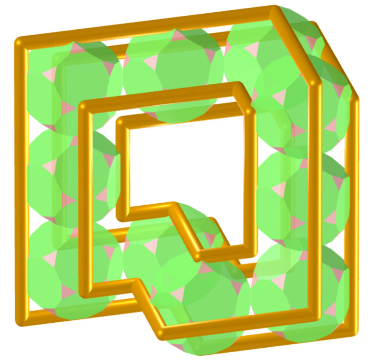</a>
  Möbius and Vélez-Jahn toroid modeled with 10 Truncated Dodecahedrons
  

<h4>70. Möbius and Vélez-Jahn Toroid of Great Truncated Dodecahedron</h4>
<a href="vr/TruncatedGreatDodecahedron.html" target="_blank" title="3D model" class="fotoA">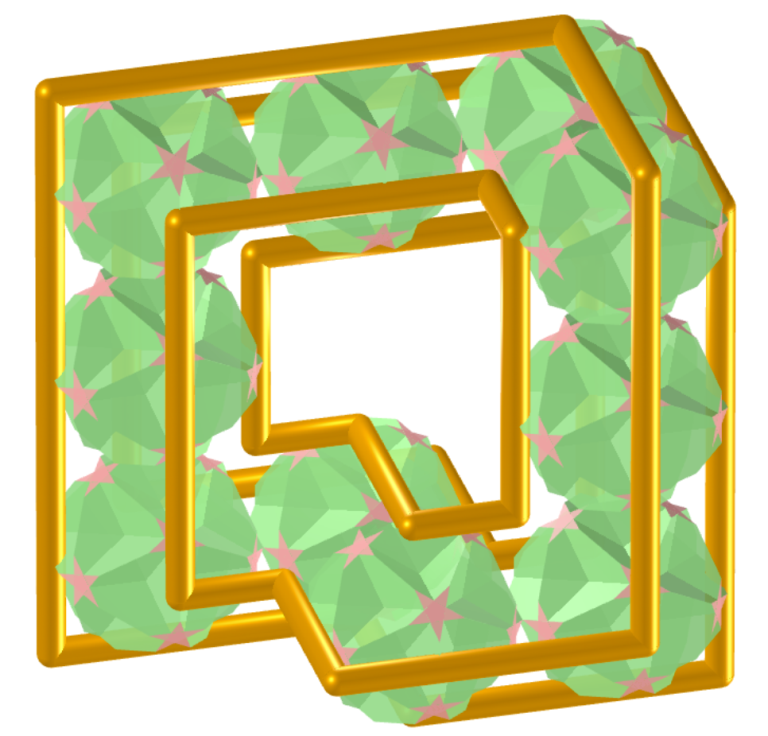</a>
  Möbius and Vélez-Jahn toroid modeled with 10 Great Truncated Dodecahedrons
  

<a href="#p1" class="topo">back to top</a>

<h4>71. Möbius and Vélez-Jahn Toroid of Great Truncated Icosahedron</h4>

  Möbius and Vélez-Jahn toroid modeled with 10 Great Truncated Icosahedrons
  

<h4>72. Möbius and Vélez-Jahn Toroid of Truncated Icosahedron</h4>

  Möbius and Vélez-Jahn toroid modeled with 10 Truncated Icosahedrons
  

<h4>73. Möbius and Vélez-Jahn Toroid of Truncated Icosidodecahedron</h4>
<a href="vr/TruncatedIcosidodecahedron.html" target="_blank" title="3D model" class="fotoA">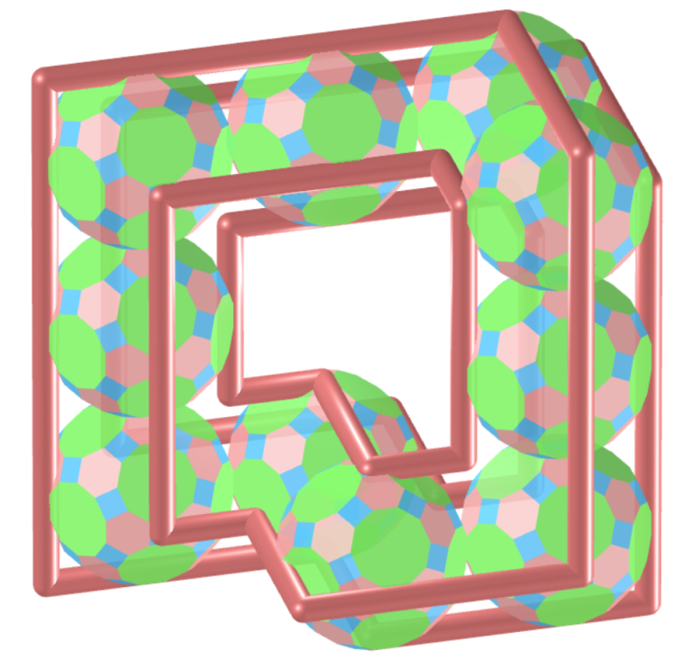</a>
  Möbius and Vélez-Jahn toroid modeled with 10 Truncated Icosidodecahedrons
  

<h4>74. Möbius and Vélez-Jahn Toroid of Uniform Great Rhombicosidodecahedron</h4>
<a href="vr/UniformGreatRhombicosidodecahedron.html" target="_blank" title="3D model" class="fotoA">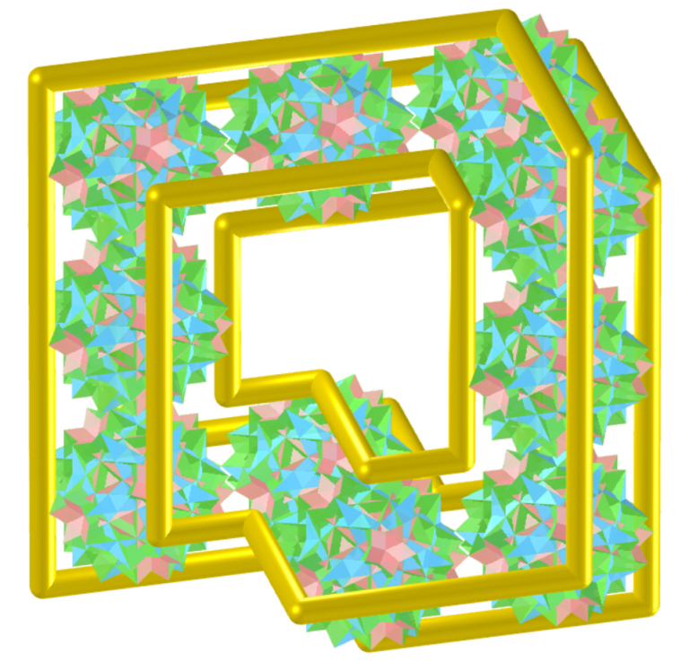</a>
  Möbius and Vélez-Jahn toroid modeled with 10 Uniform Great Rhombicosidodecahedrons
  

<h4>75. Möbius and Vélez-Jahn Toroid of Uniform Great Rhombicuboctahedron</h4>

  Möbius and Vélez-Jahn toroid modeled with 10 Uniform Great Rhombicuboctahedrons
  

<a href="#p1" class="topo">back to top</a>

  Möbius, Vélez-Jahn and Cairo toroids: visualization of solids with Virtual Reality by <a xmlns:cc="http://creativecommons.org/ns#" href="https://paulohscwb.github.io/torus-toroids/mobiuscairo/" property="cc:attributionName" rel="cc:attributionURL">Paulo Henrique Siqueira</a> is licensed with a license <a rel="license" href="http://creativecommons.org/licenses/by-nc-nd/4.0/">Creative Commons Attribution-NonCommercial-NoDerivatives 4.0 International</a>.

<h4>How to cite this work:</h4> 

Siqueira, P.H., "Möbius, Vélez-Jahn and Cairo toroids: visualization of solids with Virtual Reality". Available in: <https://paulohscwb.github.io/torus-toroids/mobiuscairo/>, July 2025.

<!---->
  <b>References:</b>
 Weisstein, Eric W. "Torus" From MathWorld-A Wolfram Web Resource. <a href="https://mathworld.wolfram.com/Torus.html" target="_blank">https://mathworld.wolfram.com/Torus.html</a>
 Weisstein, Eric W. "Toroid" From MathWorld-A Wolfram Web Resource. <a href="https://mathworld.wolfram.com/Toroid.html" target="_blank">https://mathworld.wolfram.com/Toroid.html</a>
 McCooey, D. I. "Visual Polyhedra". <a href="http://dmccooey.com/polyhedra/" target="_blank">http://dmccooey.com/polyhedra/</a>
