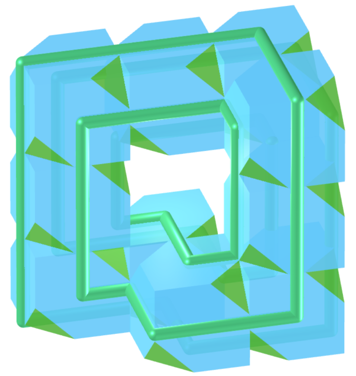
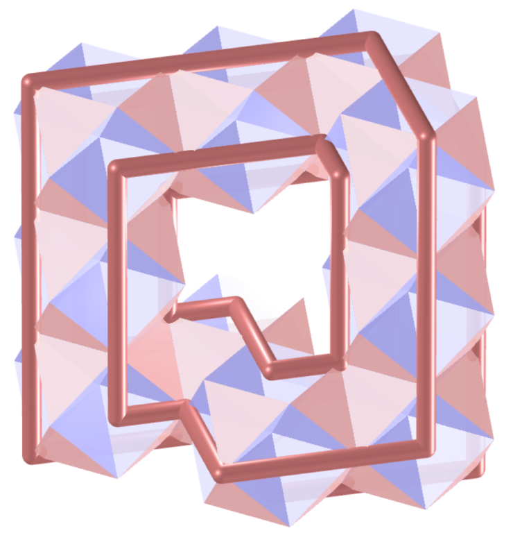
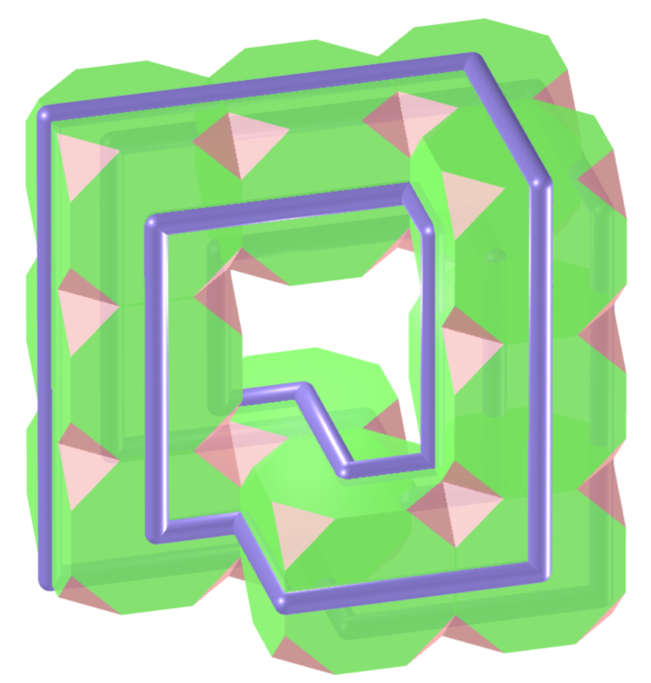

<link rel="stylesheet" href="../../scripts/style1.css">
<meta charset="utf-8">
<link rel="icon" type="image/png" href="../vr/salas/imagens/icone.png">
<h2>Toros e toroides: visualização dos sólidos com Realidade Aumentada (RA) e Realidade Virtual (RV) em A-frame</h2>
<b>autor:</b> Paulo Henrique Siqueira - Universidade Federal do Paraná
 <b>contato:</b> <a href="#"> paulohscwb@gmail.com </a>
 <a href="https://paulohscwb.github.io/torus-toroids/mobiuscairo/">english version</a>
<form style="margin: 0 auto; float:right; text-align:right; width:100%; margin-bottom:15px;">
	<select id="url" onchange="urlHandler(this.value)" style="color:royalblue;">
		<option disabled selected>Mais sólidos:</option>
		<option value="../../basic/pt-br/">Toros e toroides</option>
		<option value="../../tetragonal/pt-br/">Toroides tetragonais</option>
		<option value="../../iris/pt-br/">Toroides de íris</option>
		<option value="../../regulartetrag/pt-br/">Toroides tetragonais regulares</option>
		<option disabled value="../../mobiuscairo/pt-br/">Toroides de Möbius, Vélez-Jahn e Cairo</option>
		<!--<option value="../../hexagonal/pt-br/">Toroides hexagonais</option>
		<option value="../../heptagonal/pt-br/">Dodecaedros heptagonais</option>
		<option value="../../regular1/pt-br/">Toroides poligonais regulares 1</option>
		<option value="../../regular2/pt-br/">Toroides poligonais regulares 2</option>
		<option value="../../regular3/pt-br/">Toroides poligonais regulares 3</option>
		<option value="../../rings/pt-br/">Anéis toroides</option>
		<option value="../../regular4/pt-br/">Toroides poligonais regulares 4</option>
		<option value="../../regular5/pt-br/">Toroides poligonais regulares 5</option>-->
	</select>
</form>

  <h2 align="center"> Toroides de Möbius, Vélez-Jahn e Cairo</h2>
O azulejo do Cairo recebeu esse nome em homenagem ao padrão de reboco de algumas ruas do Cairo.
 Os sólidos com características semelhantes às folhas de Möbius foram descobertos por Gonzalo Vélez-Jahn em 1968. Estes sólidos foram descritos por Martin Gardner como poliedros toroidais, que são transformações de anéis prismáticos.
 Este trabalho mostra toroides de Möbius, Vélez-Jahn e Cairo modelados em 3D, com as visualizações que podem ser acessadas com recursos em salas de Realidade Virtual imersivas.
 
<a href="#m3d">Modelos 3D</a>&nbsp;&nbsp;|&nbsp;&nbsp;<a href="../../pt-br/">Página Inicial</a>

 

  

  

<h3 id="m3d" align="center">3D models</h3>
<iframe width="560" height="315" style="max-width:100%" src="https://www.youtube.com/embed/videoseries?list=PLy0I_lGW8HxX4SO0YCbBirWFdv0fun3KV" title="YouTube video player" frameborder="0" allow="accelerometer; autoplay; clipboard-write; encrypted-media; gyroscope; picture-in-picture; web-share" allowfullscreen></iframe>
<h4>1. Toroide de azulejo de Cairo</h4>

  <b>faces:</b> 8 pentágonos simétricos | <b>vértices:</b> 12 | <b>arestas:</b> 20
  

<h4>2. Toroide de azulejo de Cairo v2</h4>

  <b>faces:</b> 16 pentágonos simétricos | <b>vértices:</b> 24 | <b>arestas:</b> 40
  

<h4>3. Toroide de azulejo de Cairo v3</h4>

  <b>faces:</b> 16 pentágonos irregulares | <b>vértices:</b> 24 | <b>arestas:</b> 40
  

<h4>4. Toroide de azulejo de Cairo bumerangue</h4>

  <b>faces:</b> 16 pentágonos irregulares | <b>vértices:</b> 24 | <b>arestas:</b> 40
  

<h4>5. Toroide de azulejo de Cairo bumerangue v2</h4>

  <b>faces:</b> 16 pentágonos irregulares | <b>vértices:</b> 24 | <b>arestas:</b> 40
  

<h4>6. Tetraedro Chanfrado</h4>

  Toroide de Möbius e Vélez-Jahn modelado com 10 Tetraedros Chanfrados
  

<h4>7. Cubo</h4>

  Toroide de Möbius e Vélez-Jahn modelado com 10 Cubos
  

<h4>8. Cubo com pipas</h4>

  Toroide de Möbius e Vélez-Jahn modelado com 10 Cubos com pipas
  

<h4>9. Cuboctaedro Cubitruncado</h4>

  Toroide de Möbius e Vélez-Jahn modelado com 10 Cuboctaedros Cubitruncados
  

<h4>10. Cuboctaedro</h4>

  Toroide de Möbius e Vélez-Jahn modelado com 10 Cuboctaedros
  

<a href="#p1" class="topo">voltar ao topo</a>

<h4>11. Cuboctaedro com pipas</h4>

  Toroide de Möbius e Vélez-Jahn modelado com 10 Cuboctaedros com pipas
  

<h4>12. Cubohemioctaedro</h4>

  Toroide de Möbius e Vélez-Jahn modelado com 10 Cubohemioctaedros
  

<h4>13. Sólido de Escher</h4>

  Toroide de Möbius e Vélez-Jahn modelado com 10 sólidos de Escher
  

<h4>14. Grande Cubicuboctaedro</h4>

  Toroide de Möbius e Vélez-Jahn modelado com 10 Grandes Cubicuboctaedros
  

<h4>15. Grande Rombihexaedro</h4>

  Toroide de Möbius e Vélez-Jahn modelado com 10 Grandes Rombihexaedros
  

<h4>16. Grande Cuboctaedro Truncado</h4>

  Toroide de Möbius e Vélez-Jahn modelado com 10 Grandes Cuboctaedros Truncados
  

<h4>17. Octahemioctacron</h4>

  Toroide de Möbius e Vélez-Jahn modelado com 10 Octahemioctacrons
  

<h4>18. Octahemioctaedro</h4>

  Toroide de Möbius e Vélez-Jahn modelado com 10 Octahemioctaedros
  

<h4>19. Rombicuboctaedro</h4>

  Toroide de Möbius e Vélez-Jahn modelado com 10 Rombicuboctaedros
  

<h4>20. Rombicuboctaedro com pipas</h4>

  Toroide de Möbius e Vélez-Jahn modelado com 10 Rombicuboctaedros com pipas
  

<a href="#p1" class="topo">voltar ao topo</a>

<h4>21. Pequeno Cuboctaedro</h4>

  Toroide de Möbius e Vélez-Jahn modelado com 10 Pequenos Cuboctaedros
  

<h4>22. Pequeno Rombihexaedro</h4>

  Toroide de Möbius e Vélez-Jahn modelado com 10 Pequenos Rombihexaedros
  

<h4>23. Cubo Truncado</h4>

  Toroide de Möbius e Vélez-Jahn modelado com 10 Cubos Truncados
  

<h4>24. Cubo Truncado com pipas</h4>

  Toroide de Möbius e Vélez-Jahn modelado com 10 Cubos Truncados com pipas
  

<h4>25. Cuboctaedro Truncado</h4>

  Toroide de Möbius e Vélez-Jahn modelado com 10 Cuboctaedros Truncados
  

<h4>26. Cuboctaedro Truncado com pipas</h4>

  Toroide de Möbius e Vélez-Jahn modelado com 10 Cuboctaedros Truncados com pipas
  

<h4>27. Octaedro Truncado</h4>

  Toroide de Möbius e Vélez-Jahn modelado com 10 Octaedros Truncados
  

<h4>28. Octaedro Truncado com pipas</h4>

  Toroide de Möbius e Vélez-Jahn modelado com 10 Octaedros Truncados com pipas
  

<h4>29. Dodecaedro Côncavo</h4>

  Toroide de Möbius e Vélez-Jahn modelado com 10 Codecaedros Côncavos
  

<h4>30. Dodecadodecaedro Ditrigonal</h4>

  Toroide de Möbius e Vélez-Jahn modelado com 10 Dodecadodecaedros Ditrigonais
  

<a href="#p1" class="topo">voltar ao topo</a>

<h4>31. Dodecadodecaedro</h4>

  Toroide de Möbius e Vélez-Jahn modelado com 10 Dodecadodecaedros
  

<h4>32. Dodecaedro</h4>

  Toroide de Möbius e Vélez-Jahn modelado com 10 Dodecaedros
  

<h4>33. Grande Dodecicosidodecaedro Ditrigonal</h4>

  Toroide de Möbius e Vélez-Jahn modelado com 10 Grandes Dodecicosidodecaedros Ditrigonais
  

<h4>34. Grande Icosidodecaedro Ditrigonal</h4>

  Toroide de Möbius e Vélez-Jahn modelado com 10 Grandes Icosidodecaedros Ditrigonais
  

<h4>35. Grande Hexecontaedro Dodecacrônico</h4>

  Toroide de Möbius e Vélez-Jahn modelado com 10 grandes hexecontaedros dodecacrônicos
  

<h4>36. Grande Dodecaedro</h4>

  Toroide de Möbius e Vélez-Jahn modelado com 10 Grandes Dodecaedros
  

<h4>37. Grande Dodecahemicosaedro</h4>

  Toroide de Möbius e Vélez-Jahn modelado com 10 Grandes Dodecahemicosaedros
  

<h4>38. Grande Dodecahemidodecaedro</h4>

  Toroide de Möbius e Vélez-Jahn modelado com 10 Grandes Dodecahemidodecaedros
  

<h4>39. Grande Dodecicosaedro</h4>

  Toroide de Möbius e Vélez-Jahn modelado com 10 Grandes Dodecicosaedros
  

<h4>40. Grande Dodecicosidodecaedro</h4>

  Toroide de Möbius e Vélez-Jahn modelado com 10 Grandes Dodecicosidodecaedros
  

<a href="#p1" class="topo">voltar ao topo</a>

<h4>41. Grande Icosaedro</h4>

  Toroide de Möbius e Vélez-Jahn modelado com 10 Grandes Icosaedros
  

<h4>42. Grande Icosicosidodecaedro</h4>

  Toroide de Möbius e Vélez-Jahn modelado com 10 Grandes Icosicosidodecaedros
  

<h4>43. Grande Icosidodecaedro</h4>

  Toroide de Möbius e Vélez-Jahn modelado com 10 Grandes icosidodecaedros
  

<h4>44. Grande Icosihemidodecaedro</h4>

  Toroide de Möbius e Vélez-Jahn modelado com 10 Grandes icosihemidodecaedros
  

<h4>45. Grande Rombidodecaedro</h4>

  Toroide de Möbius e Vélez-Jahn modelado com 10 Grandes Rombidodecaedros
  

<h4>46. Grande Dodecaedro Estrelado Truncado</h4>

  Toroide de Möbius e Vélez-Jahn modelado com 10 Grandes Dodecaedros Estrelados Truncados
  

<h4>47. Grande Icosidodecaedro Truncado</h4>

  Toroide de Möbius e Vélez-Jahn modelado com 10 Grandes Icosidodecaedros Truncados
  

<h4>48. Icosaedro</h4>

  Toroide de Möbius e Vélez-Jahn modelado com 10 Icosaedros
  

<h4>49. Icosidodecadodecaedro</h4>

  Toroide de Möbius e Vélez-Jahn modelado com 10 Icosidodecadodecaedros
  

<h4>50. Dodecadodecaedro Icositruncado</h4>

  Toroide de Möbius e Vélez-Jahn modelado com 10 Dodecadodecaedros icositruncados
  

<a href="#p1" class="topo">voltar ao topo</a>

<h4>51. Dodecaedro Pentakis</h4>

  Toroide de Möbius e Vélez-Jahn modelado com 10 Dodecaedros Pentakis
  

<h4>52. Rombicosaedro</h4>

  Toroide de Möbius e Vélez-Jahn modelado com 10 Rombicosaedros
  

<h4>53. Rombicosidodecaedro</h4>

  Toroide de Möbius e Vélez-Jahn modelado com 10 Rombicosidodecaedros
  

<h4>54. Rombidodecadodecaedro</h4>

  Toroide de Möbius e Vélez-Jahn modelado com 10 Rombidodecadodecaedros
  

<h4>55. Pequeno Dodecicosidodecaedro Ditrigonal</h4>

  Toroide de Möbius e Vélez-Jahn modelado com 10 Pequenos Dodecicosidodecaedros Ditrigonais
  

<h4>56. Pequeno Icosidodecaedro Ditrigonal</h4>

  Toroide de Möbius e Vélez-Jahn modelado com 10 Pequenos Icosidodecaedros Ditrigonais
  

<h4>57. Pequeno Dodecahemicosaedro</h4>

  Toroide de Möbius e Vélez-Jahn modelado com 10 Pequenos Dodecahemicosaedros
  

<h4>58. Pequeno Dodecicosaedro</h4>

  Toroide de Möbius e Vélez-Jahn modelado com 10 Pequenos Dodecicosaedros
  

<h4>59. Pequeno Dodecicosidodecaedro</h4>

  Toroide de Möbius e Vélez-Jahn modelado com 10 Pequenos Dodecicosidodecaedros
  

<h4>60. Pequeno Hexecontaedro Hexagonal</h4>

  Toroide de Möbius e Vélez-Jahn modelado com 10 Pequenos Hexecontaedros Hexagonais
  

<a href="#p1" class="topo">voltar ao topo</a>

<h4>61. Pequeno Icosicosidodecaedro </h4>

  Toroide de Möbius e Vélez-Jahn modelado com 10 Pequenos Icosicosidodecaedros
  

<h4>62. Pequeno Rombidodecaedro</h4>

  Toroide de Möbius e Vélez-Jahn modelado com 10 Pequenos Rombidodecaedros
  

<h4>63. Pequeno Icosicosidodecaedro Snub</h4>

  Toroide de Möbius e Vélez-Jahn modelado com 10 Pequenos Icosicosidodecaedros Snub
  

<h4>64. Pequeno Dodecaedro Estrelado Truncado</h4>

  Toroide de Möbius e Vélez-Jahn modelado com 10 Pequenos Dodecaedros Estrelados Truncados
  

<h4>65. Pequeno Icosaedro Triâmbico</h4>

  Toroide de Möbius e Vélez-Jahn modelado com 10 Pequenos Icosaedros Triâmbicos
  

<h4>66. Hexaedro Truncado Estrelado</h4>

  Toroide de Möbius e Vélez-Jahn modelado com 10 Hexaedros Truncados Estrelados
  

<h4>67. Icosaedro Triakis</h4>

  Toroide de Möbius e Vélez-Jahn modelado com 10 Icosaedros Triakis
  

<h4>68. Dodecadodecaedro Truncado</h4>

  Toroide de Möbius e Vélez-Jahn modelado com 10 Dodecadodecaedros Truncados
  

<h4>69. Dodecaedro Truncado</h4>

  Toroide de Möbius e Vélez-Jahn modelado com 10 Dodecaedros Truncados
  

<h4>70. Grande Dodecaedro Truncado</h4>

  Toroide de Möbius e Vélez-Jahn modelado com 10 Grandes Dodecaedros Truncados
  

<a href="#p1" class="topo">voltar ao topo</a>

<h4>71. Grande Icosaedro Truncado</h4>

  Toroide de Möbius e Vélez-Jahn modelado com 10 Grandes Icosaedros Truncados
  

<h4>72. Icosaedro Truncado</h4>

  Toroide de Möbius e Vélez-Jahn modelado com 10 Icosaedros Truncados
  

<h4>73. Icosidodecaedro Truncado</h4>

  Toroide de Möbius e Vélez-Jahn modelado com 10 Icosidodecaedros Truncados
  

<h4>74. Grande Rombicosidodecaedro Uniforme</h4>

  Toroide de Möbius e Vélez-Jahn modelado com 10 Grandes Rombicosidodecaedros Uniformes
  

<h4>75. Grande Rombicuboctaedro Uniforme</h4>

  Toroide de Möbius e Vélez-Jahn modelado com 10 Grandes Rombicuboctaedros Uniformes
  

<a href="#p1" class="topo">voltar ao topo</a>

  Möbius, Vélez-Jahn and Cairo toroids: visualization of solids with Virtual Reality de <a xmlns:cc="http://creativecommons.org/ns#" href="https://paulohscwb.github.io/torus-toroids/mobiuscairo/pt-br/" property="cc:attributionName" rel="cc:attributionURL">Paulo Henrique Siqueira</a> está licenciado com uma Licença <a rel="license" href="http://creativecommons.org/licenses/by-nc-nd/4.0/">Creative Commons Atribuição-NãoComercial-SemDerivações 4.0 Internacional</a>.

<h4>Como citar este trabalho:</h4> 

Siqueira, P.H., "Möbius, Vélez-Jahn and Cairo toroids: visualization of solids with Virtual Reality". Disponível em: <https://paulohscwb.github.io/torus-toroids/mobiuscairo/pt-br/>, Julho de 2025.

<!---->
  <b>Referências:</b>
 Weisstein, Eric W. "Torus" From MathWorld-A Wolfram Web Resource. <a href="https://mathworld.wolfram.com/Torus.html" target="_blank">https://mathworld.wolfram.com/Torus.html</a>
 Weisstein, Eric W. "Toroid" From MathWorld-A Wolfram Web Resource. <a href="https://mathworld.wolfram.com/Toroid.html" target="_blank">https://mathworld.wolfram.com/Toroid.html</a>
 McCooey, D. I. "Visual Polyhedra". <a href="http://dmccooey.com/polyhedra/" target="_blank">http://dmccooey.com/polyhedra/</a>
