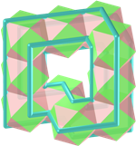
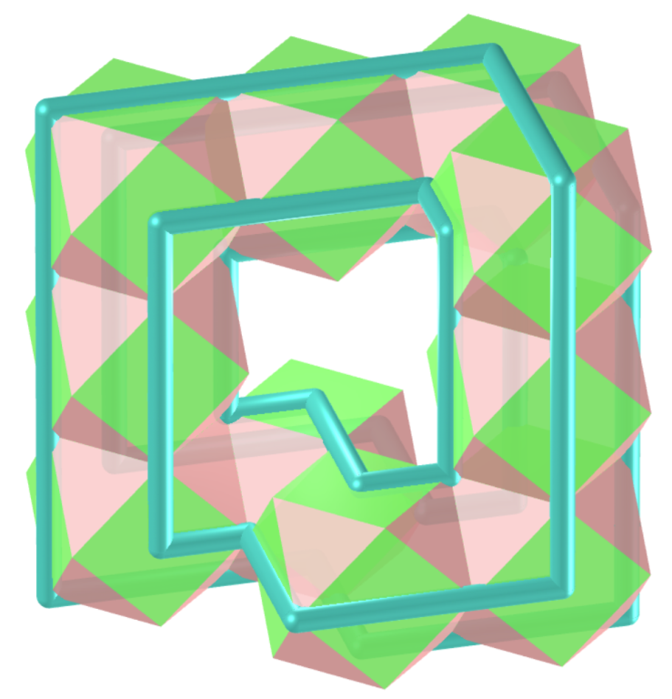
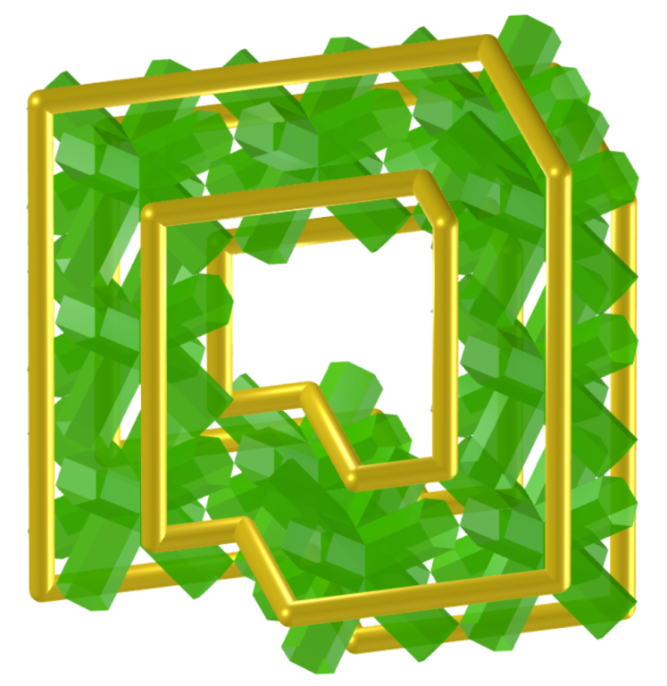
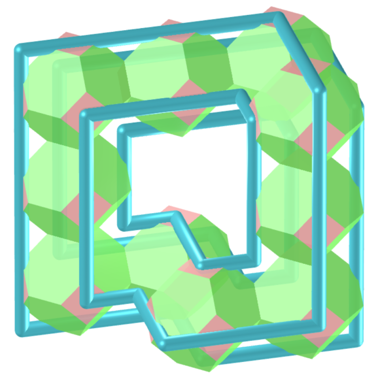

<link rel="stylesheet" href="../../scripts/style1.css">
<meta charset="utf-8">
<link rel="icon" type="image/png" href="../vr/salas/imagens/icone.png">
<h2>Toros e toroides: visualização dos sólidos com Realidade Aumentada (RA) e Realidade Virtual (RV) em A-frame</h2>
<b>autor:</b> Paulo Henrique Siqueira - Universidade Federal do Paraná
 <b>contato:</b> <a href="#"> paulohscwb@gmail.com </a>
 <a href="https://paulohscwb.github.io/torus-toroids/mobiuscairo/">english version</a>
<form style="margin: 0 auto; float:right; text-align:right; width:100%; margin-bottom:15px;">
	<select id="url" onchange="urlHandler(this.value)" style="color:royalblue;">
		<option disabled selected>Mais sólidos:</option>
		<option value="../../basic/pt-br/">Toros e toroides</option>
		<option value="../../tetragonal/pt-br/">Toroides tetragonais</option>
		<option value="../../iris/pt-br/">Toroides de íris</option>
		<option value="../../regulartetrag/pt-br/">Toroides tetragonais regulares</option>
		<option disabled value="../../mobiuscairo/pt-br/">Toroides de Möbius, Vélez-Jahn e Cairo</option>
		<!--<option value="../../hexagonal/pt-br/">Toroides hexagonais</option>
		<option value="../../heptagonal/pt-br/">Dodecaedros heptagonais</option>
		<option value="../../regular1/pt-br/">Toroides poligonais regulares 1</option>
		<option value="../../regular2/pt-br/">Toroides poligonais regulares 2</option>
		<option value="../../regular3/pt-br/">Toroides poligonais regulares 3</option>
		<option value="../../rings/pt-br/">Anéis toroides</option>
		<option value="../../regular4/pt-br/">Toroides poligonais regulares 4</option>
		<option value="../../regular5/pt-br/">Toroides poligonais regulares 5</option>-->
	</select>
</form>

  <h2 align="center"> Toroides de Möbius, Vélez-Jahn e Cairo</h2>
O azulejo do Cairo recebeu esse nome em homenagem ao padrão de reboco de algumas ruas do Cairo.
 Os sólidos com características semelhantes às folhas de Möbius foram descobertos por Gonzalo Vélez-Jahn em 1968. Estes sólidos foram descritos por Martin Gardner como poliedros toroidais, que são transformações de anéis prismáticos.
 Este trabalho mostra toroides de Möbius, Vélez-Jahn e Cairo modelados em 3D, com as visualizações que podem ser acessadas com recursos em salas de Realidade Virtual imersivas.
 
<a href="#m3d">Modelos 3D</a>&nbsp;&nbsp;|&nbsp;&nbsp;<a href="../../pt-br/">Página Inicial</a>

 

  

  

<h3 id="m3d" align="center">3D models</h3>
<!--<iframe width="560" height="315" style="max-width:100%" src="https://www.youtube.com/embed/videoseries?list=PLy0I_lGW8HxXgcL9RxOVEfCA1KDLByHZt" title="YouTube video player" frameborder="0" allow="accelerometer; autoplay; clipboard-write; encrypted-media; gyroscope; picture-in-picture; web-share" allowfullscreen></iframe>-->
<h4>1. Toroide de azulejo de Cairo</h4>

  <b>faces:</b> 8 pentágonos simétricos | <b>vértices:</b> 12 | <b>arestas:</b> 20
  

<h4>2. Toroide de azulejo de Cairo v2</h4>

  <b>faces:</b> 16 pentágonos simétricos | <b>vértices:</b> 24 | <b>arestas:</b> 40
  

<h4>3. Toroide de azulejo de Cairo v3</h4>

  <b>faces:</b> 16 pentágonos simétricos | <b>vértices:</b> 24 | <b>arestas:</b> 40
  

<h4>4. Toroide de azulejo de Cairo bumerangue</h4>

  <b>faces:</b> 16 pentágonos irregulares | <b>vértices:</b> 24 | <b>arestas:</b> 40
  

<h4>5. Toroide de azulejo de Cairo bumerangue v2</h4>

  <b>faces:</b> 16 pentágonos irregulares | <b>vértices:</b> 24 | <b>arestas:</b> 40
  

<h4>6. Toroide de Möbius e Vélez-Jahn de Tetraedro Chanfrado</h4>

  Toroide de Möbius e Vélez-Jahn modelado com 10 Tetraedros Chanfrados
  

<h4>7. Toroide de Möbius e Vélez-Jahn de Cubo</h4>

  Toroide de Möbius e Vélez-Jahn modelado com 10 Cubos
  

<h4>8. Toroide de Möbius e Vélez-Jahn de Cubo com pipas</h4>

  Toroide de Möbius e Vélez-Jahn modelado com 10 Cubos com pipas
  

<h4>9. Toroide de Möbius e Vélez-Jahn de Cuboctaedro Cubitruncado</h4>

  Toroide de Möbius e Vélez-Jahn modelado com 10 Cuboctaedros Cubitruncados
  

<h4>10. Toroide de Möbius e Vélez-Jahn de Cuboctaedro</h4>

  Toroide de Möbius e Vélez-Jahn modelado com 10 Cuboctaedros
  

<a href="#p1" class="topo">voltar ao topo</a>

<h4>11. Toroide de Möbius e Vélez-Jahn de Cuboctaedro com pipas</h4>

  Toroide de Möbius e Vélez-Jahn modelado com 10 Cuboctaedros com pipas
  

<h4>12. Toroide de Möbius e Vélez-Jahn de Cubohemioctaedro</h4>

  Toroide de Möbius e Vélez-Jahn modelado com 10 Cubohemioctaedros
  

<h4>13. Toroide de Möbius e Vélez-Jahn do sólido de Escher</h4>

  Toroide de Möbius e Vélez-Jahn modelado com 10 sólidos de Escher
  

<h4>14. Toroide de Möbius e Vélez-Jahn de Grande Cubicuboctaedro</h4>

  Toroide de Möbius e Vélez-Jahn modelado com 10 Grandes Cubicuboctaedros
  

<h4>15. Toroide de Möbius e Vélez-Jahn de Grande Rombihexaedro</h4>

  Toroide de Möbius e Vélez-Jahn modelado com 10 Grandes Rombihexaedros
  

<h4>16. Toroide de Möbius e Vélez-Jahn de Grande Cuboctaedro Truncado</h4>

  Toroide de Möbius e Vélez-Jahn modelado com 10 Grandes Cuboctaedros Truncados
  

<h4>17. Toroide de Möbius e Vélez-Jahn de Octahemioctacron</h4>

  Toroide de Möbius e Vélez-Jahn modelado com 10 Octahemioctacrons
  

<h4>18. Toroide de Möbius e Vélez-Jahn de Octahemioctaedro</h4>

  Toroide de Möbius e Vélez-Jahn modelado com 10 Octahemioctaedros
  

<h4>19. Toroide de Möbius e Vélez-Jahn de Rombicuboctaedro</h4>

  Toroide de Möbius e Vélez-Jahn modelado com 10 Rombicuboctaedros
  

<h4>20. Toroide de Möbius e Vélez-Jahn de Rombicuboctaedro com pipas</h4>

  Toroide de Möbius e Vélez-Jahn modelado com 10 Rombicuboctaedros com pipas
  

<a href="#p1" class="topo">voltar ao topo</a>

<h4>21. Toroide de Möbius e Vélez-Jahn de Pequeno Cuboctaedro</h4>

  Toroide de Möbius e Vélez-Jahn modelado com 10 Pequenos Cuboctaedros
  

<h4>22. Toroide de Möbius e Vélez-Jahn de Pequeno Rombihexaedro</h4>

  Toroide de Möbius e Vélez-Jahn modelado com 10 Pequenos Rombihexaedros
  

<h4>23. Toroide de Möbius e Vélez-Jahn de Cubo Truncado</h4>

  Toroide de Möbius e Vélez-Jahn modelado com 10 Cubos Truncados
  

<h4>24. Toroide de Möbius e Vélez-Jahn de Cubo Truncado com pipas</h4>

  Toroide de Möbius e Vélez-Jahn modelado com 10 Cubos Truncados com pipas
  

<h4>25. Toroide de Möbius e Vélez-Jahn de Cuboctaedro Truncado</h4>

  Toroide de Möbius e Vélez-Jahn modelado com 10 Cuboctaedros Truncados
  

<h4>26. Toroide de Möbius e Vélez-Jahn de Cuboctaedro Truncado com pipas</h4>

  Toroide de Möbius e Vélez-Jahn modelado com 10 Cuboctaedros Truncados com pipas
  

<h4>27. Toroide de Möbius e Vélez-Jahn de Octaedro Truncado</h4>

  Toroide de Möbius e Vélez-Jahn modelado com 10 Octaedros Truncados
  

<h4>28. Toroide de Möbius e Vélez-Jahn de Octaedro Truncado com pipas</h4>

  Toroide de Möbius e Vélez-Jahn modelado com 10 Octaedros Truncados com pipas
  

<a href="#p1" class="topo">voltar ao topo</a>

  Möbius, Vélez-Jahn and Cairo toroids: visualization of solids with Virtual Reality de <a xmlns:cc="http://creativecommons.org/ns#" href="https://paulohscwb.github.io/torus-toroids/mobiuscairo/pt-br/" property="cc:attributionName" rel="cc:attributionURL">Paulo Henrique Siqueira</a> está licenciado com uma Licença <a rel="license" href="http://creativecommons.org/licenses/by-nc-nd/4.0/">Creative Commons Atribuição-NãoComercial-SemDerivações 4.0 Internacional</a>.

<h4>Como citar este trabalho:</h4> 

Siqueira, P.H., "Möbius, Vélez-Jahn and Cairo toroids: visualization of solids with Virtual Reality". Disponível em: <https://paulohscwb.github.io/torus-toroids/mobiuscairo/pt-br/>, Julho de 2025.

<!---->
  <b>Referências:</b>
 Weisstein, Eric W. "Torus" From MathWorld-A Wolfram Web Resource. <a href="https://mathworld.wolfram.com/Torus.html" target="_blank">https://mathworld.wolfram.com/Torus.html</a>
 Weisstein, Eric W. "Toroid" From MathWorld-A Wolfram Web Resource. <a href="https://mathworld.wolfram.com/Toroid.html" target="_blank">https://mathworld.wolfram.com/Toroid.html</a>
 McCooey, D. I. "Visual Polyhedra". <a href="http://dmccooey.com/polyhedra/" target="_blank">http://dmccooey.com/polyhedra/</a>
