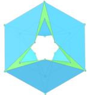
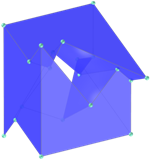
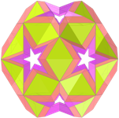

<link rel="stylesheet" href="../scripts/style.css">
<meta charset="utf-8">
<link rel="icon" type="image/png" href="../basic/vr/salas/imagens/icone.png">
<h2>Visualização de Toros e Toroides com Realidade Aumentada (RA) e Realidade Virtual (RV) em A-frame</h2>
<b>autor:</b> Paulo Henrique Siqueira - Universidade Federal do Paraná
 <b>contato:</b> <a href="#"> paulohscwb@gmail.com </a>
 <a href="https://paulohscwb.github.io/torus-toroids/">english version</a>
  Um toro comum é considerado uma superfície de gênero 1. Este sólido possui um único "buraco", e pode ser construído a partir de um retângulo colando ambos os pares de bordas opostas sem torções. O toro usual incorporado no espaço tridimensional tem o formato de uma rosquinha, mas o conceito de toro também é extremamente útil no espaço de dimensões superiores.
 Em geral, os toros também podem ter vários furos, sendo o termo n-toro usado para um toro com n furos. O toro pode ser definido como o lugar geométrico  formado pela rotação de uma superfície circular plana de raio r, em torno de uma circunferência de raio R. 
 O toroide é uma superfície de revolução obtida pela rotação de uma curva plana fechada, ou um polígono, em torno de um eixo paralelo ao plano que não intercepta a curva. O toroide mais simples é o toro e o termo toroide é usado para se referir a um poliedro toroidal.
 Este trabalho mostra toros e toroides modelados em 3D, com as visualizações que podem ser acessadas com os recursos de Realidade Aumentada e também em salas imersivas de Realidade Virtual.

<h3 style="margin-top:3px"><a target="_blank" href="../basic/pt-br/"> Toros e toroides</a></h3>
<!--<h3 style="margin-top:3px"><a target="_blank" href="../tetragonal/pt-br/"> Toroides tetragonais</a></h3>
<h3 style="margin-top:3px"><a target="_blank" href="../iris/pt-br/"> Toroides de íris</a></h3>
<h3 style="margin-top:3px"><a target="_blank" href="../mobius-cairo/pt-br/"> Toroides de Mobius e Cairo</a></h3>
<h3 style="margin-top:3px"><a target="_blank" href="../regular/pt-br/"> Toroides regulares</a></h3>
<h3 style="margin-top:3px"><a target="_blank" href="../hexagonal/pt-br/"> Toroides hexagonais</a></h3>
<h3 style="margin-top:3px"><a target="_blank" href="../heptagonal/pt-br/"> Dodecaedros heptagonais</a></h3>
<h3 style="margin-top:3px"><a target="_blank" href="../regular1/pt-br/"> Toroides poligonais regulares 1</a></h3>
<h3 style="margin-top:3px"><a target="_blank" href="../regular2/pt-br/"> Toroides poligonais regulares 2</a></h3>
<h3 style="margin-top:3px"><a target="_blank" href="../regular3/pt-br/"> Toroides poligonais regulares 3</a></h3>
<h3 style="margin-top:3px"><a target="_blank" href="../rings/pt-br/"> Anéis toroides</a></h3>
<h3 style="margin-top:3px"><a target="_blank" href="../regular4/pt-br/"> Toroides poligonais regulares 4</a></h3>
<h3 style="margin-top:3px"><a target="_blank" href="../regular5/pt-br/"> Toroides poligonais regulares 5</a></h3>-->

<h3 align="center">Salas imersivas</h3>

<h3 align="center">Realidade Aumentada e modelos 3D</h3>

 Os ambientes de Realidade Aumentada foram criados com os scripts de <b>Jerome Etienne</b>: <a href="https://github.com/jeromeetienne/AR.js" target="_blank"> AR.js - Augmented Reality for the Web</a>.
 Os scripts de órbita desenvolvidos por <b>Kevin Ngo</b> foram usados nas páginas de Realidade Virtual dos modelos 3D: <a href="https://github.com/supermedium/superframe/tree/master/components/orbit-controls/" target="_blank"> Orbit controls for A-Frame</a>.
 As salas imersivas utilizam as propriedades físicas dos objetos 3D desenvolvidas por <b>Micah Blumberg</b>: <a  href="https://github.com/c-frame/aframe-physics-system" target="_blank"> Physics for A-Frame VR</a>
 Os controles de interação usados nas salas imersivas foram desenvolvidos por <b>Will Murphy</b>: <a  href="https://github.com/c-frame/aframe-super-hands-component" target="_blank"> Super Hands</a>
 

  Torus and Toroids: visualization of solids with Augmented Reality and Virtual Reality de <a xmlns:cc="http://creativecommons.org/ns#" href="https://paulohscwb.github.io/torus-toroids/" property="cc:attributionName" rel="cc:attributionURL">Paulo Henrique Siqueira</a> está licenciado com uma Licença <a rel="license" href="http://creativecommons.org/licenses/by-nc-nd/4.0/">Creative Commons Atribuição-NãoComercial-SemDerivações 4.0 Internacional</a>.

<h4>Como citar este trabalho:</h4> 

Siqueira, P.H., "Torus and Toroids: visualization of solids with Augmented Reality and Virtual Reality". Disponível em: <https://paulohscwb.github.io/torus-toroids/>, Fevereiro de 2025.

<!---->
 <b>Referências:</b>
 Weisstein, Eric W. "Torus" From MathWorld-A Wolfram Web Resource. <a href="https://mathworld.wolfram.com/Torus.html" target="_blank">https://mathworld.wolfram.com/Torus.html</a>
 Weisstein, Eric W. "Toroid" From MathWorld-A Wolfram Web Resource. <a href="https://mathworld.wolfram.com/Toroid.html" target="_blank">https://mathworld.wolfram.com/Toroid.html</a>
 McCooey, D. I. "Visual Polyhedra". <a href="http://dmccooey.com/polyhedra/" target="_blank">http://dmccooey.com/polyhedra/</a>
