<link rel="stylesheet" href="../../scripts/style1.css">
<meta charset="utf-8">
<link rel="icon" type="image/png" href="../vr/salas/imagens/icone.png">
<h2>Toros e toroides: visualização dos sólidos com Realidade Aumentada (RA) e Realidade Virtual (RV) em A-frame</h2>
<b>autor:</b> Paulo Henrique Siqueira - Universidade Federal do Paraná
 <b>contato:</b> <a href="#"> paulohscwb@gmail.com </a>
 <a href="https://paulohscwb.github.io/torus-toroids/regular3/">english version</a>
<form style="margin: 0 auto; float:right; text-align:right; width:100%; margin-bottom:15px;">
	<select id="url" onchange="urlHandler(this.value)" style="color:royalblue;">
		<option disabled selected>Mais sólidos:</option>
		<option value="../../basic/pt-br/">Toros e toroides</option>
		<option value="../../tetragonal/pt-br/">Toroides tetragonais</option>
		<option value="../../iris/pt-br/">Toroides de íris</option>
		<option value="../../regulartetrag/pt-br/">Toroides tetragonais regulares</option>
		<option value="../../mobiuscairo/pt-br/">Toroides de Möbius, Vélez-Jahn e Cairo</option>
		<option value="../../hexagonal/pt-br/">Toroides hexagonais</option>
		<option value="../../regular1/pt-br/">Toroides poligonais regulares e compostos 1</option>
		<option value="../../heptadodekleinbottle/pt-br/">Dodecaedros heptagonais e garrafas de Klein</option>
		<option value="../../regular2/pt-br/">Toroides poligonais regulares e compostos 2</option>
		<option value="../../stewartrings/pt-br/">Anéis de Stewart</option>
		<option disabled value="../../regular3/pt-br/">Toroides poligonais regulares e compostos 3</option>
		<!--<option value="../../regular4/pt-br/">Toroides poligonais regulares 4</option>
		<option value="../../regular5/pt-br/">Toroides poligonais regulares 5</option>-->
	</select>
</form>

  <h2 align="center">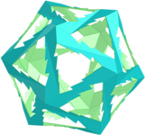 Toroides poligonais regulares e compostos 3</h2>
Um sólido toroidal ou toroide é um poliedro orientável sem autointerseções que tem gênero maior que zero (o que significa que contém um ou mais buracos). O gênero (G) de um poliedro orientável está relacionado ao número de vértices (V), faces (F) e arestas (E) da seguinte forma:

V + F − E = 2 − 2 * G

 Este trabalho mostra toroides poligonais regulares e compostos modelados em 3D, com as visualizações que podem ser acessadas com recursos em salas de Realidade Virtual imersivas.
 
<a href="#m3d">Modelos 3D</a>&nbsp;&nbsp;|&nbsp;&nbsp;<a href="../../pt-br/">Página Inicial</a>

 

  

  

<h3 id="m3d" align="center">Modelos 3D</h3>
<!--<iframe width="560" height="315" style="max-width:100%" src="https://www.youtube.com/embed/videoseries?list=PLy0I_lGW8HxWrThyG3c9HmtaH_RUtJPEN" title="YouTube video player" frameborder="0" allow="accelerometer; autoplay; clipboard-write; encrypted-media; gyroscope; picture-in-picture; web-share" allowfullscreen></iframe>-->
<h4>1. Cubo</h4>
<a href="../vr/Cube1.htm" target="_blank" title="modelo 3D" class="fotoA">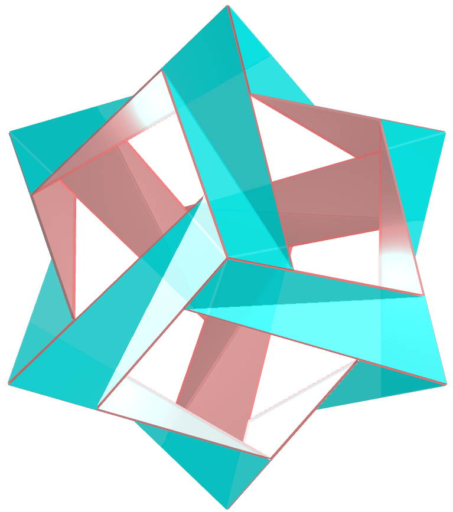</a>
  Toroide construído a partir de um cubo, com construções baseadas nos trabalhos de Rinus Roelofs: cada poliedro é construído com conexões triangulares que formam ângulos iguais entre suas faces.
  

<h4>2. Cubo v2</h4>
<a href="../vr/Cube2.htm" target="_blank" title="modelo 3D" class="fotoA">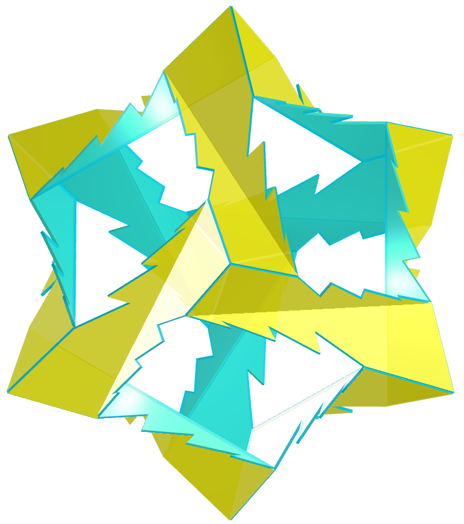</a>
  Toroide construído a partir de um cubo, com construções baseadas nos trabalhos de Rinus Roelofs: cada poliedro é construído com conexões triangulares que formam ângulos iguais entre suas faces.
  

<h4>3. Cuboctaedro</h4>
<a href="../vr/Cuboctahedron.htm" target="_blank" title="modelo 3D" class="fotoA">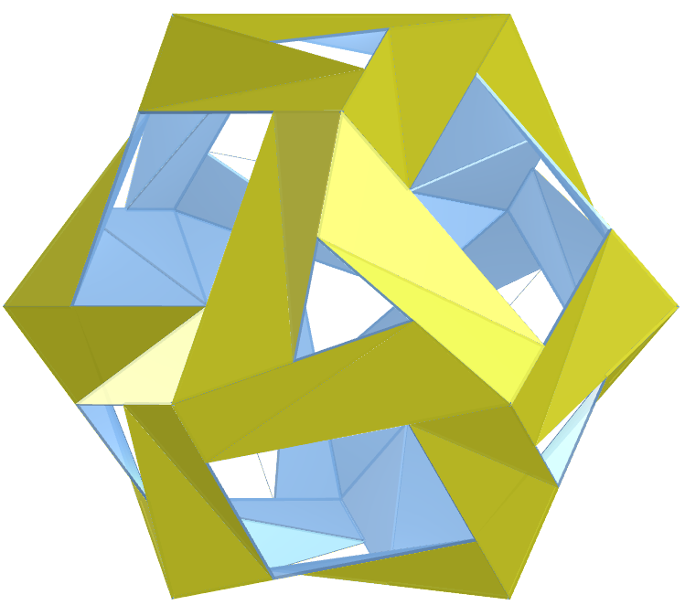</a>
  Toroide construído a partir de um cuboctaedro, com construções baseadas nos trabalhos de Rinus Roelofs: cada poliedro é construído com conexões triangulares que formam ângulos iguais entre suas faces.
  

<h4>4. Icositetraedro deltoidal</h4>
<a href="../vr/DeltoidalIcositetrahedron.htm" target="_blank" title="modelo 3D" class="fotoA">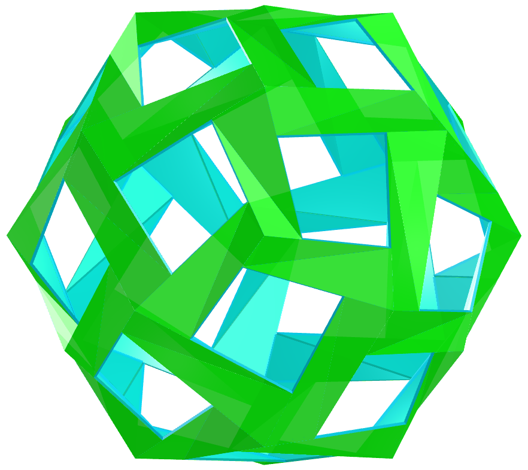</a>
  Toroide construído a partir de um icositetraedro deltoidal, com construções baseadas nos trabalhos de Rinus Roelofs.
  

<h4>5. Dodecaedro</h4>
<a href="../vr/Dodecahedron1.htm" target="_blank" title="modelo 3D" class="fotoA">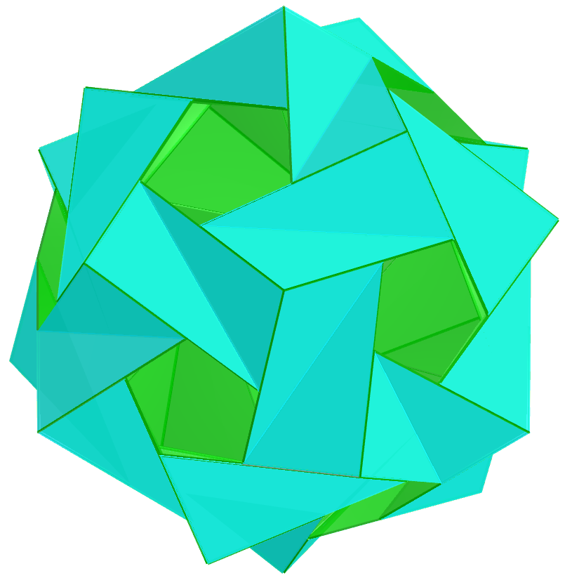</a>
  Toroide construído a partir de um dodecaedro, com construções baseadas nos trabalhos de Rinus Roelofs.
  

<h4>6. Dodecaedro v2</h4>
<a href="../vr/Dodecahedron2.htm" target="_blank" title="modelo 3D" class="fotoA">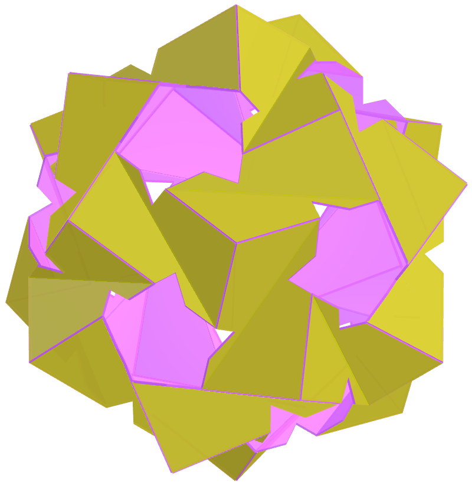</a>
  Toroide construído a partir de um dodecaedro, com construções baseadas nos trabalhos de Rinus Roelofs.
  

<h4>7. Dodecaedro v3</h4>
<a href="../vr/Dodecahedron3.htm" target="_blank" title="modelo 3D" class="fotoA">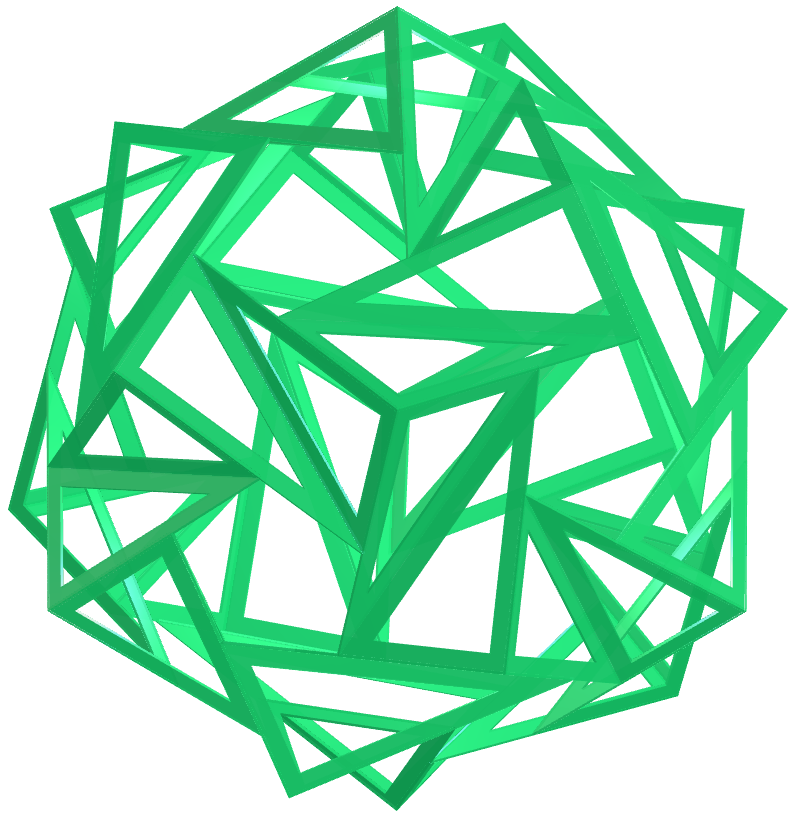</a>
  Toroide construído a partir de um dodecaedro, com construções baseadas nos trabalhos de Rinus Roelofs.
  

<h4>8. Dodecaedro v4</h4>
<a href="../vr/Dodecahedron4.htm" target="_blank" title="modelo 3D" class="fotoA">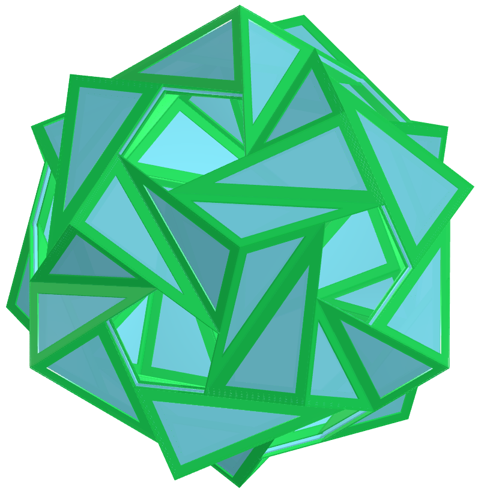</a>
  Toroide construído a partir de um dodecaedro, com construções baseadas nos trabalhos de Rinus Roelofs.
  

<h4>9. Tetraedro hexakis</h4>
<a href="../vr/HexakisTetrahedron.htm" target="_blank" title="modelo 3D" class="fotoA">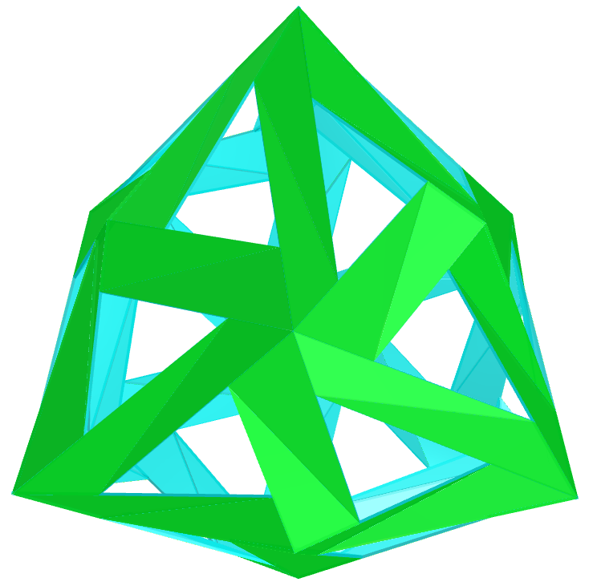</a>
  Toroide construído a partir de um tetraedro hexakis, com construções baseadas nos trabalhos de Rinus Roelofs.
  

<h4>10. Icosaedro</h4>
<a href="../vr/Icosahedron1.htm" target="_blank" title="modelo 3D" class="fotoA">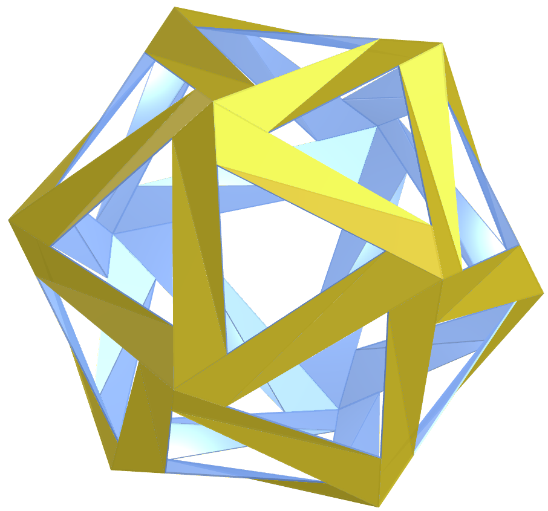</a>
  Toroide construído a partir de um icosaedro, com construções baseadas nos trabalhos de Rinus Roelofs.
  

<a href="#p1" class="topo">voltar ao topo</a>

<h4>11. Icosaedro v2</h4>
<a href="../vr/Icosahedron2.htm" target="_blank" title="modelo 3D" class="fotoA">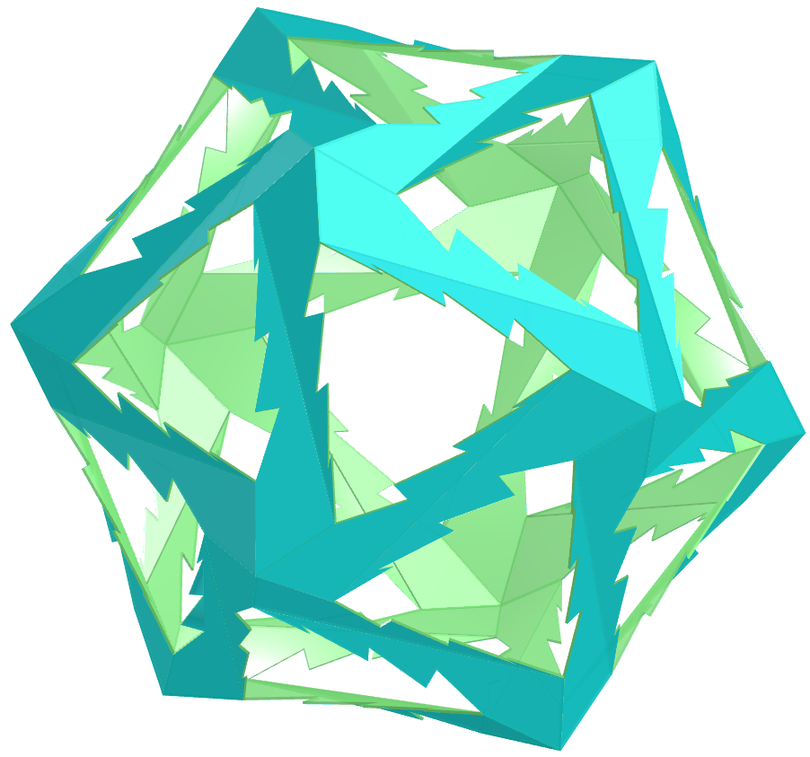</a>
  Toroide construído a partir de um icosaedro, com construções baseadas nos trabalhos de Rinus Roelofs.
  

<h4>12. Octaedro</h4>
<a href="../vr/Octahedron1.htm" target="_blank" title="modelo 3D" class="fotoA">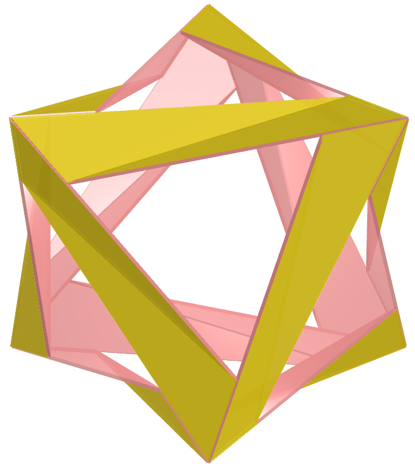</a>
  Toroide construído a partir de um octaedro, com construções baseadas nos trabalhos de Rinus Roelofs.
  

<h4>13. Octaedro v2</h4>
<a href="../vr/Octahedron2.htm" target="_blank" title="modelo 3D" class="fotoA">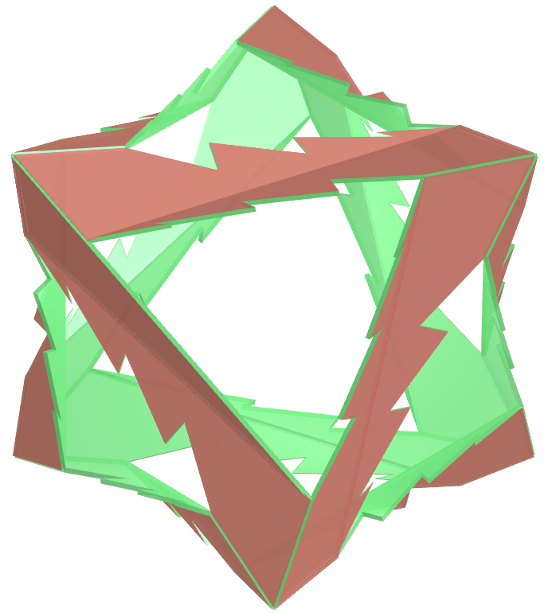</a>
  Toroide construído a partir de um octaedro, com construções baseadas nos trabalhos de Rinus Roelofs.
  

<h4>14. Rombicuboctaedro</h4>
<a href="../vr/Rhombicuboctahedron.htm" target="_blank" title="modelo 3D" class="fotoA">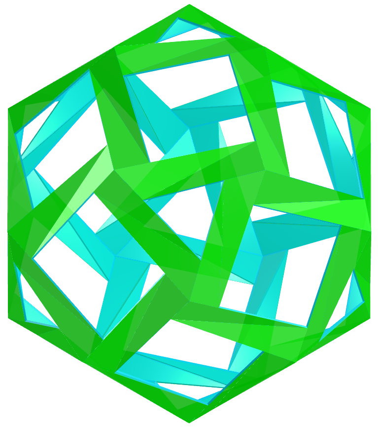</a>
  Toroide construído a partir de um rombicuboctaedro, com construções baseadas nos trabalhos de Rinus Roelofs.
  

<h4>15. Cubo snub</h4>
<a href="../vr/SnubCube.htm" target="_blank" title="modelo 3D" class="fotoA">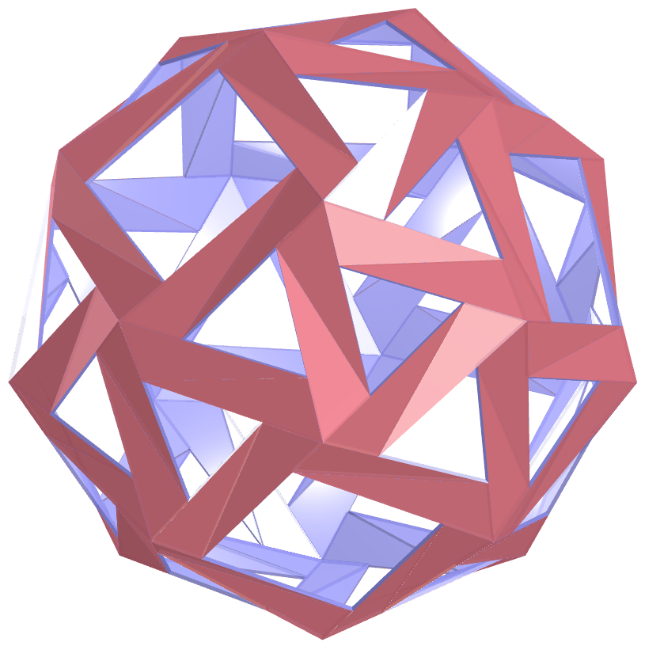</a>
  Toroide construído a partir de um cubo snub, com construções baseadas nos trabalhos de Rinus Roelofs.
  

<h4>16. Girobicúpula quadrada</h4>
<a href="../vr/SquareGyrobicupola.htm" target="_blank" title="modelo 3D" class="fotoA">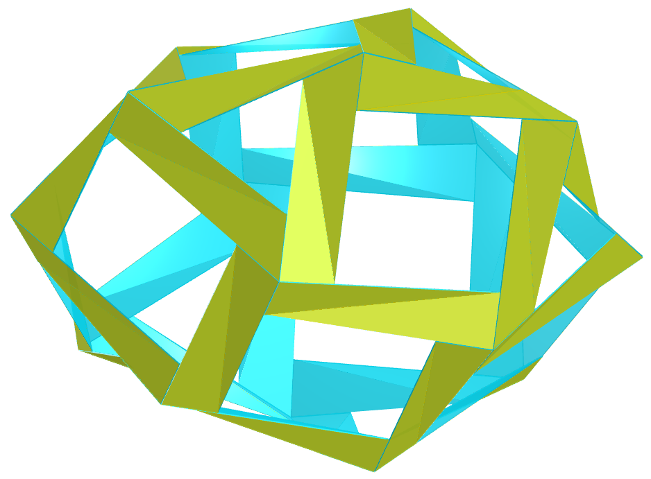</a>
  Toroide construído a partir de uma girobicúpula quadrada, com construções baseadas nos trabalhos de Rinus Roelofs.
  

<h4>17. Ortobicúpula quadrada</h4>
<a href="../vr/SquareOrthobicupola.htm" target="_blank" title="modelo 3D" class="fotoA">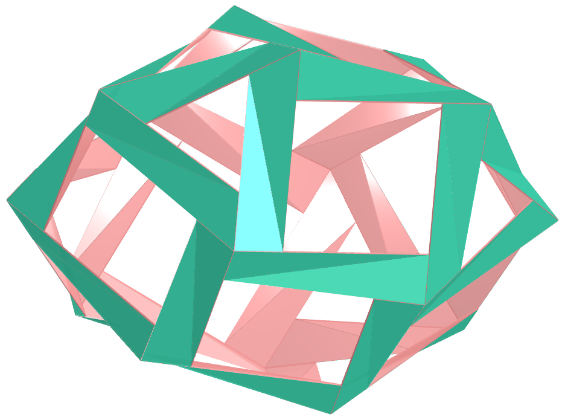</a>
  Toroide construído a partir de uma ortobicúpula quadrada, com construções baseadas nos trabalhos de Rinus Roelofs.
  

<h4>18. Tetraedro</h4>
<a href="../vr/Tetrahedron1.htm" target="_blank" title="modelo 3D" class="fotoA">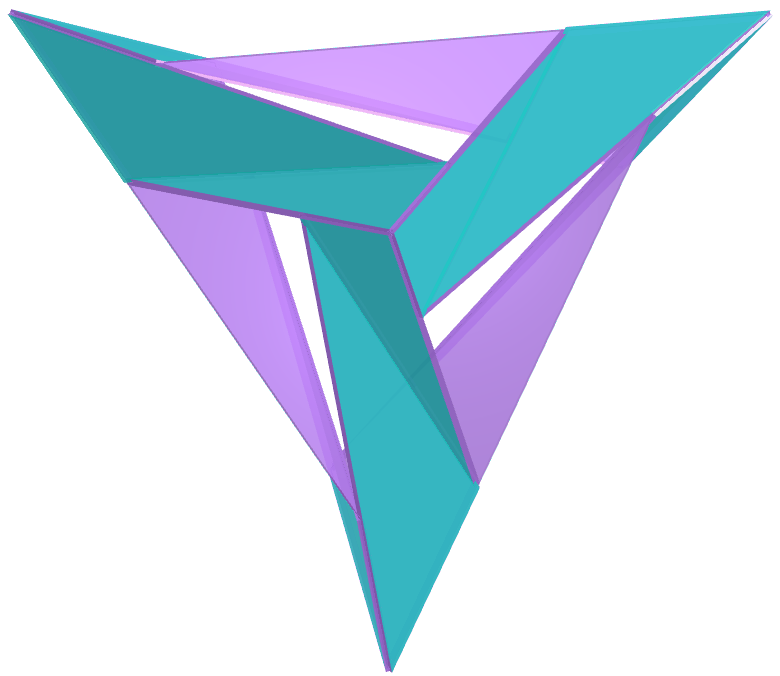</a>
  Toroide construído a partir de um tetraedro, com construções baseadas nos trabalhos de Rinus Roelofs.
  

<h4>19. Tetraedro v2</h4>
<a href="../vr/Tetrahedron2.htm" target="_blank" title="modelo 3D" class="fotoA">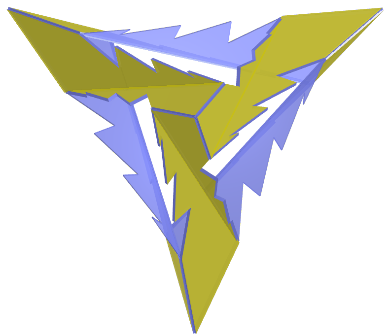</a>
  Toroide construído a partir de um tetraedro, com construções baseadas nos trabalhos de Rinus Roelofs.
  

<h4>20. Hexaedro tetrakis</h4>
<a href="../vr/TetrakisHexahedron.htm" target="_blank" title="modelo 3D" class="fotoA">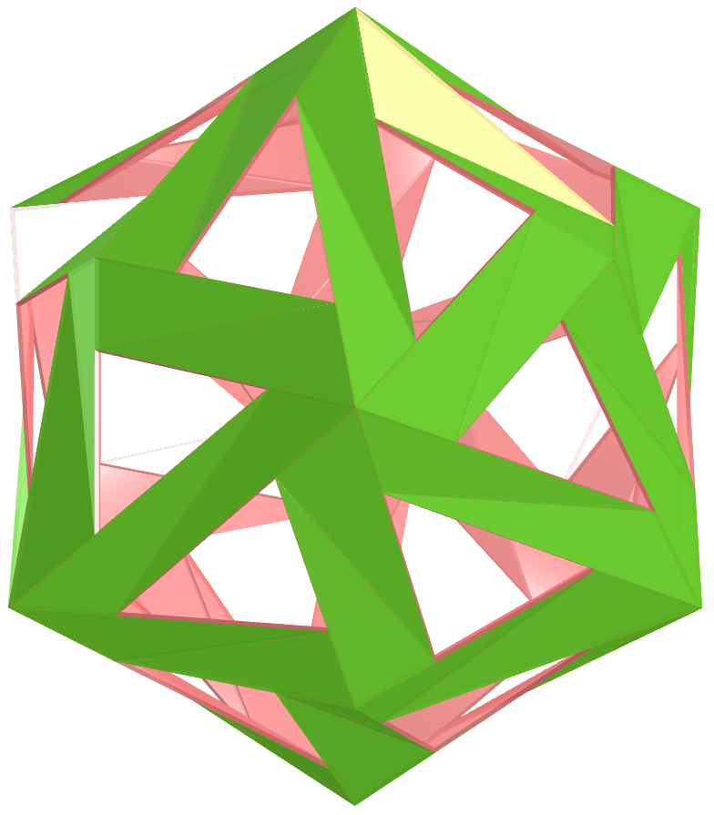</a>
  Toroide construído a partir de um hexaedro tetrakis, com construções baseadas nos trabalhos de Rinus Roelofs.
  

<a href="#p1" class="topo">voltar ao topo</a>

<h4>21. Ortobicúpula triangular</h4>
<a href="../vr/TriangularOrthobicupola.htm" target="_blank" title="modelo 3D" class="fotoA">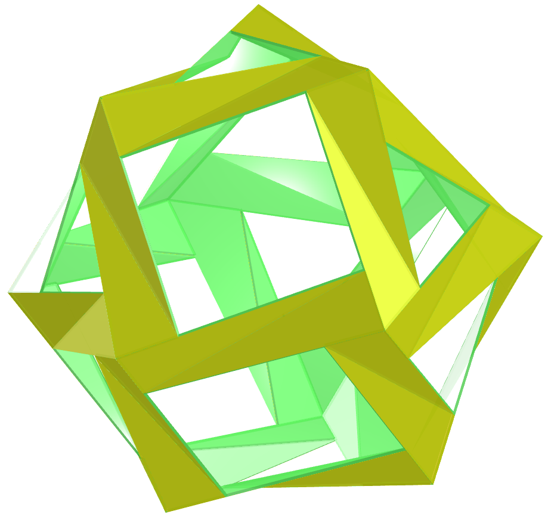</a>
  Toroide construído a partir de uma ortobicúpula triangular, com construções baseadas nos trabalhos de Rinus Roelofs.
  

<h4>22. Icosaedro truncado</h4>
<a href="../vr/TruncatedIcosahedron.htm" target="_blank" title="modelo 3D" class="fotoA">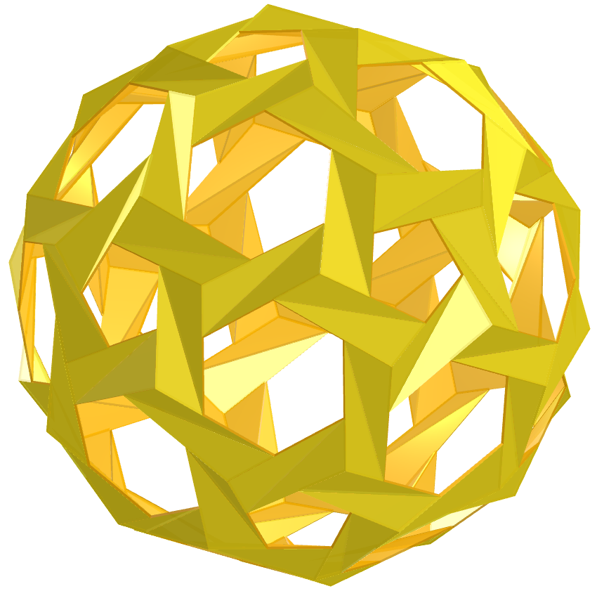</a>
  Toroide construído a partir de um icosaedro truncado, com construções baseadas nos trabalhos de Rinus Roelofs.
  

<a href="#p1" class="topo">voltar ao topo</a>

  Regular polygonal and composition toroids 3: visualization of solids with Virtual Reality de <a xmlns:cc="http://creativecommons.org/ns#" href="https://paulohscwb.github.io/torus-toroids/regular3/pt-br/" property="cc:attributionName" rel="cc:attributionURL">Paulo Henrique Siqueira</a> está licenciado com uma Licença <a rel="license" href="http://creativecommons.org/licenses/by-nc-nd/4.0/">Creative Commons Atribuição-NãoComercial-SemDerivações 4.0 Internacional</a>.

<h4>Como citar este trabalho:</h4> 

Siqueira, P.H., "Regular polygonal and composition toroids 3: visualization of solids with Virtual Reality". Disponível em: <https://paulohscwb.github.io/torus-toroids/regular3/pt-br/>, Junho de 2026.

<!---->
  <b>Referências:</b>
 Weisstein, Eric W. "Torus" From MathWorld-A Wolfram Web Resource. <a href="https://mathworld.wolfram.com/Torus.htm" target="_blank">https://mathworld.wolfram.com/Torus.html</a>
 Weisstein, Eric W. "Toroid" From MathWorld-A Wolfram Web Resource. <a href="https://mathworld.wolfram.com/Toroid.htm" target="_blank">https://mathworld.wolfram.com/Toroid.html</a>
 McCooey, D. I. "Visual Polyhedra". <a href="http://dmccooey.com/polyhedra/" target="_blank">http://dmccooey.com/polyhedra/</a>
