<link rel="stylesheet" href="../scripts/style1.css">
<meta charset="utf-8">
<link rel="icon" type="image/png" href="vr/salas/imagens/icone.png">
<h2>Torus and Toroids: visualization of solids with Augmented Reality (AR) and Virtual Reality (VR) in A-frame</h2>
 <b>author:</b> Paulo Henrique Siqueira - Universidade Federal do Paraná
  <b>contact:</b> <a href="#">paulohscwb@gmail.com</a>
  <a href="https://paulohscwb.github.io/torus-toroids/regulartetrag/pt-br/">versão em português</a>
 <form style="margin: 0 auto; float:right; text-align:right; width:100%; margin-bottom:15px;">
	<select id="url" onchange="urlHandler(this.value)" style="color:royalblue;">
		<option disabled selected value>More solids:</option>
		<option value="../basic/">Torus and toroids</option>
		<option value="../tetragonal/">Tetragonal toroids</option>
		<option value="../iris/">Iris toroids</option>
		<option disabled value="../regulartetrag/">Regular tetragonal toroids</option>
		<option value="../mobiuscairo/">Möbius, Vélez-Jahn and Cairo toroids</option>
		<option value="../hexagonal/">Hexagonal toroids</option>
		<option value="../regular1/">Regular polygonal and composition toroids 1</option>
		<!--<option value="../heptagonal/">Heptagonal dodecahedrons</option>
		<option value="../regular2/">Regular polygonal toroids 2</option>
		<option value="../regular3/">Regular polygonal toroids 3</option>
		<option value="../rings/">Rings toroids</option>
		<option value="../regular4/">Regular polygonal toroids 4</option>
		<option value="../regular5/">Regular polygonal toroids 5</option>-->
	</select>
</form>

  <h2 align="center">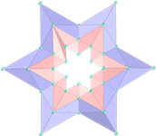 Regular tetragonal toroids</h2>
A toroidal solid or toroid, is an orientable polyhedron without self-intersections that has genus greater than zero (meaning that it contains one or more holes). An orientable polyhedron's genus (G) is related to the number of vertices (V), faces (F), and edges (E) as follows:

V + F − E = 2 − 2 * G

This work shows regular tetragonal toroids modeled in 3D, with views that can be accessed with resources in immersive Virtual Reality rooms.
 
<a href="#m3d">3D Models</a>&nbsp;&nbsp;|&nbsp;&nbsp;<a href="../">Home</a>

 

 
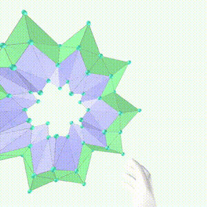

<h3 id="m3d" align="center">3D models</h3>
<iframe width="560" height="315" style="max-width:100%" src="https://www.youtube.com/embed/videoseries?list=PLy0I_lGW8HxXgcL9RxOVEfCA1KDLByHZt" title="YouTube video player" frameborder="0" allow="accelerometer; autoplay; clipboard-write; encrypted-media; gyroscope; picture-in-picture; web-share" allowfullscreen></iframe>
<h4>1. Triangular regular tetragonal toroid</h4>

  <b>faces:</b> 12 trapezoids | <b>vertices:</b> 12 | <b>edges:</b> 24
  

<h4>2. Square regular tetragonal toroid</h4>
<a href="vr/Regular4TetragonalToroid.htm" target="_blank" title="3D model" class="fotoA">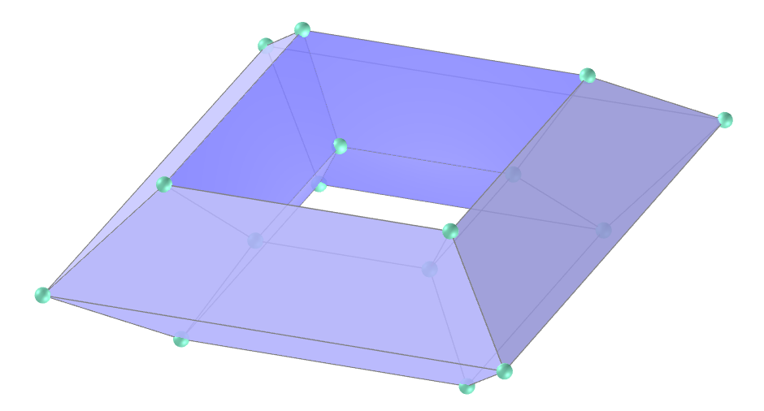</a>
  <b>faces:</b> 16 trapezoids | <b>vertices:</b> 16 | <b>edges:</b> 32
  

<h4>3. Square regular sinusoidal tetragonal toroid</h4>
<a href="vr/Regular4TetragonalToroidSin.htm" target="_blank" title="3D model" class="fotoA">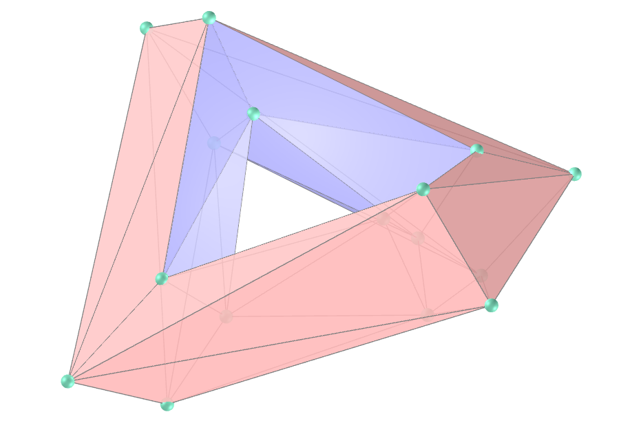</a>
  <b>faces:</b> 32 triangles | <b>vertices:</b> 16 | <b>edges:</b> 40
  

<h4>4. Pentagonal regular tetragonal toroid</h4>

  <b>faces:</b> 20 trapezoids | <b>vertices:</b> 20 | <b>edges:</b> 40
  

<h4>5. Pentagonal regular star tetragonal toroid</h4>
<a href="vr/Regular5TetragonalStarToroid.htm" target="_blank" title="3D model" class="fotoA">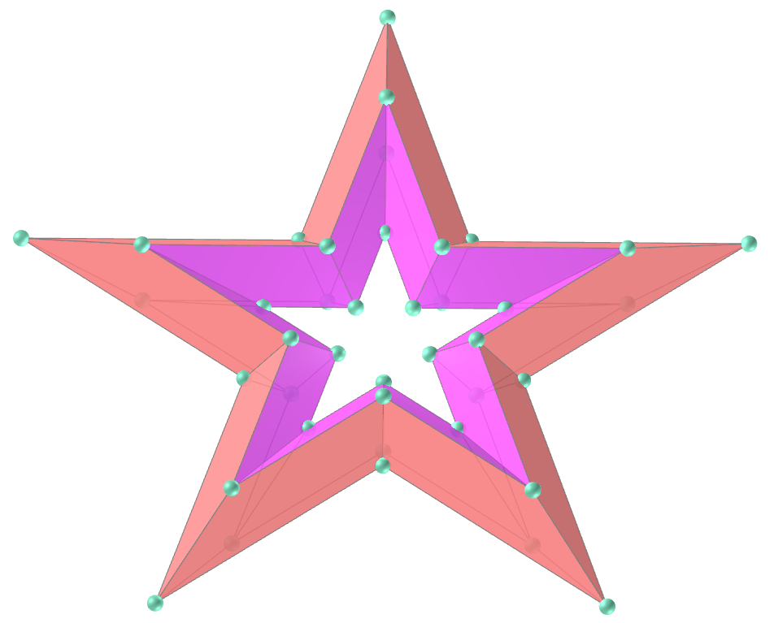</a>
  <b>faces:</b> 40 trapezoids | <b>vertices:</b> 40 | <b>edges:</b> 80
  

<h4>6. Pentagonal regular star tetragonal toroid v2</h4>

  <b>faces:</b> 80 triangles | <b>vertices:</b> 40 | <b>edges:</b> 120
  

<h4>7. Hexagonal regular tetragonal toroid</h4>
<a href="vr/Regular6TetragonalToroid.htm" target="_blank" title="3D model" class="fotoA">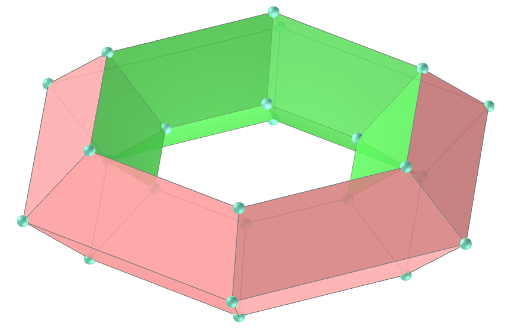</a>
  <b>faces:</b> 24 trapezoids | <b>vertices:</b> 24 | <b>edges:</b> 48
  

<h4>8. Hexagonal regular star tetragonal toroid</h4>
<a href="vr/Regular6TetragonalStarToroid.htm" target="_blank" title="3D model" class="fotoA">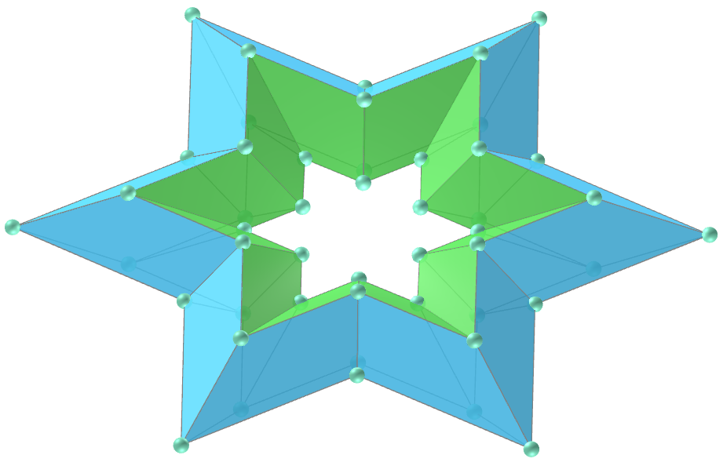</a>
  <b>faces:</b> 48 trapezoids | <b>vertices:</b> 48 | <b>edges:</b> 96
  

<h4>9. Hexagonal regular star tetragonal toroid v2</h4>
<a href="vr/Regular6TetragonalStarToroid1.htm" target="_blank" title="3D model" class="fotoA">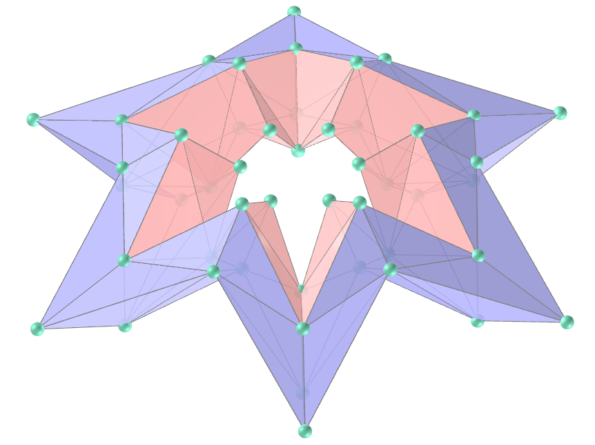</a>
  <b>faces:</b> 96 triangles | <b>vertices:</b> 48 | <b>edges:</b> 144
  

<h4>10. Hexagonal regular sinusoidal tetragonal toroid</h4>
<a href="vr/Regular6TetragonalToroidSin.htm" target="_blank" title="3D model" class="fotoA">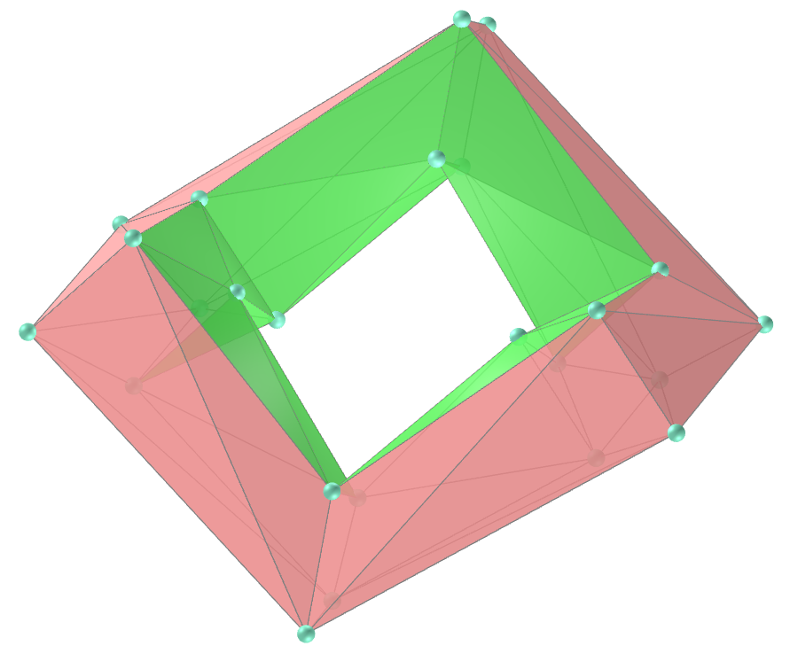</a>
  <b>faces:</b> 48 triangles | <b>vertices:</b> 24 | <b>edges:</b> 72
  

<a href="#p1" class="topo">back to top</a>

<h4>11. Hexagonal regular star sinusoidal tetragonal toroid</h4>

  <b>faces:</b> 96 triangles | <b>vertices:</b> 48 | <b>edges:</b> 144
  

<h4>12. Heptagonal regular tetragonal toroid</h4>
<a href="vr/Regular7TetragonalToroid.htm" target="_blank" title="3D model" class="fotoA">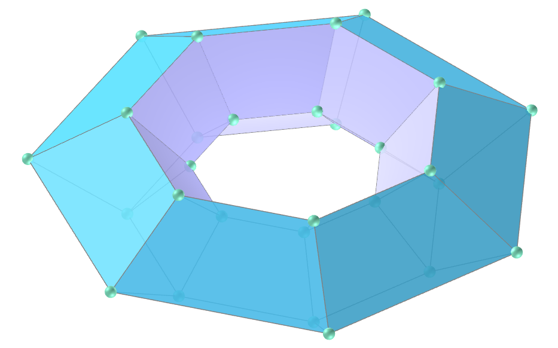</a>
  <b>faces:</b> 28 trapezoids | <b>vertices:</b> 28 | <b>edges:</b> 56
  

<h4>13. Heptagonal regular star tetragonal toroid</h4>

  <b>faces:</b> 56 trapezoids | <b>vertices:</b> 56 | <b>edges:</b> 112
  

<h4>14. Heptagonal regular star tetragonal toroid v2</h4>
<a href="vr/Regular7TetragonalStarToroid1.htm" target="_blank" title="3D model" class="fotoA">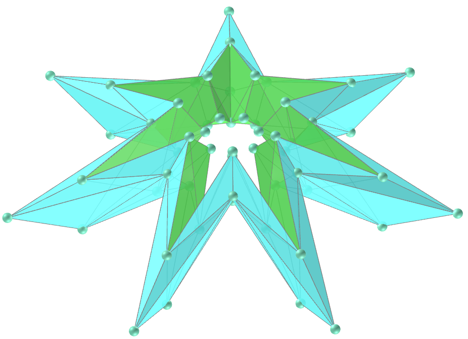</a>
  <b>faces:</b> 112 triangles | <b>vertices:</b> 56 | <b>edges:</b> 168
  

<h4>15. Octagonal regular tetragonal toroid</h4>

  <b>faces:</b> 32 trapezoids | <b>vertices:</b> 32 | <b>edges:</b> 64
  

<h4>16. Octagonal regular star tetragonal toroid</h4>
<a href="vr/Regular8TetragonalStarToroid.htm" target="_blank" title="3D model" class="fotoA">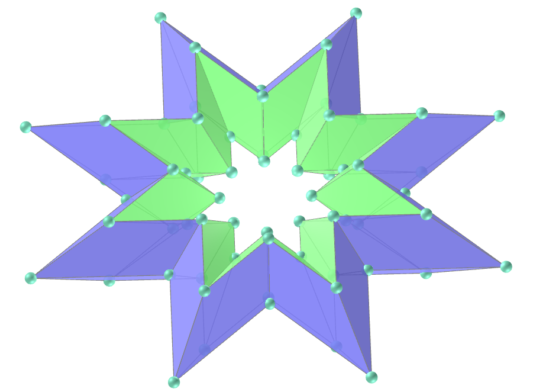</a>
  <b>faces:</b> 64 trapezoids | <b>vertices:</b> 64 | <b>edges:</b> 128
  

<h4>17. Octagonal regular star tetragonal toroid v2</h4>
<a href="vr/Regular8TetragonalStarToroid1.htm" target="_blank" title="3D model" class="fotoA">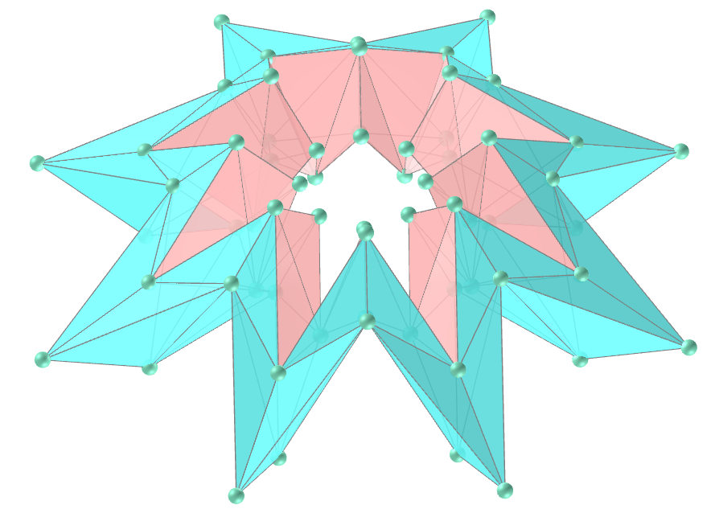</a>
  <b>faces:</b> 128 triangles | <b>vertices:</b> 64 | <b>edges:</b> 192
  

<h4>18. Octagonal regular sinusoidal tetragonal toroid</h4>
<a href="vr/Regular8TetragonalToroidSin.htm" target="_blank" title="3D model" class="fotoA">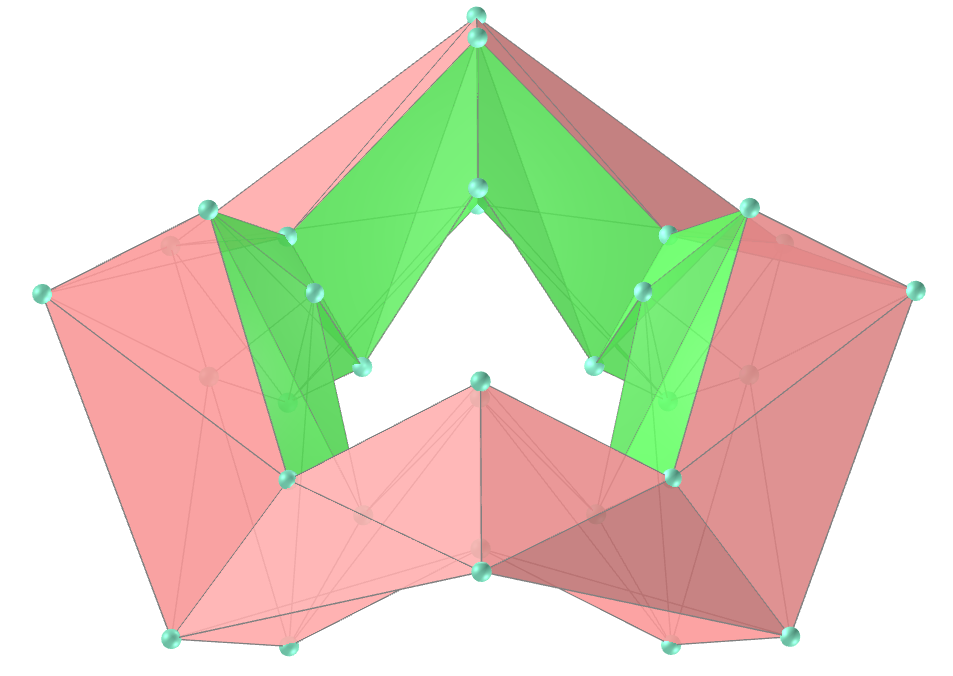</a>
  <b>faces:</b> 64 triangles | <b>vertices:</b> 32 | <b>edges:</b> 96
  

<h4>19. Octagonal regular star sinusoidal tetragonal toroid</h4>
<a href="vr/Regular8TetragonalStarToroidSin.htm" target="_blank" title="3D model" class="fotoA">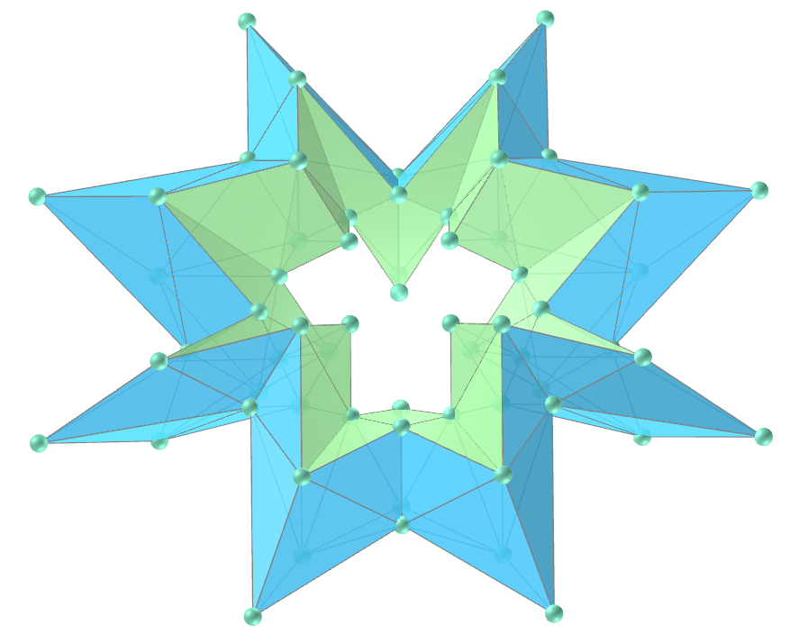</a>
  <b>faces:</b> 128 triangles | <b>vertices:</b> 64 | <b>edges:</b> 192
  

<h4>20. Enneagonal regular tetragonal toroid</h4>
<a href="vr/Regular9TetragonalToroid.htm" target="_blank" title="3D model" class="fotoA">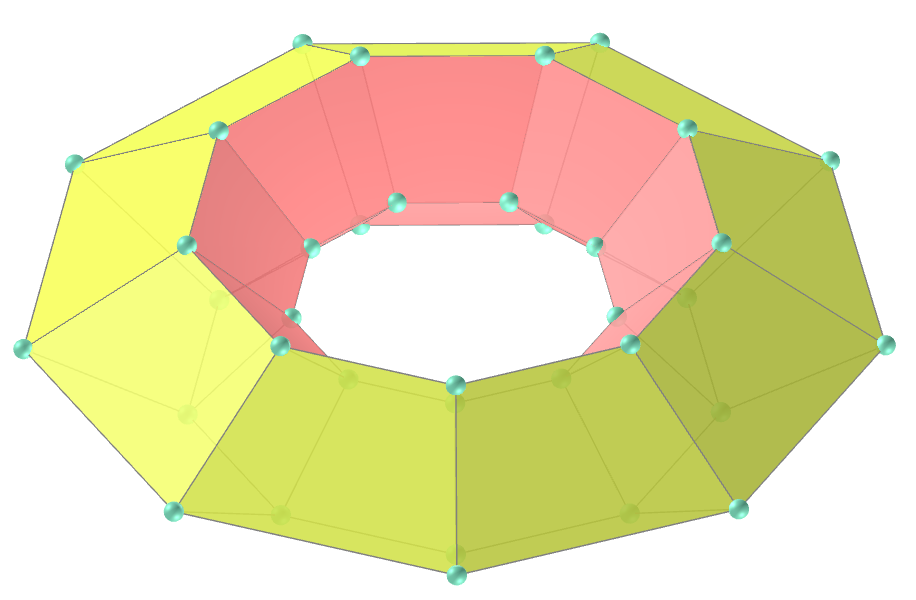</a>
  <b>faces:</b> 36 trapezoids | <b>vertices:</b> 36 | <b>edges:</b> 72
  

<a href="#p1" class="topo">back to top</a>

<h4>21. Enneagonal regular star tetragonal toroid</h4>
<a href="vr/Regular9TetragonalStarToroid.htm" target="_blank" title="3D model" class="fotoA">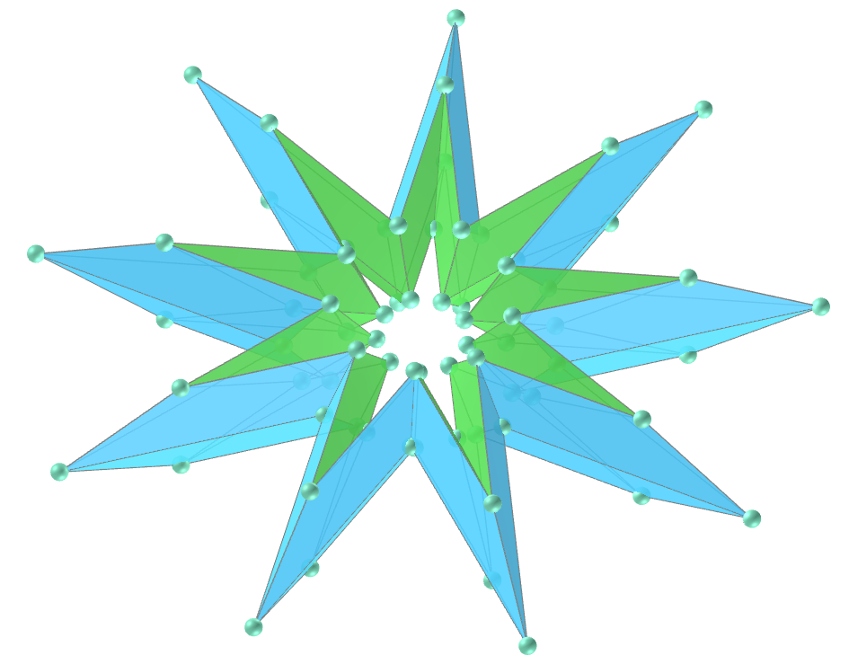</a>
  <b>faces:</b> 72 trapezoids | <b>vertices:</b> 72 | <b>edges:</b> 144
  

<h4>22. Enneagonal regular star tetragonal toroid v2</h4>

  <b>faces:</b> 144 triangles | <b>vertices:</b> 72 | <b>edges:</b> 216
  

<h4>23. Decagonal regular tetragonal toroid</h4>

  <b>faces:</b> 40 trapezoids | <b>vertices:</b> 40 | <b>edges:</b> 80
  

<h4>24. Decagonal regular star tetragonal toroid</h4>
<a href="vr/Regular10TetragonalStarToroid.htm" target="_blank" title="3D model" class="fotoA">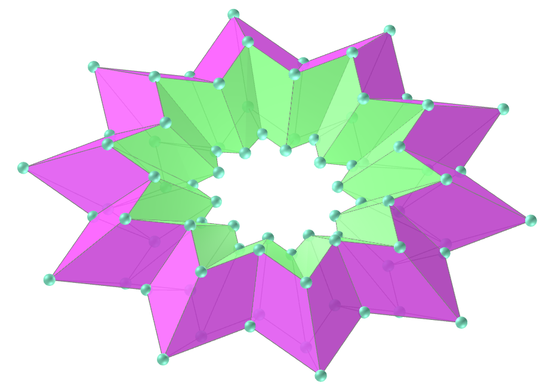</a>
  <b>faces:</b> 80 trapezoids | <b>vertices:</b> 80 | <b>edges:</b> 160
  

<h4>25. Decagonal regular star tetragonal toroid v2</h4>

  <b>faces:</b> 160 triangles | <b>vertices:</b> 80 | <b>edges:</b> 240
  

<h4>26. Decagonal regular sinusoidal tetragonal toroid</h4>

  <b>faces:</b> 80 triangles | <b>vertices:</b> 40 | <b>edges:</b> 120
  

<h4>27. Decagonal regular star sinusoidal tetragonal toroid</h4>
<a href="vr/Regular10TetragonalStarToroidSin.htm" target="_blank" title="3D model" class="fotoA">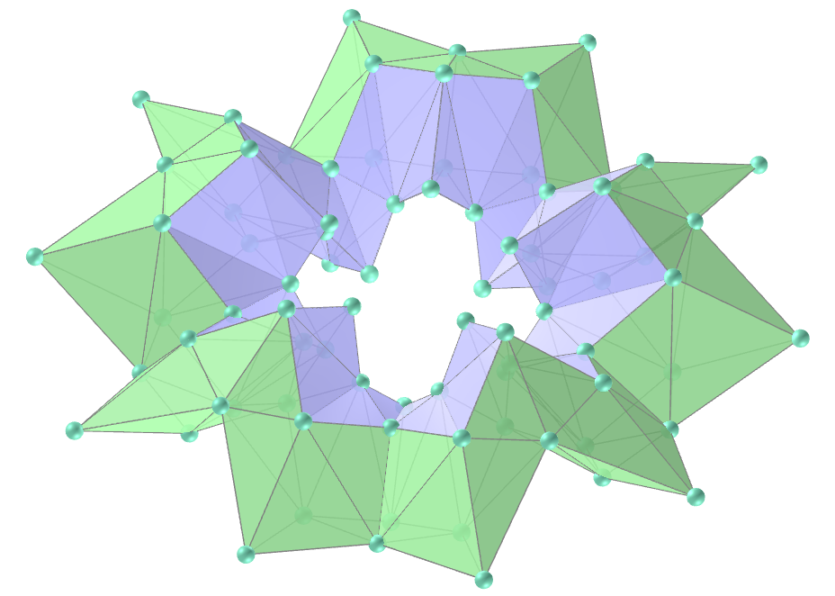</a>
  <b>faces:</b> 160 triangles | <b>vertices:</b> 80 | <b>edges:</b> 240
  

<h4>28. Pine tree with pentagonal toroids</h4>

  Construction of a pine tree using tetragonal pentagonal toroids.
  

<h4>29. Pine tree with hexagonal toroids</h4>

  Construction of a pine tree using tetragonal hexagonal toroids.
  

<h4>30. Pine tree with heptagonal toroids</h4>

  Construction of a pine tree using tetragonal heptagonal toroids.
  

<a href="#p1" class="topo">back to top</a>

<h4>31. Pine tree with octagonal toroids</h4>

  Construction of a pine tree using tetragonal octagonal toroids.
  

<h4>32. Pine tree with enneagonal toroids</h4>

  Construction of a pine tree using enneagonal pentagonal toroids.
  

<h4>33. Pine tree with decagonal toroids</h4>

  Construction of a pine tree using decagonal pentagonal toroids.
  

<h4>34. Geometric Christmas tree with heptagonal toroids v1</h4>

  Construction of a Christmas tree using tetragonal heptagonal toroids and regular tetragonal toroids.
  

<h4>35. Geometric Christmas tree with heptagonal toroids v2</h4>

  Construction of a Christmas tree using tetragonal heptagonal toroids and hexagonal toroids.
  

<h4>36. Geometric Christmas tree with octagonal toroids v1</h4>

  Construction of a Christmas tree using tetragonal octagonal toroids and regular tetragonal toroids.
  

<h4>37. Geometric Christmas tree with octagonal toroids v2</h4>

  Construction of a Christmas tree using tetragonal octagonal toroids and regular tetragonal toroids.
  

<h4>38. Geometric Christmas tree with octagonal toroids v3</h4>

  Construction of a Christmas tree using tetragonal octagonal toroids and regular tetragonal toroids.
  

<h4>39. Geometric Christmas tree with enneagonal toroids v1</h4>

  Construction of a Christmas tree using tetragonal enneagonal toroids and hexagonal toroids.
  

<h4>40. Geometric Christmas tree with enneagonal toroids v2</h4>

  Construction of a Christmas tree using tetragonal enneagonal toroids and hexagonal toroids.
  

<a href="#p1" class="topo">back to top</a>

<h4>41. Geometric Christmas tree with decagonal toroids v1</h4>

  Construction of a Christmas tree using tetragonal decagonal toroids and hexagonal toroids.
  

<h4>42. Geometric Christmas tree with decagonal toroids v2</h4>

  Construction of a Christmas tree using tetragonal decagonal toroids and hexagonal toroids.
  

<h4>43. Geometric Christmas tree with decagonal toroids v3</h4>

  Construction of a Christmas tree using tetragonal decagonal toroids and hexagonal toroids.
  

<h4>44. Geometric Christmas tree with pentagonal toroids v1</h4>

  Construction of a Christmas tree using tetragonal pentagonal toroids and regular tetragonal toroids.
  

<h4>45. Geometric Christmas tree with pentagonal toroids v2</h4>

  Construction of a Christmas tree using tetragonal pentagonal toroids and regular tetragonal toroids.
  

<h4>46. Geometric Christmas tree with hexagonal toroids v1</h4>

  Construction of a Christmas tree using tetragonal hexagonal toroids and regular tetragonal toroids.
  

<h4>47. Geometric Christmas tree with hexagonal toroids v2</h4>

  Construction of a Christmas tree using tetragonal hexagonal toroids and regular tetragonal toroids.
  

<h4>48. Geometric Christmas tree with hexagonal toroids v3</h4>

  Construction of a Christmas tree using tetragonal hexagonal toroids and regular tetragonal toroids.
  

<a href="#p1" class="topo">back to top</a>

  Regular tetragonal toroids: visualization of solids with Virtual Reality by <a xmlns:cc="http://creativecommons.org/ns#" href="https://paulohscwb.github.io/torus-toroids/regulartetrag/" property="cc:attributionName" rel="cc:attributionURL">Paulo Henrique Siqueira</a> is licensed with a license <a rel="license" href="http://creativecommons.org/licenses/by-nc-nd/4.0/">Creative Commons Attribution-NonCommercial-NoDerivatives 4.0 International</a>.

<h4>How to cite this work:</h4> 

Siqueira, P.H., "Regular tetragonal toroids: visualization of solids with Virtual Reality". Available in: <https://paulohscwb.github.io/torus-toroids/regulartetrag/>, May 2025.

<!---->
  <b>References:</b>
 Weisstein, Eric W. "Torus" From MathWorld-A Wolfram Web Resource. <a href="https://mathworld.wolfram.com/Torus.html" target="_blank">https://mathworld.wolfram.com/Torus.html</a>
 Weisstein, Eric W. "Toroid" From MathWorld-A Wolfram Web Resource. <a href="https://mathworld.wolfram.com/Toroid.html" target="_blank">https://mathworld.wolfram.com/Toroid.html</a>
 McCooey, D. I. "Visual Polyhedra". <a href="http://dmccooey.com/polyhedra/" target="_blank">http://dmccooey.com/polyhedra/</a>
