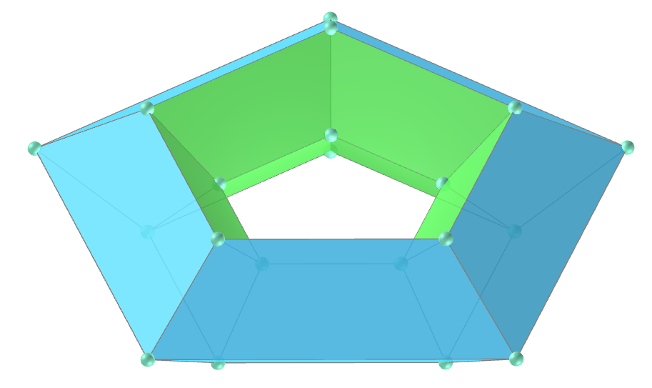
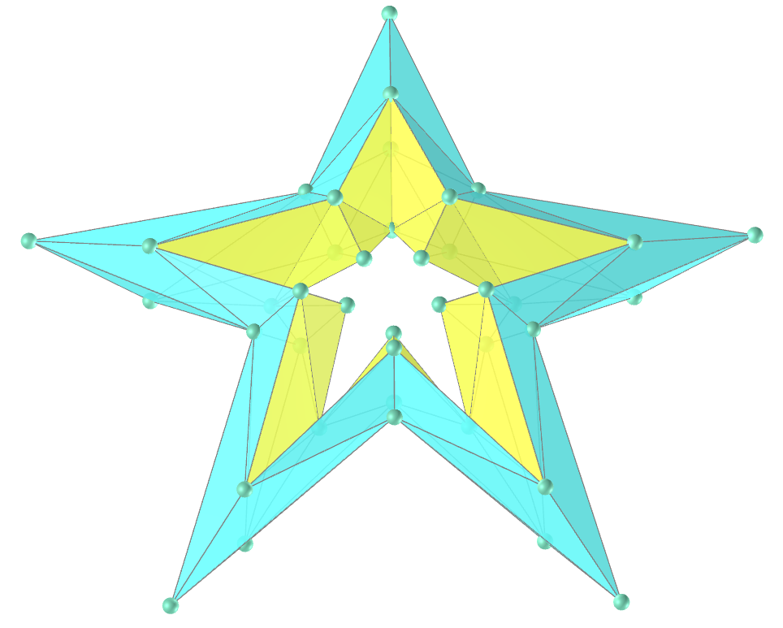
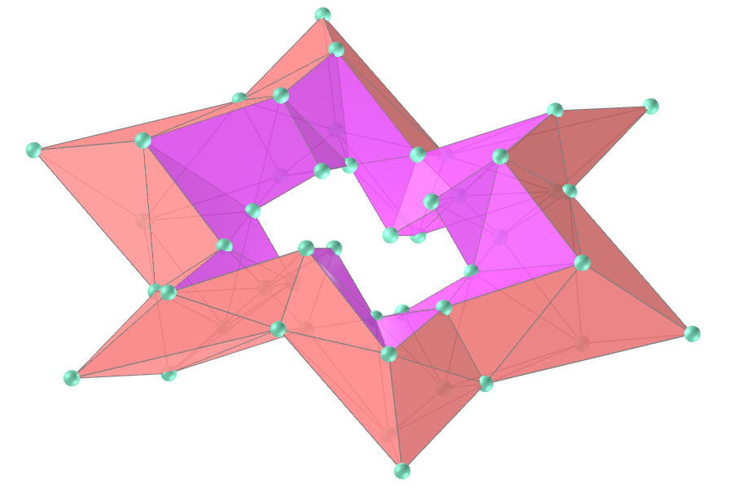
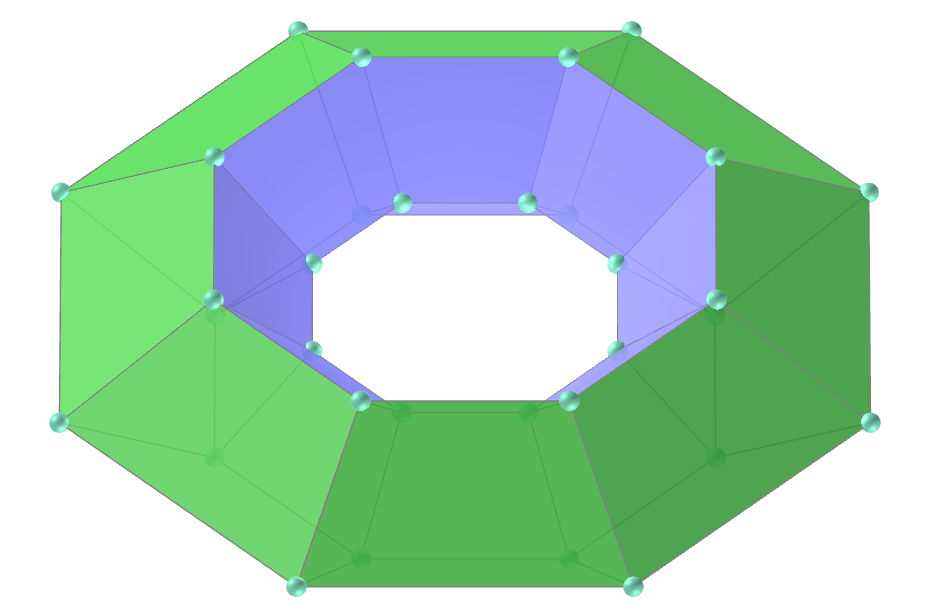

<link rel="stylesheet" href="../../scripts/style1.css">
<meta charset="utf-8">
<link rel="icon" type="image/png" href="../vr/salas/imagens/icone.png">
<h2>Toros e toroides: visualização dos sólidos com Realidade Aumentada (RA) e Realidade Virtual (RV) em A-frame</h2>
<b>autor:</b> Paulo Henrique Siqueira - Universidade Federal do Paraná
 <b>contato:</b> <a href="#"> paulohscwb@gmail.com </a>
 <a href="https://paulohscwb.github.io/torus-toroids/regulartetrag/">english version</a>
<form style="margin: 0 auto; float:right; text-align:right; width:100%; margin-bottom:15px;">
	<select id="url" onchange="urlHandler(this.value)" style="color:royalblue;">
		<option disabled selected>Mais sólidos:</option>
		<option value="../../basic/pt-br/">Toros e toroides</option>
		<option value="../../tetragonal/pt-br/">Toroides tetragonais</option>
		<option value="../../iris/pt-br/">Toroides de íris</option>
		<option disabled value="../../regulartetrag/pt-br/">Toroides tetragonais regulares</option>
		<!--<option value="../../mobius-cairo/pt-br/">Toroides de Mobius e Cairo</option>
		<option value="../../hexagonal/pt-br/">Toroides hexagonais</option>
		<option value="../../heptagonal/pt-br/">Dodecaedros heptagonais</option>
		<option value="../../regular1/pt-br/">Toroides poligonais regulares 1</option>
		<option value="../../regular2/pt-br/">Toroides poligonais regulares 2</option>
		<option value="../../regular3/pt-br/">Toroides poligonais regulares 3</option>
		<option value="../../rings/pt-br/">Anéis toroides</option>
		<option value="../../regular4/pt-br/">Toroides poligonais regulares 4</option>
		<option value="../../regular5/pt-br/">Toroides poligonais regulares 5</option>-->
	</select>
</form>

  <h2 align="center"> Toroides tetragonais regulares</h2>
Um sólido toroidal ou toroide é um poliedro orientável sem autointerseções que tem gênero maior que zero (o que significa que contém um ou mais buracos). O gênero (G) de um poliedro orientável está relacionado ao número de vértices (V), faces (F) e arestas (E) da seguinte forma:

V + F − E = 2 − 2 * G

Este trabalho mostra toroides tetragonais regulares modelados em 3D, com as visualizações que podem ser acessadas com recursos em salas de Realidade Virtual imersivas.
 
<a href="#m3d">Modelos 3D</a>&nbsp;&nbsp;|&nbsp;&nbsp;<a href="../../pt-br/">Página Inicial</a>

 

  

  

<h3 id="m3d" align="center">3D models</h3>
<!--<iframe width="560" height="315" style="max-width:100%" src="https://www.youtube.com/embed/videoseries?list=PLy0I_lGW8HxXgcL9RxOVEfCA1KDLByHZt" title="YouTube video player" frameborder="0" allow="accelerometer; autoplay; clipboard-write; encrypted-media; gyroscope; picture-in-picture; web-share" allowfullscreen></iframe>-->
<h4>1. Toroide tetragonal regular triangular</h4>

  <b>faces:</b> 12 trapézios
  <b>vértices:</b> 12
  <b>arestas:</b> 24
  

<h4>2. Toroide tetragonal regular quadrado</h4>

  <b>faces:</b> 16 trapézios
  <b>vértices:</b> 16
  <b>arestas:</b> 32
  

<h4>3. Toroide tetragonal senoidal regular quadrado</h4>

  <b>faces:</b> 32 triângulos
  <b>vértices:</b> 16
  <b>arestas:</b> 40
  

<h4>4. Toroide tetragonal regular pentagonal</h4>

  <b>faces:</b> 20 trapézios
  <b>vértices:</b> 20
  <b>arestas:</b> 40
  

<h4>5. Toroide tetragonal regular estrelado pentagonal</h4>

  <b>faces:</b> 40 trapézios
  <b>vértices:</b> 40
  <b>arestas:</b> 80
  

<h4>6. Toroide tetragonal regular estrelado pentagonal v2</h4>

  <b>faces:</b> 80 triângulos
  <b>vértices:</b> 40
  <b>arestas:</b> 120
  

<h4>7. Toroide tetragonal regular hexagonal</h4>

  <b>faces:</b> 24 trapézios
  <b>vértices:</b> 24
  <b>arestas:</b> 48
  

<h4>8. Toroide tetragonal regular estrelado hexagonal</h4>

  <b>faces:</b> 48 trapézios
  <b>vértices:</b> 48
  <b>arestas:</b> 96
  

<h4>9. Toroide tetragonal regular estrelado hexagonal v2</h4>

  <b>faces:</b> 96 triângulos
  <b>vértices:</b> 48
  <b>arestas:</b> 144
  

<h4>10. Toroide tetragonal senoidal regular hexagonal</h4>

  <b>faces:</b> 48 triângulos
  <b>vértices:</b> 24
  <b>arestas:</b> 72
  

<a href="#p1" class="topo">voltar ao topo</a>

<h4>11. Toroide tetragonal regular senoidal estrelado hexagonal</h4>

  <b>faces:</b> 96 triângulos
  <b>vértices:</b> 48
  <b>arestas:</b> 144
  

<h4>12. Toroide tetragonal regular heptagonal</h4>

  <b>faces:</b> 28 trapézios
  <b>vértices:</b> 28
  <b>arestas:</b> 56
  

<h4>13. Toroide tetragonal regular estrelado heptagonal</h4>

  <b>faces:</b> 56 trapézios
  <b>vértices:</b> 56
  <b>arestas:</b> 112
  

<h4>14. Toroide tetragonal regular estrelado heptagonal v2</h4>

  <b>faces:</b> 112 triângulos
  <b>vértices:</b> 56
  <b>arestas:</b> 168
  

<h4>15. Toroide tetragonal regular octogonal</h4>

  <b>faces:</b> 32 trapézios
  <b>vértices:</b> 32
  <b>arestas:</b> 64
  

<h4>16. Toroide tetragonal regular estrelado octogonal</h4>

  <b>faces:</b> 64 trapézios
  <b>vértices:</b> 64
  <b>arestas:</b> 128
  

<h4>17. Toroide tetragonal regular estrelado octogonal v2</h4>

  <b>faces:</b> 128 triângulos
  <b>vértices:</b> 64
  <b>arestas:</b> 192
  

<h4>18. Toroide tetragonal senoidal regular octogonal</h4>

  <b>faces:</b> 64 triângulos
  <b>vértices:</b> 32
  <b>arestas:</b> 96
  

<h4>19. Toroide tetragonal regular senoidal estrelado octogonal</h4>

  <b>faces:</b> 128 triângulos
  <b>vértices:</b> 64
  <b>arestas:</b> 192
  

<h4>20. Toroide tetragonal regular eneagonal</h4>

  <b>faces:</b> 36 trapézios
  <b>vértices:</b> 36
  <b>arestas:</b> 72
  

<a href="#p1" class="topo">voltar ao topo</a>

<h4>21. Toroide tetragonal regular estrelado eneagonal</h4>

  <b>faces:</b> 72 trapézios
  <b>vértices:</b> 72
  <b>arestas:</b> 144
  

<h4>22. Toroide tetragonal regular estrelado eneagonal v2</h4>

  <b>faces:</b> 144 triângulos
  <b>vértices:</b> 72
  <b>arestas:</b> 216
  

<h4>23. Toroide tetragonal regular decagonal</h4>

  <b>faces:</b> 40 trapézios
  <b>vértices:</b> 40
  <b>arestas:</b> 80
  

<h4>24. Toroide tetragonal regular estrelado decagonal</h4>

  <b>faces:</b> 80 trapézios
  <b>vértices:</b> 80
  <b>arestas:</b> 160
  

<h4>25. Toroide tetragonal regular estrelado decagonal v2</h4>

  <b>faces:</b> 160 triângulos
  <b>vértices:</b> 80
  <b>arestas:</b> 240
  

<h4>26. Toroide tetragonal senoidal regular decagonal</h4>

  <b>faces:</b> 80 triângulos
  <b>vértices:</b> 40
  <b>arestas:</b> 120
  

<h4>27. Toroide tetragonal regular senoidal estrelado decagonal</h4>

  <b>faces:</b> 160 triângulos
  <b>vértices:</b> 80
  <b>arestas:</b> 240
  

<a href="#p1" class="topo">voltar ao topo</a>

  Regular tetragonal toroids: visualization of solids with Virtual Reality de <a xmlns:cc="http://creativecommons.org/ns#" href="https://paulohscwb.github.io/torus-toroids/regulartetrag/pt-br/" property="cc:attributionName" rel="cc:attributionURL">Paulo Henrique Siqueira</a> está licenciado com uma Licença <a rel="license" href="http://creativecommons.org/licenses/by-nc-nd/4.0/">Creative Commons Atribuição-NãoComercial-SemDerivações 4.0 Internacional</a>.

<h4>Como citar este trabalho:</h4> 

Siqueira, P.H., "Regular tetragonal toroids: visualization of solids with Virtual Reality". Disponível em: <https://paulohscwb.github.io/torus-toroids/regulartetrag/pt-br/>, Maio de 2025.

<!---->
  <b>Referências:</b>
 Weisstein, Eric W. "Torus" From MathWorld-A Wolfram Web Resource. <a href="https://mathworld.wolfram.com/Torus.html" target="_blank">https://mathworld.wolfram.com/Torus.html</a>
 Weisstein, Eric W. "Toroid" From MathWorld-A Wolfram Web Resource. <a href="https://mathworld.wolfram.com/Toroid.html" target="_blank">https://mathworld.wolfram.com/Toroid.html</a>
 McCooey, D. I. "Visual Polyhedra". <a href="http://dmccooey.com/polyhedra/" target="_blank">http://dmccooey.com/polyhedra/</a>
