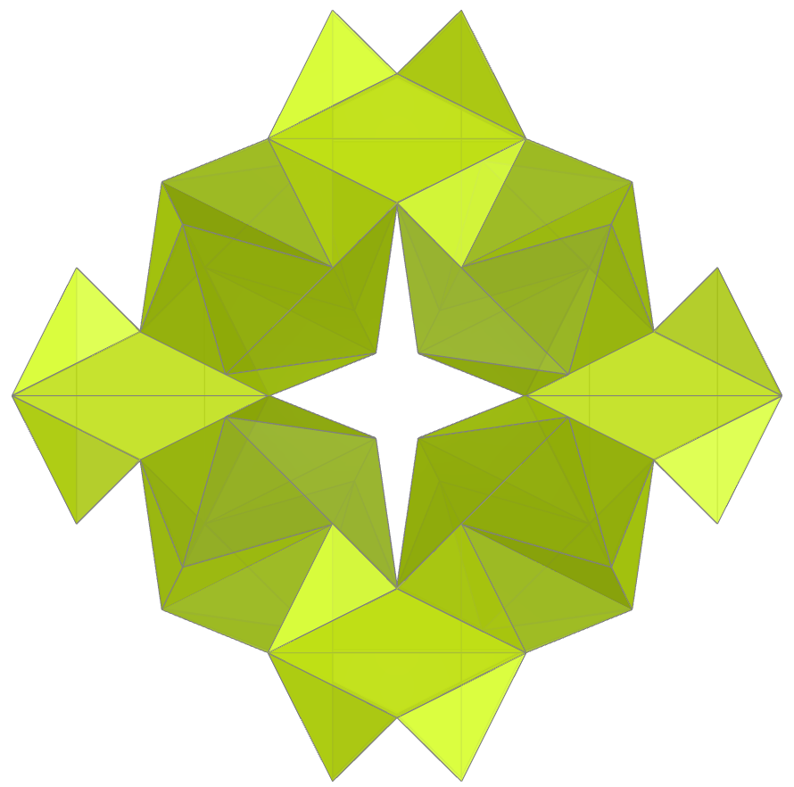
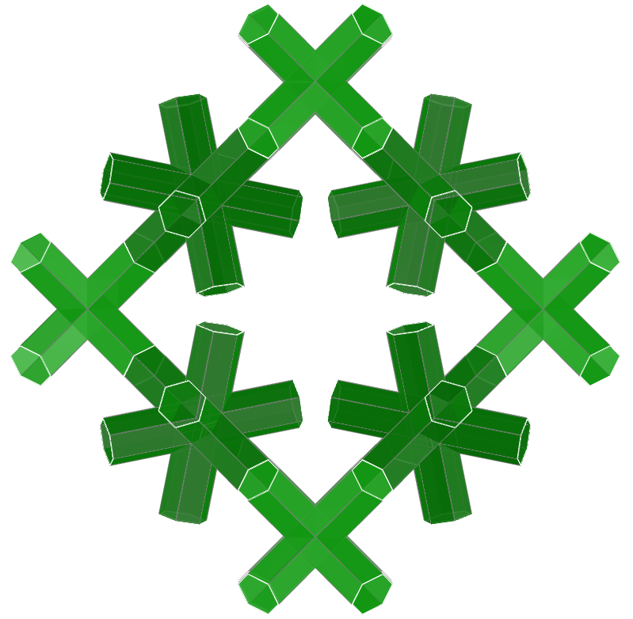
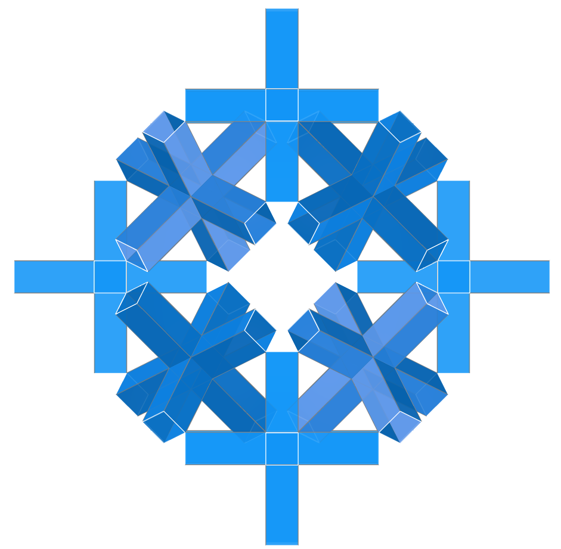
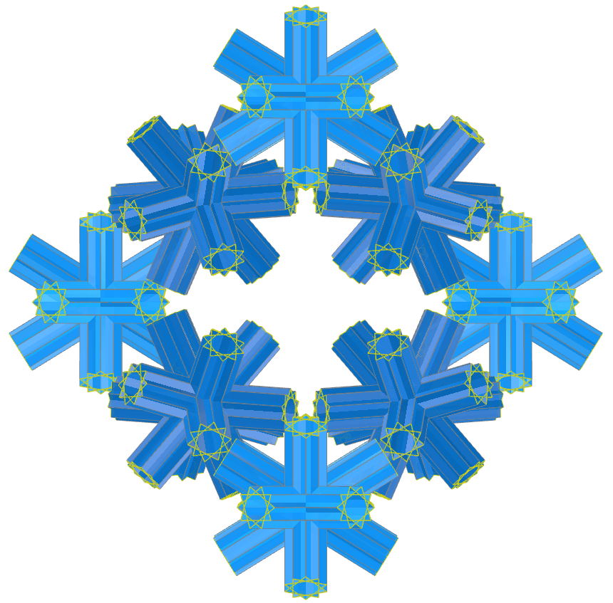
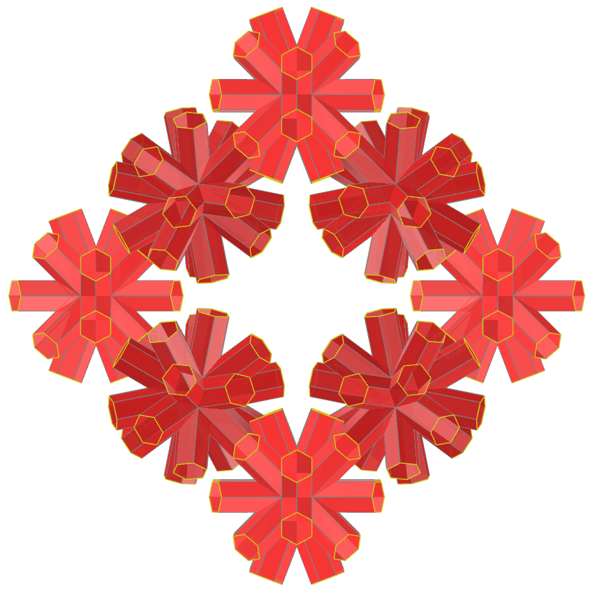
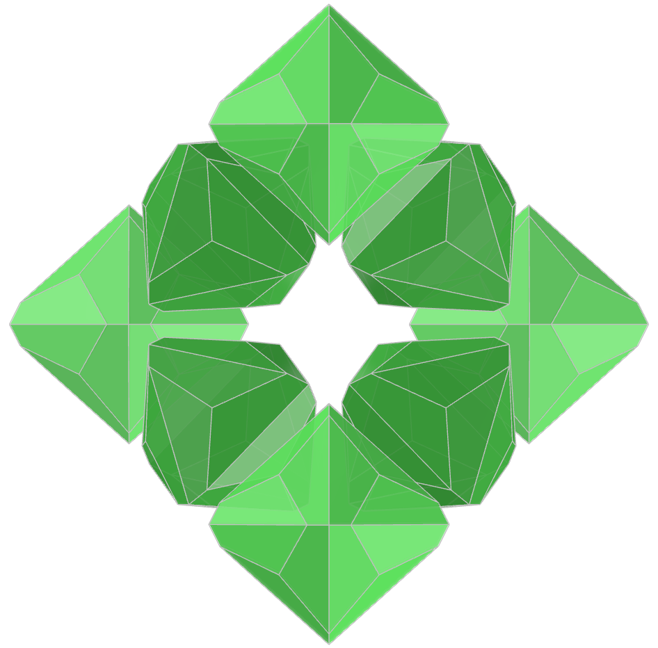
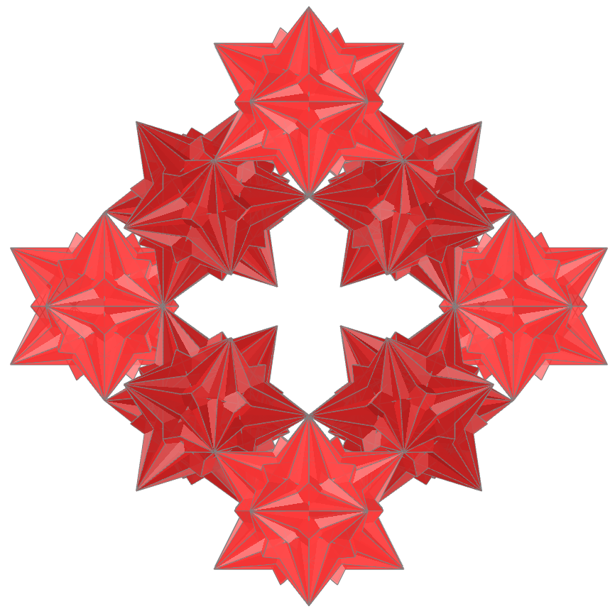

<link rel="stylesheet" href="../scripts/style1.css">
<meta charset="utf-8">
<link rel="icon" type="image/png" href="vr/salas/imagens/icone.png">
<h2>Torus and Toroids: visualization of solids with Augmented Reality (AR) and Virtual Reality (VR) in A-frame</h2>
 <b>author:</b> Paulo Henrique Siqueira - Universidade Federal do Paraná
  <b>contact:</b> <a href="#">paulohscwb@gmail.com</a>
  <a href="https://paulohscwb.github.io/torus-toroids/stewartrings/pt-br/">versão em português</a>
 <form style="margin: 0 auto; float:right; text-align:right; width:100%; margin-bottom:15px;">
	<select id="url" onchange="urlHandler(this.value)" style="color:royalblue;">
		<option disabled selected value>More solids:</option>
		<option value="../basic/">Torus and toroids</option>
		<option value="../tetragonal/">Tetragonal toroids</option>
		<option value="../iris/">Iris toroids</option>
		<option value="../regulartetrag/">Regular tetragonal toroids</option>
		<option value="../mobiuscairo/">Möbius, Vélez-Jahn and Cairo toroids</option>
		<option value="../hexagonal/">Hexagonal toroids</option>
		<option value="../regular1/">Regular polygonal and composition toroids 1</option>
		<option value="../heptadodekleinbottle/">Heptagonal dodecahedrons and Klein bottles</option>
		<option value="../regular2/">Regular polygonal and composition toroids 2</option>
		<option disabled value="../stewartrings/">Stewart rings</option>
		<!--<option value="../regular3/">Regular polygonal and composition toroids 3</option>
		<option value="../regular4/">Regular polygonal toroids 4</option>
		<option value="../regular5/">Regular polygonal toroids 5</option>-->
	</select>
</form>

  <h2 align="center"> Stewart rings</h2>
A toroidal solid or toroid, is an orientable polyhedron without self-intersections that has genus greater than zero (meaning that it contains one or more holes). An orientable polyhedron's genus (G) is related to the number of vertices (V), faces (F), and edges (E) as follows:

V + F − E = 2 − 2 * G

Bonnie Stewart's toroids (1964) are solids that possess regular polygonal faces. The adjacent faces of these toroids are not coplanar. This work shows Stewart rings modeled in 3D, with views that can be accessed with resources in immersive Virtual Reality rooms.
 
<a href="#m3d">3D Models</a>&nbsp;&nbsp;|&nbsp;&nbsp;<a href="../">Home</a>

 

 

<h3 id="m3d" align="center">3D models</h3>
<!--<iframe width="560" height="315" style="max-width:100%" src="https://www.youtube.com/embed/videoseries?list=PLy0I_lGW8HxWrThyG3c9HmtaH_RUtJPEN" title="YouTube video player" frameborder="0" allow="accelerometer; autoplay; clipboard-write; encrypted-media; gyroscope; picture-in-picture; web-share" allowfullscreen></iframe>-->
<h4>1. Cube</h4>

  Stewart rings of Cube.
  

<h4>2. Chamfered Icosahedron</h4>

  Stewart rings of Chamfered Icosahedron.
  

<h4>3. Chamfered Octahedron</h4>

  Stewart rings of Chamfered Octahedron.
  

<h4>4. Chamfered Truncated Icosahedron</h4>

  Stewart rings of Chamfered Truncated Icosahedron.
  

<h4>5. Concave Dodecahedron</h4>

  Stewart rings of Concave Dodecahedron.
  

<h4>6. Cuboctahedron</h4>

  Stewart rings of Cuboctahedron.
  

<h4>7. Ditrigonal Dodecadodecahedron</h4>

  Stewart rings of Ditrigonal Dodecadodecahedron.
  

<h4>8. Dodecadodecahedron</h4>

  Stewart rings of Dodecadodecahedron.
  

<h4>9. Dodecahedron</h4>

  Stewart rings of Dodecahedron.
  

<h4>10. Escher Solid</h4>

  Stewart rings of Escher Solid.
  

<a href="#p1" class="topo">back to top</a>

<h4>11. Great Cubicuboctahedron</h4>

  Stewart rings of Great Cubicuboctahedron.
  

<h4>12. Great Ditrigonal Icosidodecahedron</h4>

  Stewart rings of Great Ditrigonal Icosidodecahedron.
  

<h4>13. Great Dodecahedron</h4>

  Stewart rings of Great Dodecahedron.
  

<h4>14. Great Dodecahemicosahedron</h4>

  Stewart rings of Great Dodecahemicosahedron.
  

<h4>15. Great Icosahedron</h4>

  Stewart rings of Great Icosahedron.
  

<h4>16. Great Rhombihexahedron</h4>

  Stewart rings of Great Rhombihexahedron.
  

<h4>17. Great Stellated Dodecahedron</h4>

  Stewart rings of Great Stellated Dodecahedron.
  

<h4>18. Hexagonal Prism</h4>

  Stewart ring of Hexagonal Prism.
  

<h4>19. Icosahedron</h4>

  Stewart rings of Icosahedron.
  

<h4>20. Icosidodecahedron</h4>

  Stewart rings of Icosidodecahedron.
  

<a href="#p1" class="topo">back to top</a>

<h4>21. Klein Map</h4>

  Stewart rings of Klein Map.
  

<h4>22. Octahedron</h4>

  Stewart rings of Octahedron.
  

<h4>23. Octahemioctahedron</h4>

  Stewart rings of Octahemioctahedron.
  

<h4>24. Regular Map #1</h4>

  Stewart rings of Regular Map.
  

<h4>25. Regular Map #2</h4>

  Stewart rings of Regular Map.
  

<h4>26. Regular Map #3</h4>

  Stewart rings of Regular Map.
  

<h4>27. Regular Map #4</h4>

  Stewart rings of Regular Map.
  

<h4>28. Regular Map #5</h4>

  Stewart rings of Regular Map.
  

<h4>29. Regular Map #6</h4>

  Stewart rings of Regular Map.
  

<h4>30. Regular Map #7</h4>

  Stewart rings of Regular Map.
  

<a href="#p1" class="topo">back to top</a>

<h4>31. Regular Map #8</h4>

  Stewart rings of Regular Map.
  

<h4>32. Rhombicosacron</h4>

  Stewart rings of Rhombicosacron.
  

<h4>33. Rhombicosahedron</h4>

  Stewart rings of Rhombicosahedron.
  

<h4>34. Rhombicosidodecahedron</h4>

  Stewart rings of Rhombicosidodecahedron.
  

<h4>35. Rhombicuboctahedron</h4>

  Stewart rings of Rhombicuboctahedron.
  

<h4>36. Small Cubicuboctahedron</h4>

  Stewart rings of Small Cubicuboctahedron.
  

<h4>37. Small Ditrigonal Dodecicosidodecahedron</h4>

  Stewart rings of Small Ditrigonal Dodecicosidodecahedron.
  

<h4>38. Small Dodecahemicosahedron</h4>

  Stewart rings of Small Dodecahemicosahedron.
  

<h4>39. Small Dodecicosidodecahedron</h4>

  Stewart rings of Small Dodecicosidodecahedron.
  

<h4>40. Small Icosicosidodecahedron</h4>

  Stewart rings of Small Icosicosidodecahedron.
  

<a href="#p1" class="topo">back to top</a>

<h4>41. Small Icosihemidodecahedron</h4>

  Stewart rings of Small Icosihemidodecahedron.
  

<h4>42. Small Stellapentakis Dodecahedron</h4>

  Stewart rings of Small Stellapentakis Dodecahedron.
  

<h4>43. Small Stellated Dodecahedron</h4>

  Stewart rings of Small Stellated Dodecahedron.
  

<h4>44. Stella Octangula</h4>

  Stewart rings of Stella Octangula.
  

<h4>45. Stellated Truncated Hexahedron</h4>

  Stewart rings of Stellated Truncated Hexahedron.
  

<h4>46. Tetrahedron</h4>

  Stewart rings of Tetrahedron.
  

<h4>47. Triakis Tetrahedron</h4>

  Stewart rings of Triakis Tetrahedron.
  

<h4>48. Truncated Cube</h4>

  Stewart rings of Truncated Cube.
  

<h4>49. Truncated Cuboctahedron</h4>

  Stewart rings of Truncated Cuboctahedron.
  

<h4>50. Truncated Dodecahedron</h4>

  Stewart rings of Truncated Dodecahedron.
  

<a href="#p1" class="topo">back to top</a>

<h4>51. Truncated Great Icosahedron</h4>

  Stewart rings of Truncated Great Icosahedron.
  

<h4>52. Truncated Icosahedron</h4>

  Stewart rings of Truncated Icosahedron.
  

<h4>53. Truncated Octahedron</h4>

  Stewart rings of Truncated Octahedron.
  

<h4>54. Truncated Tetrahedron</h4>

  Stewart rings of Truncated Tetrahedron.
  

<h4>55. Uniform Great Rhombicuboctahedron</h4>

  Stewart rings of Uniform Great Rhombicuboctahedron.
  

<h4>56. Cubohemioctahedron</h4>

  Stewart rings of Cubohemioctahedron.
  

<h4>57. Jessens Orthogonal Icosahedron</h4>

  Stewart rings of Jessens Orthogonal Icosahedron.
  

<h4>58. Tetrahemihexacron</h4>

  Stewart rings of Tetrahemihexacron.
  

<h4>59. Hexahemioctacron</h4>

  Stewart rings of Hexahemioctacron.
  

<h4>60. Great Dodecahemidodecacron</h4>

  Stewart rings of Great Dodecahemidodecacron.
  

<a href="#p1" class="topo">back to top</a>

<h4>61. Small Icosihemidodecacron</h4>

  Stewart rings of Small Icosihemidodecacron.
  

<h4>62. Great Dodecahemicosacron</h4>

  Stewart rings of Great Dodecahemicosacron.
  

<h4>63. Dyakis Dodecahedron</h4>

  Stewart rings of Dyakis Dodecahedron.
  

<h4>64. Great Triakis Icosahedron</h4>

  Stewart rings of Great Triakis Icosahedron.
  

<a href="#p1" class="topo">back to top</a>

  Stewart rings: visualization of solids with Virtual Reality by <a xmlns:cc="http://creativecommons.org/ns#" href="https://paulohscwb.github.io/torus-toroids/stewartrings/" property="cc:attributionName" rel="cc:attributionURL">Paulo Henrique Siqueira</a> is licensed with a license <a rel="license" href="http://creativecommons.org/licenses/by-nc-nd/4.0/">Creative Commons Attribution-NonCommercial-NoDerivatives 4.0 International</a>.

<h4>How to cite this work:</h4> 

Siqueira, P.H., "Stewart rings: visualization of solids with Virtual Reality". Available in: <https://paulohscwb.github.io/stewartrings/stewartrings/>, May 2026.

<!---->
  <b>References:</b>
 Weisstein, Eric W. "Torus" From MathWorld-A Wolfram Web Resource. <a href="https://mathworld.wolfram.com/Torus.html" target="_blank">https://mathworld.wolfram.com/Torus.html</a>
 Weisstein, Eric W. "Toroid" From MathWorld-A Wolfram Web Resource. <a href="https://mathworld.wolfram.com/Toroid.html" target="_blank">https://mathworld.wolfram.com/Toroid.html</a>
 McCooey, D. I. "Visual Polyhedra". <a href="http://dmccooey.com/polyhedra/" target="_blank">http://dmccooey.com/polyhedra/</a>
