<link rel="stylesheet" href="../scripts/style.css">
<meta charset="utf-8">
<link rel="icon" type="image/png" href="vr/salas/imagens/icone.png">
<h2>Torus and Toroids: visualization of solids with Augmented Reality (AR) and Virtual Reality (VR) in A-frame</h2>
 <b>author:</b> Paulo Henrique Siqueira - Universidade Federal do Paraná
  <b>contact:</b> <a href="#">paulohscwb@gmail.com</a>
  <a href="https://paulohscwb.github.io/torus-toroids/tetragonal/pt-br/">versão em português</a>
 <form style="margin: 0 auto; float:right; text-align:right; width:100%; margin-bottom:15px;">
	<select id="url" onchange="urlHandler(this.value)" style="color:royalblue;">
		<option disabled selected value>More solids:</option>
		<option value="../basic/">Torus and toroids</option>
		<option disabled value="../tetragonal/">Tetragonal toroids</option>
		<!--<option value="../iris/">Iris toroids</option>
		<option value="../mobius-cairo/">Mobius and Cairo toroids</option>
		<option value="../regular/">Regular toroids</option>
		<option value="../hexagonal/">Hexagonal toroids</option>
		<option value="../heptagonal/">Heptagonal dodecahedrons</option>
		<option value="../regular1/">Regular polygonal toroids 1</option>
		<option value="../regular2/">Regular polygonal toroids 2</option>
		<option value="../regular3/">Regular polygonal toroids 3</option>
		<option value="../rings/">Rings toroids</option>
		<option value="../regular4/">Regular polygonal toroids 4</option>
		<option value="../regular5/">Regular polygonal toroids 5</option>-->
	</select>
</form>

  <h2 align="center"> Tetragonal toroids</h2>
A toroidal solid or toroid, is an orientable polyhedron without self-intersections that has genus greater than zero (meaning that it contains one or more holes). An orientable polyhedron's genus (G) is related to the number of vertices (V), faces (F), and edges (E) as follows:

V + F − E = 2 − 2 * G

This work shows tetragonal toroids modeled in 3D, with views that can be accessed with Augmented Reality resources and also in immersive Virtual Reality rooms.

<a href="#ra">Augmented Reality</a>&nbsp;&nbsp;|&nbsp;&nbsp;<a href="#m3d">3D Models</a>&nbsp;&nbsp;|&nbsp;&nbsp;<a href="../">Home</a>

  

 <h3 align="center">Immersive room</h3>
  
<iframe width="100%" src="sala.htm" title="Sala Imersiva dos toros e toroides" frameborder="0" loading="lazy"></iframe>

  
<a href="sala.htm" target="_blank">&#x1f517; room link</a>
 
  

  <h3 id="ra" align="center">Augmented Reality</h3>
  To view torus and toroids in AR, simply visit the pages indicated in the 3D solid models using any browser with a webcam device (smartphone, tablet or notebook). 
 Access to the VR pages is done by clicking on the blue circle that appears on top of the marker.

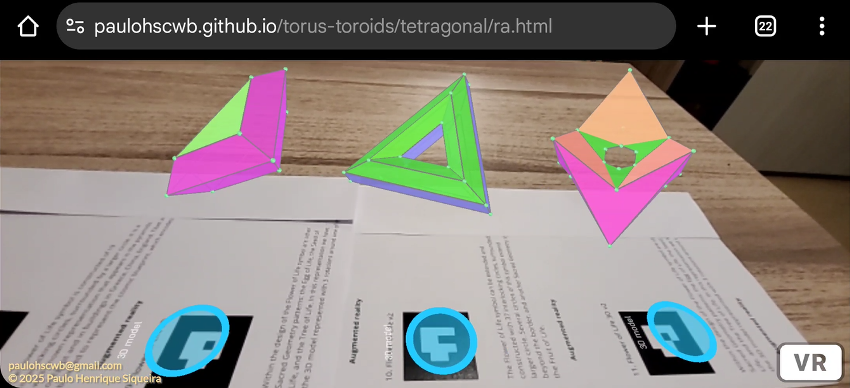

<h3 id="m3d" align="center">3D models</h3>
<iframe width="560" height="315" style="max-width:100%" src="https://www.youtube.com/embed/videoseries?list=PLy0I_lGW8HxXgcL9RxOVEfCA1KDLByHZt" title="YouTube video player" frameborder="0" allow="accelerometer; autoplay; clipboard-write; encrypted-media; gyroscope; picture-in-picture; web-share" allowfullscreen></iframe>
<h4>1. Regular triangular tetragonal toroid</h4>
<a href="vr/Regular3TetragonalToroid.htm" target="_blank" title="3D model" class="fotoA">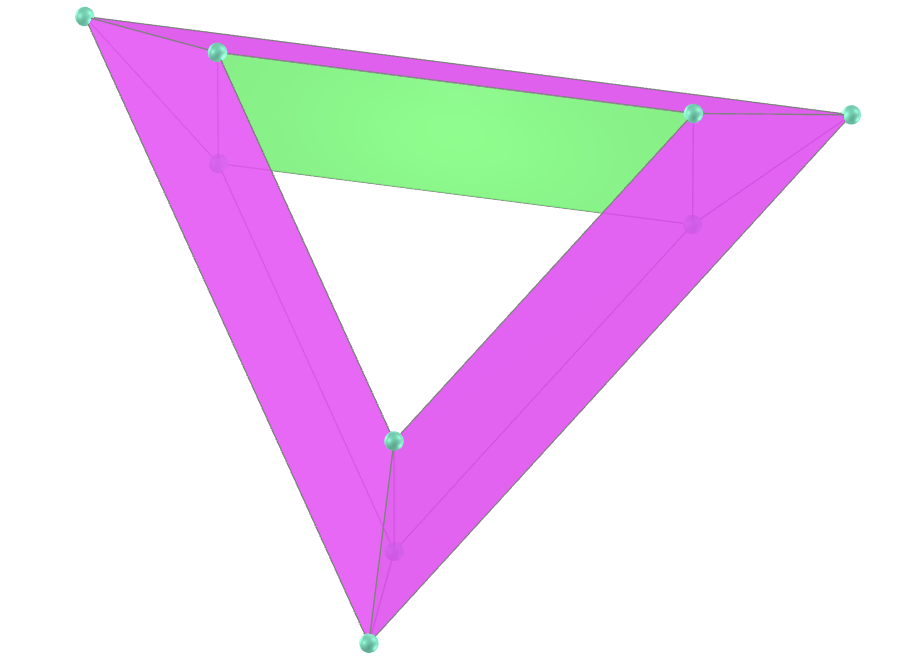</a>
   <b>faces:</b> 3 rectangles and 6 isosceles trapezoids
  <b>vertices:</b> 9
  <b>edges:</b> 18
    
 

<h4>2. Regular triangular tetragonal toroid</h4>
<a href="vr/Regular3TetragonalToroid_A.htm" target="_blank" title="3D model" class="fotoA">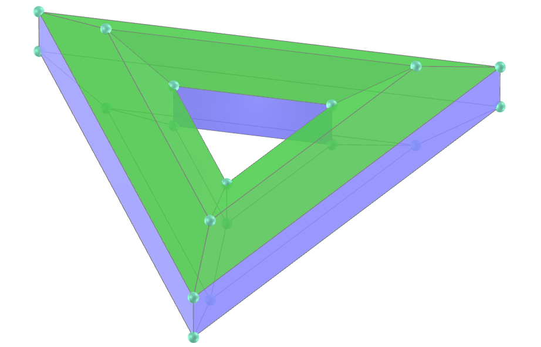</a>
   <b>faces:</b> 6 rectangles and 12 isosceles trapezoids
  <b>vertices:</b> 18
  <b>edges:</b> 36
    
 

<h4>3. Regular triangular antiprismatic tetragonal toroid</h4>
<a href="vr/RegularAntiprismaticTetragonalToroid.htm" target="_blank" title="3D model" class="fotoA">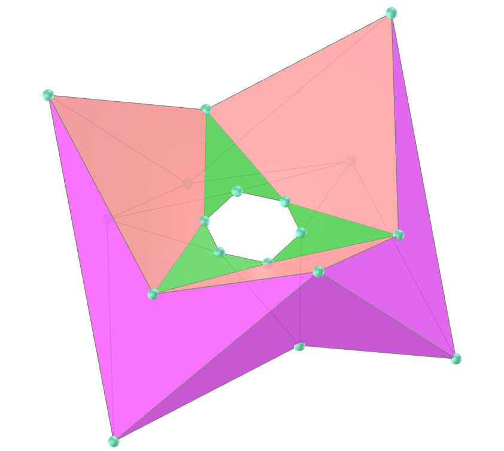</a>
   <b>faces:</b> 12 darts and 6 kites
  <b>vertices:</b> 18
  <b>edges:</b> 36
    
  
 

<h4>4. Regular triangular cubic tetragonal toroid</h4>
<a href="vr/Regular3TetragonalToroid_C.htm" target="_blank" title="3D model" class="fotoA">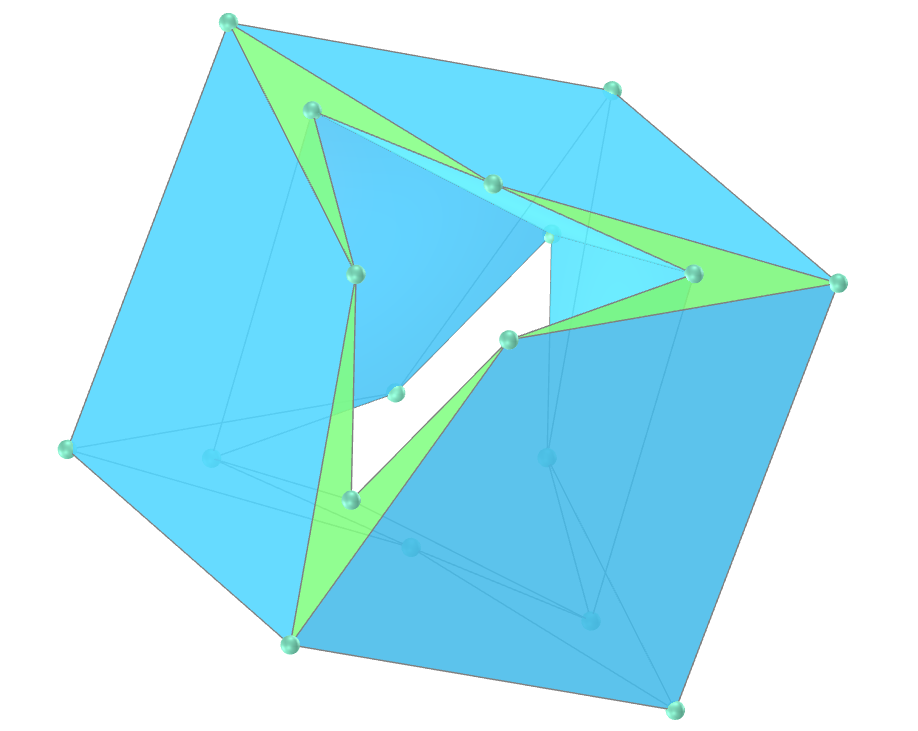</a>
   <b>faces:</b> 12 kites and 6 darts
  <b>vertices:</b> 18
  <b>edges:</b> 36
    
 

<h4>5. Regular square tetragonal toroid</h4>

   <b>faces:</b> 4 rectangles and 8 isosceles trapezoids
  <b>vertices:</b> 12
  <b>edges:</b> 24
    
 
 

<h4>6. Square antiprism trapezohedron toroid</h4>
<a href="vr/TetragonalAntiprismTrapezohedronToroid.htm" target="_blank" title="3D model" class="fotoA">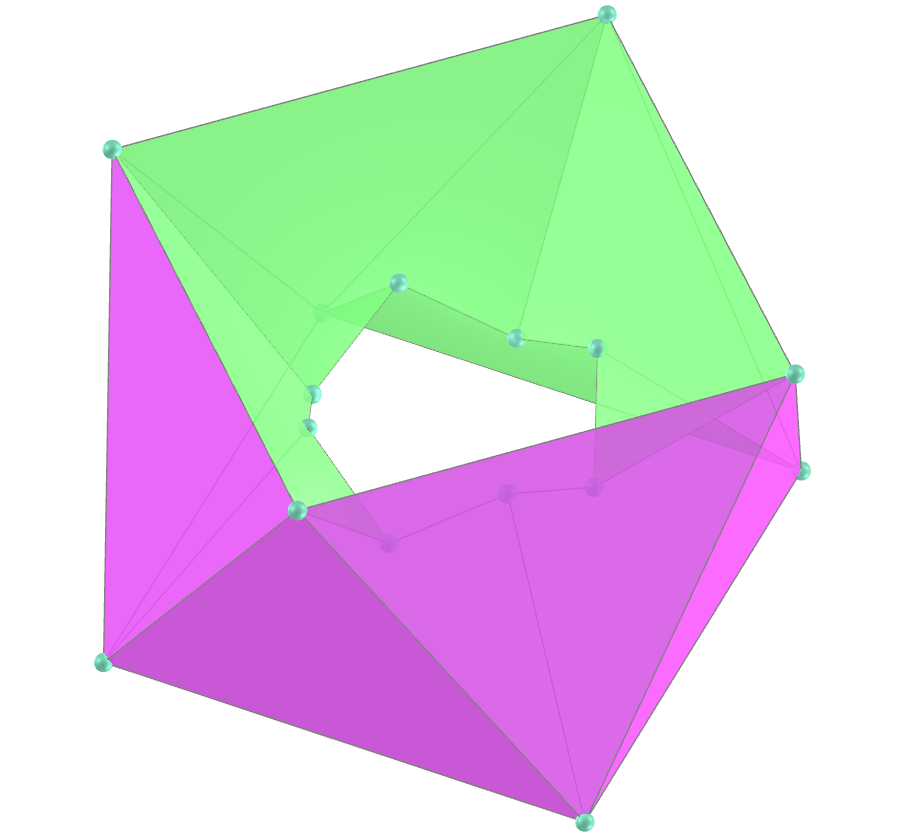</a>
   <b>faces:</b> 8 equilateral triangles and 8 symmetric pentagons
  <b>vertices:</b> 16
  <b>edges:</b> 32
    
 

<h4>7. Square trapezohedron antiprism toroid</h4>
<a href="vr/TetragonalTrapezohedronAntiprismToroid.htm" target="_blank" title="3D model" class="fotoA">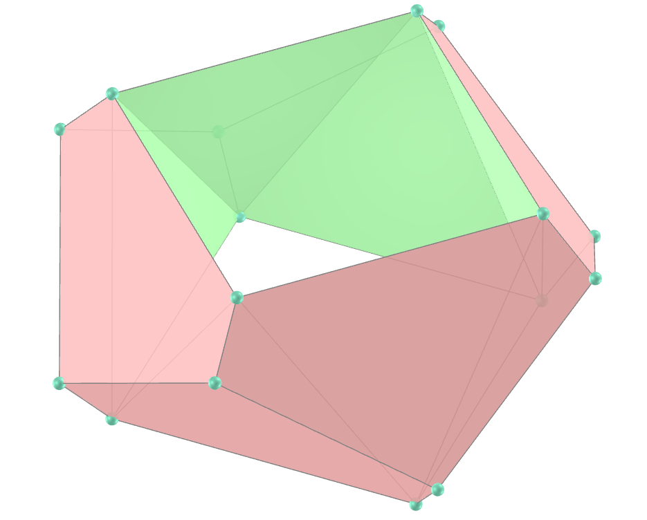</a>
   <b>faces:</b> 8 equilateral triangles and 8 symmetric pentagons
  <b>vertices:</b> 16
  <b>edges:</b> 32
    
 

<a href="#p1" class="topo">back to top</a>

<h4>8. Square trapezohedron toroid</h4>
<a href="vr/TetragonalTrapezohedronToroid.htm" target="_blank" title="3D model" class="fotoA">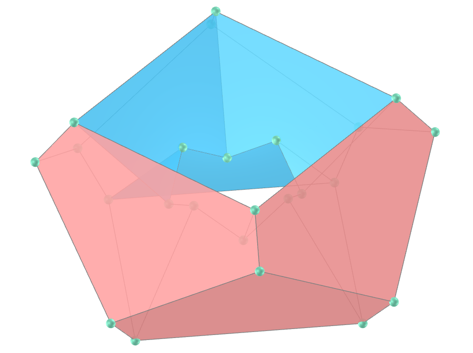</a>
   <b>faces:</b> 16 symmetric pentagons
  <b>vertices:</b> 24
  <b>edges:</b> 40
    
 

<h4>9. Regular pentagonal tetragonal toroid</h4>
<a href="vr/Regular5TetragonalToroid.htm" target="_blank" title="3D model" class="fotoA">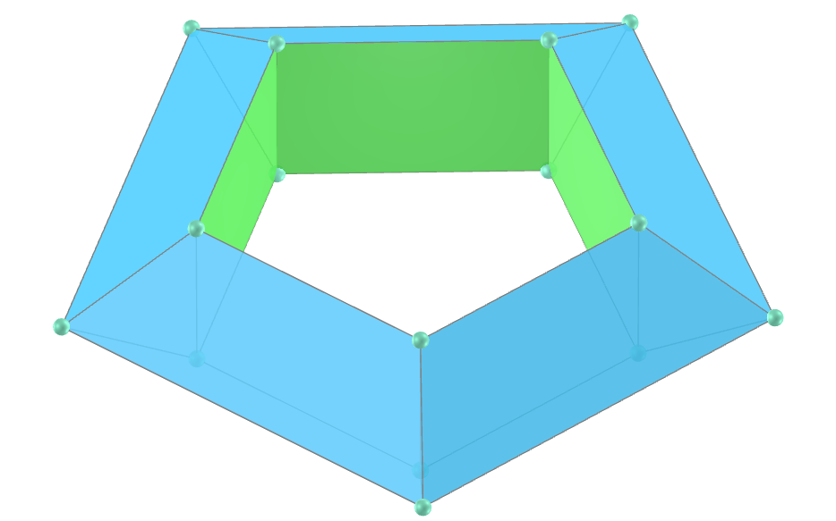</a>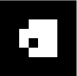
   <b>faces:</b> 5 rectangles and 10 isosceles trapezoids
  <b>vertices:</b> 15
  <b>edges:</b> 30
    
 

<h4>10. Regular hexagonal tetragonal toroid</h4>
<a href="vr/Regular6TetragonalToroid.htm" target="_blank" title="3D model" class="fotoA">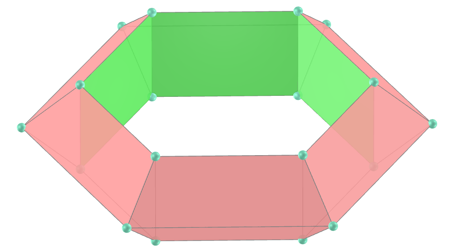</a>
   <b>faces:</b> 6 rectangles and 12 isosceles trapezoids
  <b>vertices:</b> 18
  <b>edges:</b> 36
    
 

<h4>11. Regular heptagonal tetragonal toroid</h4>
<a href="vr/Regular7TetragonalToroid.htm" target="_blank" title="3D model" class="fotoA">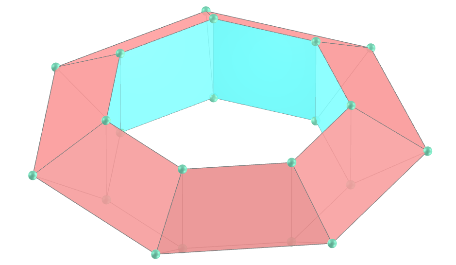</a>
   <b>faces:</b> 7 rectangles and 14 isosceles trapezoids
  <b>vertices:</b> 21
  <b>edges:</b> 42
    
 

<h4>12. Regular octagonal tetragonal toroid</h4>
<a href="vr/Regular8TetragonalToroid.htm" target="_blank" title="3D model" class="fotoA">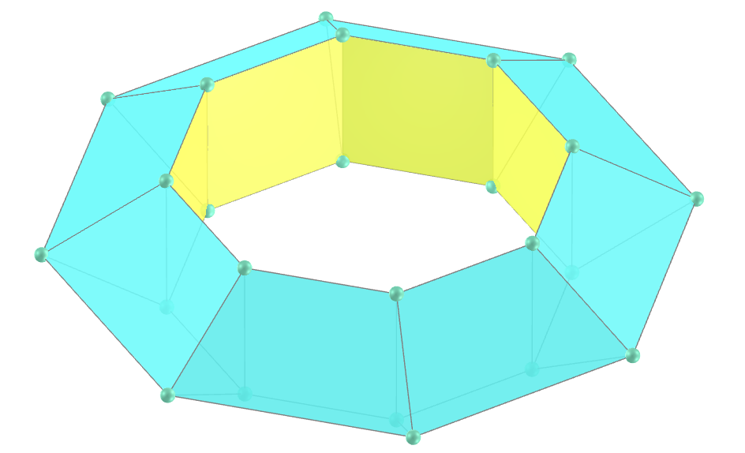</a>
   <b>faces:</b> 8 rectangles and 16 isosceles trapezoids
  <b>vertices:</b> 24
  <b>edges:</b> 48
    
 

<h4>13. Regular enneagonal tetragonal toroid</h4>
<a href="vr/Regular9TetragonalToroid.htm" target="_blank" title="3D model" class="fotoA">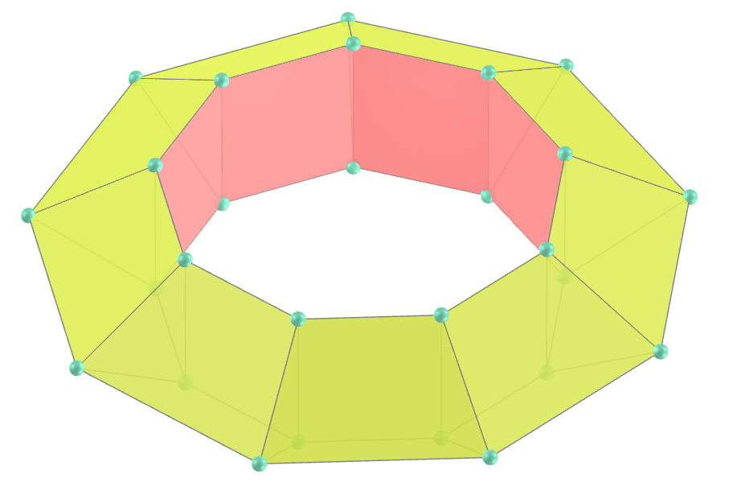</a>
   <b>faces:</b> 9 rectangles and 18 isosceles trapezoids
  <b>vertices:</b> 27
  <b>edges:</b> 54
    
 

<h4>14. Regular decagonal tetragonal toroid</h4>
<a href="vr/Regular10TetragonalToroid.htm" target="_blank" title="3D model" class="fotoA">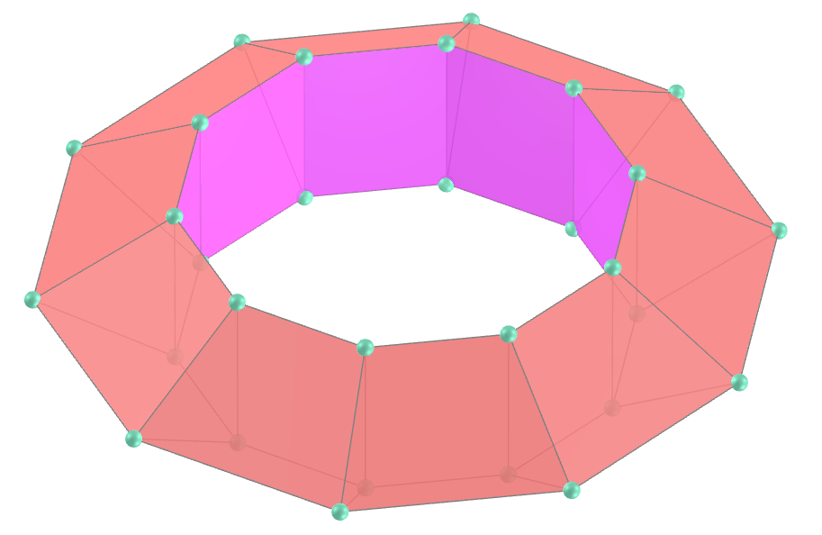</a>
   <b>faces:</b> 10 rectangles and 20 isosceles trapezoids
  <b>vertices:</b> 30
  <b>edges:</b> 60
    
 

<a href="#p1" class="topo">back to top</a>

  Tetragonal toroids: visualization of solids with Augmented Reality and Virtual Reality by <a xmlns:cc="http://creativecommons.org/ns#" href="https://paulohscwb.github.io/torus-toroids/basic/" property="cc:attributionName" rel="cc:attributionURL">Paulo Henrique Siqueira</a> is licensed with a license <a rel="license" href="http://creativecommons.org/licenses/by-nc-nd/4.0/">Creative Commons Attribution-NonCommercial-NoDerivatives 4.0 International</a>.

<h4>How to cite this work:</h4> 

Siqueira, P.H., "Tetragonal toroids: visualization of solids with Augmented Reality and Virtual Reality". Available in: <https://paulohscwb.github.io/torus-toroids/basic/>, February 2025.

<!---->
  <b>References:</b>
 Weisstein, Eric W. "Torus" From MathWorld-A Wolfram Web Resource. <a href="https://mathworld.wolfram.com/Torus.html" target="_blank">https://mathworld.wolfram.com/Torus.html</a>
 Weisstein, Eric W. "Toroid" From MathWorld-A Wolfram Web Resource. <a href="https://mathworld.wolfram.com/Toroid.html" target="_blank">https://mathworld.wolfram.com/Toroid.html</a>
 McCooey, D. I. "Visual Polyhedra". <a href="http://dmccooey.com/polyhedra/" target="_blank">http://dmccooey.com/polyhedra/</a>
