<link rel="stylesheet" href="../../scripts/style.css">
<meta charset="utf-8">
<link rel="icon" type="image/png" href="../vr/salas/imagens/icone.png">
<h2>Toros e toroides: visualização dos sólidos com Realidade Aumentada (RA) e Realidade Virtual (RV) em A-frame</h2>
<b>autor:</b> Paulo Henrique Siqueira - Universidade Federal do Paraná
 <b>contato:</b> <a href="#"> paulohscwb@gmail.com </a>
 <a href="https://paulohscwb.github.io/torus-toroids/tetragonal/">english version</a>
<form style="margin: 0 auto; float:right; text-align:right; width:100%; margin-bottom:15px;">
	<select id="url" onchange="urlHandler(this.value)" style="color:royalblue;">
		<option disabled selected>Mais sólidos:</option>
		<option value="../../basic/pt-br/">Toros e toroides</option>
		<option disabled value="../../tetragonal/pt-br/">Toroides tetragonais</option>
		<option value="../../iris/pt-br/">Toroides de íris</option>
		<!--<option value="../../mobius-cairo/pt-br/">Toroides de Mobius e Cairo</option>
		<option value="../../regular/pt-br/">Toroides regulares</option>
		<option value="../../hexagonal/pt-br/">Toroides hexagonais</option>
		<option value="../../heptagonal/pt-br/">Dodecaedros heptagonais</option>
		<option value="../../regular1/pt-br/">Toroides poligonais regulares 1</option>
		<option value="../../regular2/pt-br/">Toroides poligonais regulares 2</option>
		<option value="../../regular3/pt-br/">Toroides poligonais regulares 3</option>
		<option value="../../rings/pt-br/">Anéis toroides</option>
		<option value="../../regular4/pt-br/">Toroides poligonais regulares 4</option>
		<option value="../../regular5/pt-br/">Toroides poligonais regulares 5</option>-->
	</select>
</form>

  <h2 align="center">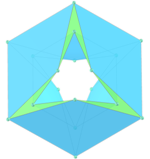 Toroides tetragonais</h2>
Um sólido toroidal ou toroide é um poliedro orientável sem autointerseções que tem gênero maior que zero (o que significa que contém um ou mais buracos). O gênero (G) de um poliedro orientável está relacionado ao número de vértices (V), faces (F) e arestas (E) da seguinte forma:

V + F − E = 2 − 2 * G

Este trabalho mostra toroides tetragonais modelados em 3D, com as visualizações que podem ser acessadas com recursos de Realidade Aumentada e também em salas de Realidade Virtual imersivas.
 
<a href="#ra">Realidade Aumentada</a>&nbsp;&nbsp;|&nbsp;&nbsp;<a href="#m3d">Modelos 3D</a>&nbsp;&nbsp;|&nbsp;&nbsp;<a href="../../pt-br/">Página Inicial</a>

 <h3 align="center">Sala imersiva</h3>
  
<iframe width="100%" src="../sala.htm" title="Sala Imersiva dos toros e toroides" frameborder="0" loading="lazy"></iframe>

  
<a href="../sala.htm" target="_blank">&#x1f517; room link</a>
 
  

  <h3 id="ra" align="center">Realidade Aumentada</h3>
  Para visualizar os toros e toroides em RA, visite as páginas indicadas nos modelos 3D dos sólidos utilizando qualquer navegador com um dispositivo de webcam (smartphone, tablet ou notebook).
 O acesso às páginas de RV é feito clicando no círculo azul que aparece em cima de cada marcador.

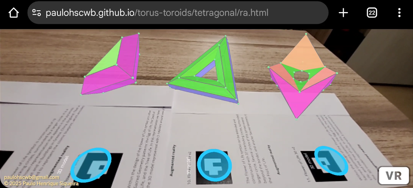

<h3 id="m3d" align="center">Modelos 3D</h3>
<iframe width="560" height="315" style="max-width:100%" src="https://www.youtube.com/embed/videoseries?list=PLy0I_lGW8HxXgcL9RxOVEfCA1KDLByHZt" title="YouTube video player" frameborder="0" allow="accelerometer; autoplay; clipboard-write; encrypted-media; gyroscope; picture-in-picture; web-share" allowfullscreen></iframe>
<h4>1. Toroide tetragonal triangular regular</h4>
<a href="../vr/Regular3TetragonalToroid.htm" target="_blank" title="modelo 3D" class="fotoA">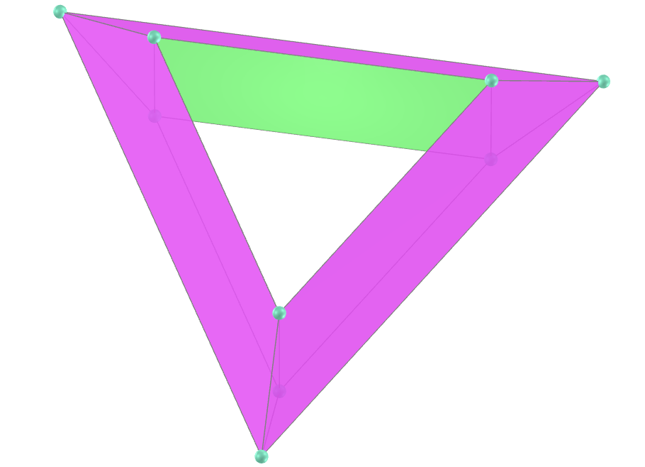</a>
   <b>faces:</b> 3 retângulos e 6 trapézios isósceles
  <b>vértices:</b> 9
  <b>arestas:</b> 18
    

<h4>2. Toroide tetragonal triangular regular</h4>
<a href="../vr/Regular3TetragonalToroid_A.htm" target="_blank" title="modelo 3D" class="fotoA">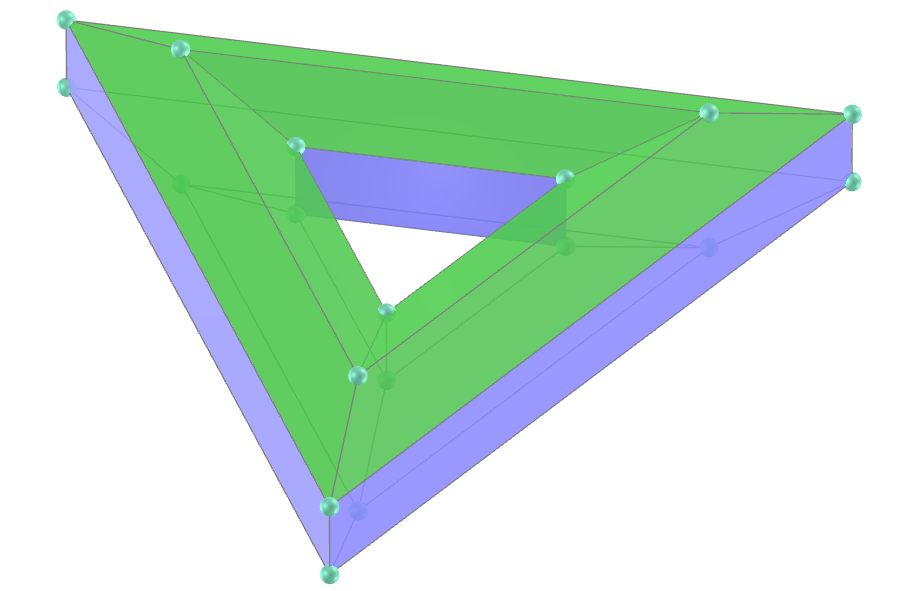</a>
   <b>faces:</b> 6 retângulos e 12 trapézios isósceles
  <b>vértices:</b> 18
  <b>arestas:</b> 36
    

<h4>3. Toroide tetragonal triangular antiprismático regular</h4>
<a href="../vr/RegularAntiprismaticTetragonalToroid.htm" target="_blank" title="modelo 3D" class="fotoA">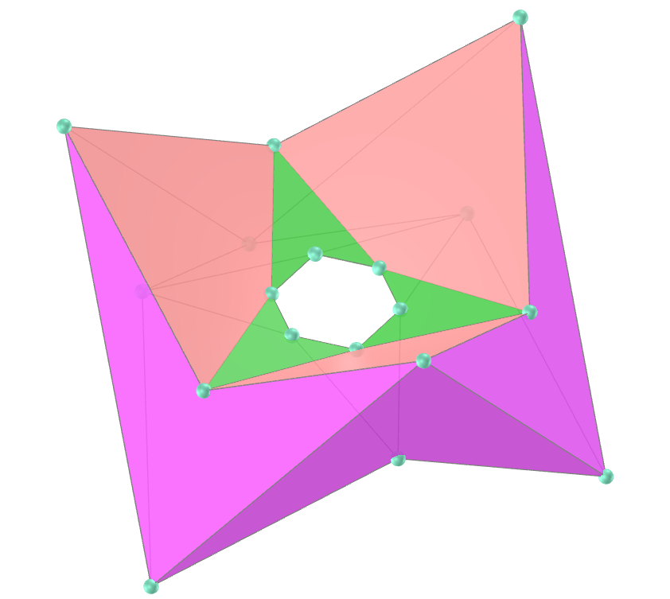</a>
   <b>faces:</b> 12 dardos e 6 pipas
  <b>vértices:</b> 18
  <b>arestas:</b> 36
    

<h4>4. Toroide tetragonal triangular cúbico regular</h4>

   <b>faces:</b> 12 pipas e 6 dardos
  <b>vértices:</b> 18
  <b>arestas:</b> 36
    

<h4>5. Toroide tetragonal quadrado regular</h4>
<a href="../vr/Regular4TetragonalToroid.htm" target="_blank" title="modelo 3D" class="fotoA">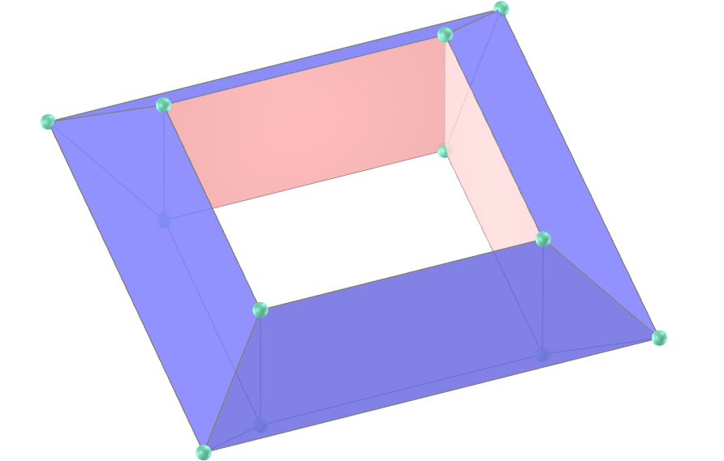</a>
   <b>faces:</b> 4 retângulos e 8 trapézios isósceles
  <b>vértices:</b> 12
  <b>arestas:</b> 24
    

<h4>6. Toroide trapezoedro antiprisma quadrado</h4>

   <b>faces:</b> 8 triângulos equiláteros e 8 pentágonos simétricos
  <b>vértices:</b> 16
  <b>arestas:</b> 32
    

<h4>7. Toroide antiprisma trapezoedro quadrado</h4>
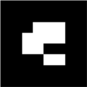
   <b>faces:</b> 8 triângulos equiláteros e 8 pentágonos simétricos
  <b>vértices:</b> 16
  <b>arestas:</b> 32
    

<a href="#p1" class="topo">voltar ao topo</a>

<h4>8. Toroide trapezoedro quadrado</h4>

   <b>faces:</b> 16 pentágonos simétricos
  <b>vértices:</b> 24
  <b>arestas:</b> 40
    

<h4>9. Toroide tetragonal pentagonal regular</h4>
<a href="../vr/Regular5TetragonalToroid.htm" target="_blank" title="modelo 3D" class="fotoA">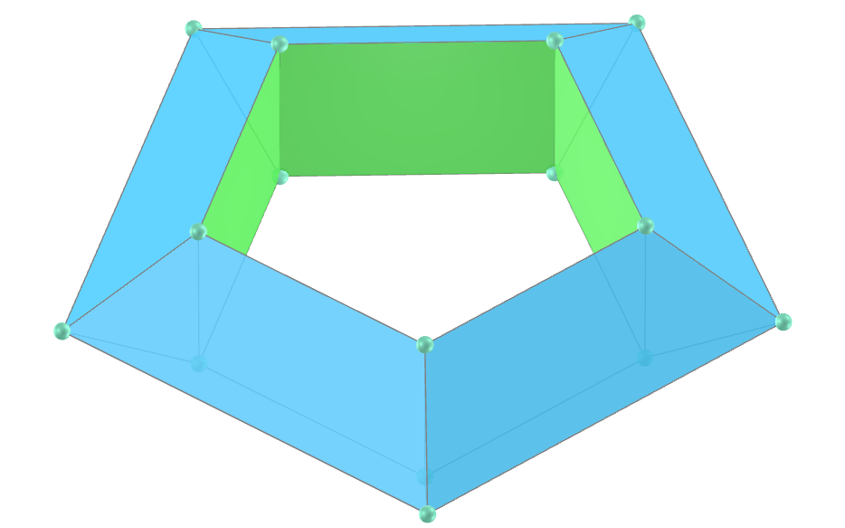</a>
   <b>faces:</b> 5 retângulos e 10 trapézios isósceles
  <b>vértices:</b> 15
  <b>arestas:</b> 30
    

<h4>10. Toroide tetragonal hexagonal regular</h4>
<a href="../vr/Regular6TetragonalToroid.htm" target="_blank" title="modelo 3D" class="fotoA">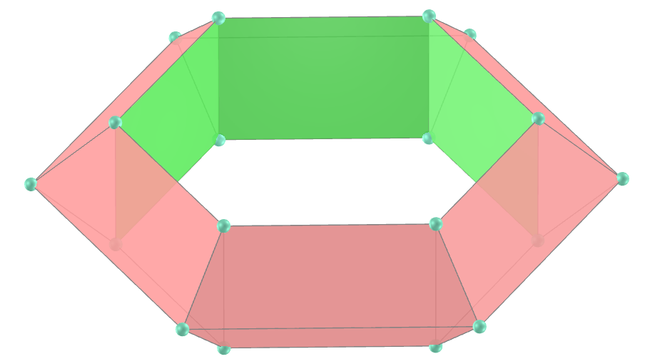</a>
   <b>faces:</b> 6 retângulos e 12 trapézios isósceles
  <b>vértices:</b> 18
  <b>arestas:</b> 36
    

<h4>11. Toroide tetragonal heptagonal regular</h4>
<a href="../vr/Regular7TetragonalToroid.htm" target="_blank" title="modelo 3D" class="fotoA">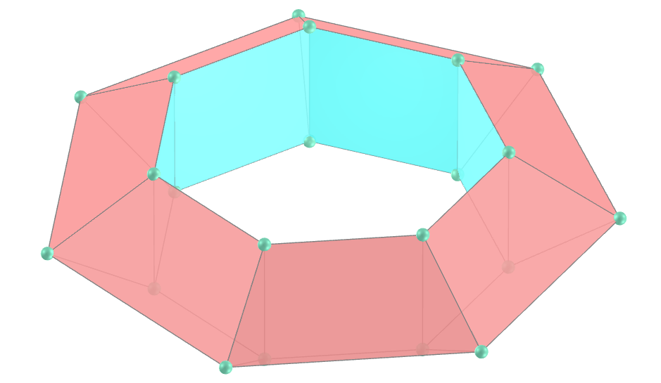</a>
   <b>faces:</b> 7 retângulos e 14 trapézios isósceles
  <b>vértices:</b> 21
  <b>arestas:</b> 42
    

<h4>12. Toroide tetragonal octogonal regular</h4>

   <b>faces:</b> 8 retângulos e 16 trapézios isósceles
  <b>vértices:</b> 24
  <b>arestas:</b> 48
    

<h4>13. Toroide tetragonal eneagonal regular</h4>
<a href="../vr/Regular9TetragonalToroid.htm" target="_blank" title="modelo 3D" class="fotoA">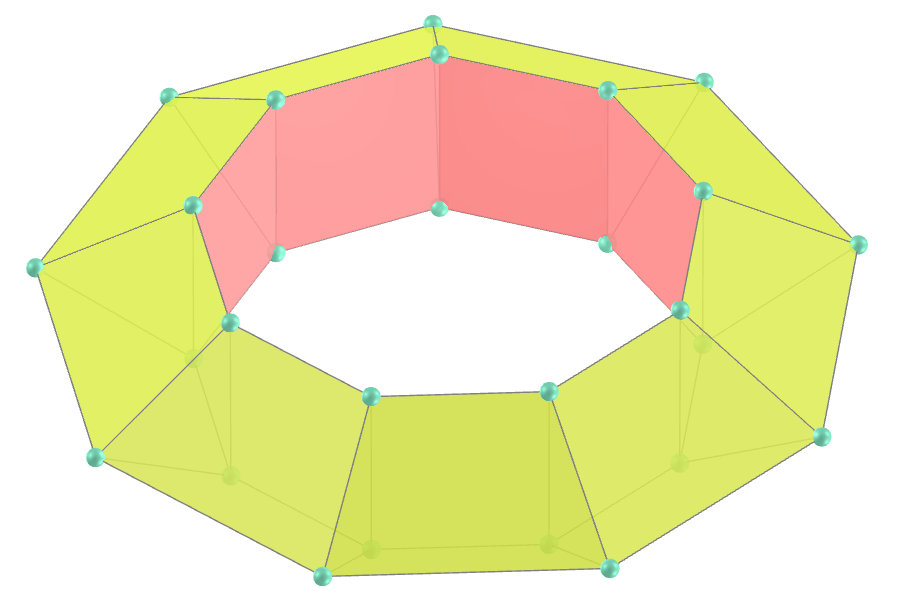</a>
   <b>faces:</b> 9 retângulos e 18 trapézios isósceles
  <b>vértices:</b> 27
  <b>arestas:</b> 54
    

<h4>14. Toroide tetragonal decagonal regular</h4>

   <b>faces:</b> 10 retângulos e 20 trapézios isósceles
  <b>vértices:</b> 30
  <b>arestas:</b> 60
    

<a href="#p1" class="topo">voltar ao topo</a>

  Tetragonal toroids: visualization of solids with Augmented Reality and Virtual Reality de <a xmlns:cc="http://creativecommons.org/ns#" href="https://paulohscwb.github.io/torus-toroids/tetragonal/pt-br/" property="cc:attributionName" rel="cc:attributionURL">Paulo Henrique Siqueira</a> está licenciado com uma Licença <a rel="license" href="http://creativecommons.org/licenses/by-nc-nd/4.0/">Creative Commons Atribuição-NãoComercial-SemDerivações 4.0 Internacional</a>.

<h4>Como citar este trabalho:</h4> 

Siqueira, P.H., "Tetragonal toroids: visualization of solids with Augmented Reality and Virtual Reality". Disponível em: <https://paulohscwb.github.io/torus-toroids/tetragonal/pt-br/>, Fevereiro de 2025.

<!---->
  <b>Referências:</b>
 Weisstein, Eric W. "Torus" From MathWorld-A Wolfram Web Resource. <a href="https://mathworld.wolfram.com/Torus.html" target="_blank">https://mathworld.wolfram.com/Torus.html</a>
 Weisstein, Eric W. "Toroid" From MathWorld-A Wolfram Web Resource. <a href="https://mathworld.wolfram.com/Toroid.html" target="_blank">https://mathworld.wolfram.com/Toroid.html</a>
 McCooey, D. I. "Visual Polyhedra". <a href="http://dmccooey.com/polyhedra/" target="_blank">http://dmccooey.com/polyhedra/</a>
